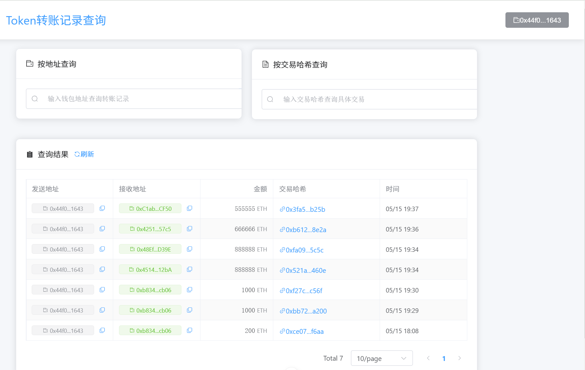
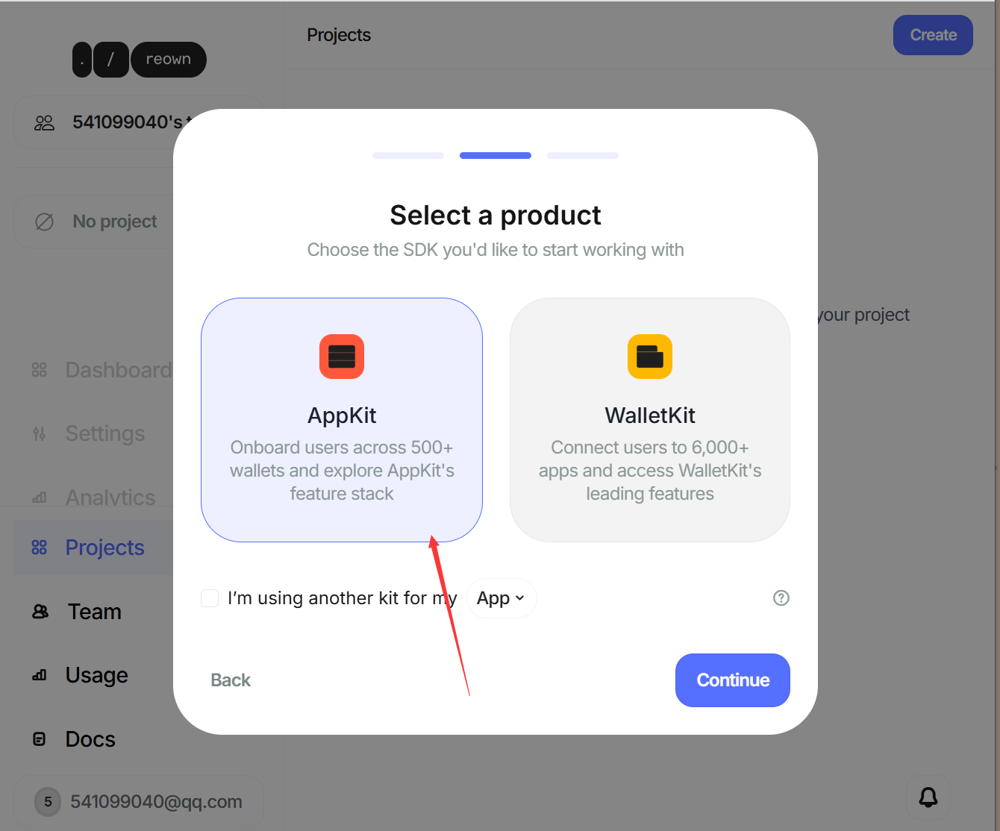
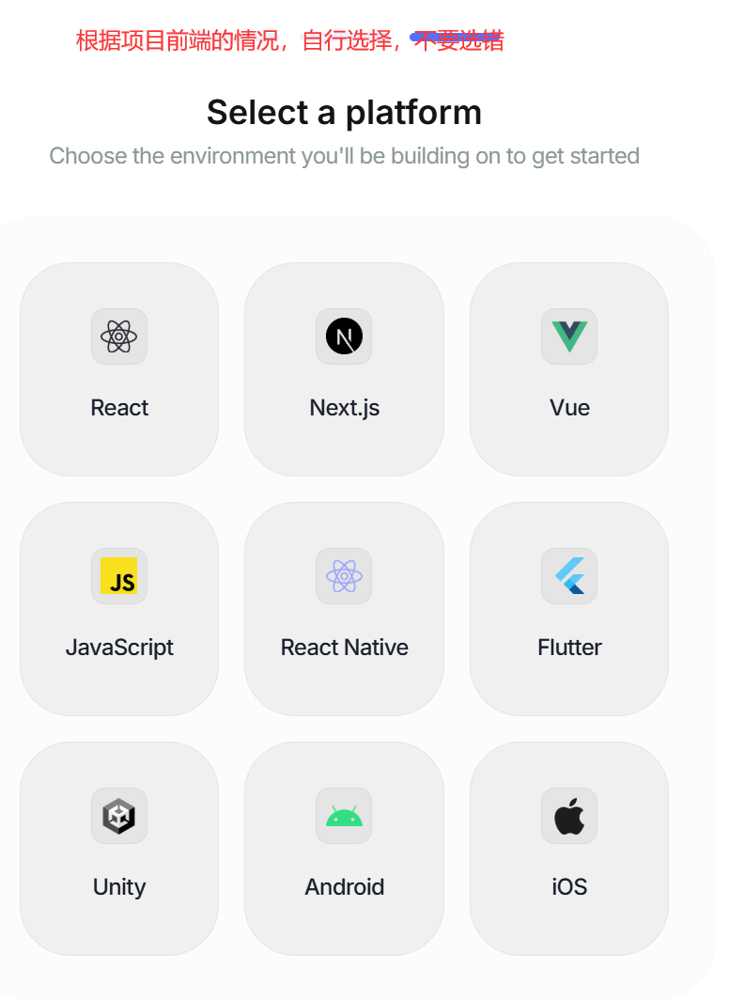

forge script  script/deploy_tokenBankV3.s.sol --rpc-url local --broadcast --private-key  0xac0974bec39a17e36ba4a6b4d238ff944bacb478cbed5efcae784d7bf4f2ff80  

# 前后端联合工作 5月14日作业
任务如下：
1.需要帮我做1个后端，用nestjs框架，目录为：D:\blockchain\DAPP\tokenbank_backend
我计算机现有node的版本如下：v20.17.0
2.后端需要索引出Token 转账信息，记录到数据库中：
- D:\blockchain\DAPP\tokenbank_frontdend 这个目录下是之前做的前端，使用vue框架。这个前端可以将metamask钱包中的token存款到tokenbank，也可以从tokenbank取款；
- token合约和tokenbank合约是部署在sepolia测试中的，
- 现在需要将token转账的信息从区块链中读取出来，要求能够实时读取，并同步记录到数据库中，
- 前端增加转账token功能，可以连接钱包后，将token转给任意钱包
- 前端通过Restful 接口来查询转账记录，前端界面增加查询功能，可以通过输入钱包用户的地址，查询其转入和转出token的记录；
- 数据库连接信息：IP:192.168.0.111  用户名：zhf   密码：123123  端口：5432  数据库名：zhf_db   数据库类型及版本：psql (PostgreSQL) 14.4
-  数据库需要建表，请提供给我建表语句；
-  以下是token合约转账的函数：
  
 event Transfer(address indexed from, address indexed to, uint256 value);

 function transfer(address _to, uint256 _value) public returns (bool success) {
        // write your code here
        require(_to != address(0),'Invalid Address');//检查接收地址，若0，则报错并回滚交易
        require(balances[msg.sender] >= _value,'ERC20: transfer amount exceeds balance');//检查调用该函数得账户地址的余额，若不足,则报错并回滚交易
        balances[msg.sender] -= _value;
        balances[_to] += _value;

        emit Transfer(msg.sender, _to, _value);  
        return true;   
    }

- 能用viem库实现的，就用viem库去实现。viem库已经安装。

 npx prettier --write "src/**/*.{js,ts}"

 npm run start:dev

帮我写个前端，目录我已经创建了，你不要创建了,目录是D:\blockchain\DAPP\query_frontend
用vue3去完成，简单直观就可以了
1.我已经做1个后端，用的nestjs框架，目录为：D:\blockchain\DAPP\query_backend
后端是将区块链上token转账信息记录到数据库中，并提供Restful接口查询转账记录。
2. 我计算机现有node的版本如下：v20.17.0
任务要求：
- 前端可以连接钱包
- 前端通过Restful 接口来查询转账记录，前端界面增加查询功能，可以通过输入钱包用户的地址，查询其转入和转出token的记录；
- 可 查询指定交易哈希的转账记录；对应的接口后端已经提供，需要你扫描后端文件确认。
- 分页查询所有转账记录；对应的接口后端已经提供，需要你扫描后端文件确认。

帮我写个前端，目录是D:\blockchain\DAPP\query_frontend
用vue3去完成，简单直观就可以了
1.我已经做1个后端，用的nestjs框架，目录为：D:\blockchain\DAPP\query_backend
后端是将区块链上token转账信息记录到数据库中，并提供Restful接口查询转账记录。
1. 我计算机现有node的版本如下：v20.17.0
任务要求：
- 前端可以连接钱包
- 前端通过Restful 接口来查询转账记录，前端界面增加查询功能，可以通过输入钱包用户的地址，查询其转入和转出token的记录；
- 可 查询指定交易哈希的转账记录；对应的接口后端已经提供，需要你扫描后端文件确认。
- 分页查询所有转账记录；对应的接口后端已经提供，需要你扫描后端文件确认。

# NFTmarket的前端作业 
## 作业要求：

为 NFTMarket 项目添加前端，并接入 AppKit 进行前端登录，并实际操作使用 WalletConnect 进行登录（需要先安装手机端钱包）。

并在 NFTMarket 前端添加上架操作，切换另一个账号后可使用 Token 进行购买 NFT。

## 给AI的描述：
1. 任务概述：帮我做一个DAPP的前端，用vue3框架，项目目录为：D:\blockchain\DAPP ，项目名称为：NFTmarket_frontend，开发环境和构建工具使用vite。使用 vue-dapp + viem 这两个库！
前端可以可以连接钱包，进行登录。连接钱包的方式除了，正常的连接本地钱包，也可以扫描二维码进行，移动端的登录（注意不需要开发移动端）。

1. 功能实现：
前置情况：以下内容的操作都是在sepolia测试网络进行的。
- NFTMARKET已经部署到sepolia测试网了，合约的文件位置：D:\blockchain\foundry\s6\src\tokens\9day_NFTmarket.sol
合约地址是：0x75cFefc86d4e1E9e9d570370776818b6639fa606
- NFT合约 已经授权给NFTMARKET合约了，授权的脚本是：D:\blockchain\foundry\s6\script\ApproveNFT.s.sol
NFT合约地址：0xF53701FF88DEaeBb83202F1e21E166f8951E093d
- 已经实现了对NFTMARKET的数据监测功能，脚本位置：D:\blockchain\foundry\s6\script\nftMarketlistener.js
- 已经部署了ERC20token合约，合约文件位置：D:\blockchain\foundry\s6\src\tokens\9day_fourthToken.sol   合约地址是：0x2887a24C331FDbc3D8638fFF98b7997965C085d5，代币名称：buyNFT，已经全部取回钱包。
- 已经写了购买NFT的脚本，位置：D:\blockchain\foundry\s6\script\DeployBuyNFT.s.sol，但是没有授权NFTMARKET合约使用这个 ERC20 代币buyNFT。

本次任务要求：
- 以上描述中的文件都要扫描核实一遍，确认没有问题；
- 在 NFTMarket 前端实现NFT的上架操作和下架操作；
- 在 NFTMarket 前端添加检测数据的实时显示；
- 在 NFTMarket 前端，可以发起购买NFT的操作，并使用buyNFT 这个Token进行购买；而且能连接我本地的钱包metamask，进行购买。

## 强制转换当前钱包连接网络到sepolia
继续报错NFTMarket.vue:367 上架失败：chainID 不匹配

ContractFunctionExecutionError: The current chain of the wallet (id: 10) does not match the target chain for the transaction (id: 11155111 – Sepolia).

Current Chain ID:  10
Expected Chain ID: 11155111 – Sepolia
 
Request Arguments:
  from:  0x44f08ed7d8f63b345f0fc512aecfaa4f16831643
  to:    0x75cFefc86d4e1E9e9d570370776818b6639fa606
  data:  0xdda342bb000000000000000000000000f53701ff88deaebb83202f1e21e166f8951e093d0000000000000000000000000000000000000000000000000000000000000001000000000000000000000000000000000000000000000000000110d9316ec000

**解决办法** 强制切换到sepolia

await window.ethereum.request({
  method: 'wallet_switchEthereumChain',
  params: [{ chainId: '0xaa36a7' }]
})

然后再查看当前链ID
await window.ethereum.request({ method: 'eth_chainId' })

## 关键内容记录
1. web3moda 官网申请的ID,通过创建项目获得ID,网站需要注册后才能创建项目。
2. **有这个ID才能在前端中**做连接不同类型钱包的选择：fb3301e78d2a273f91bc5457731176c5
教程地址：https://zhuanlan.zhihu.com/p/667681714
我选择了Appkit，见下图

开发平台选择，我是vue

3. https://cloud.reown.com/app/8e2bfa88-29ad-460f-afd9-2bce3721dd16 注册登陆后的页面
4. 

