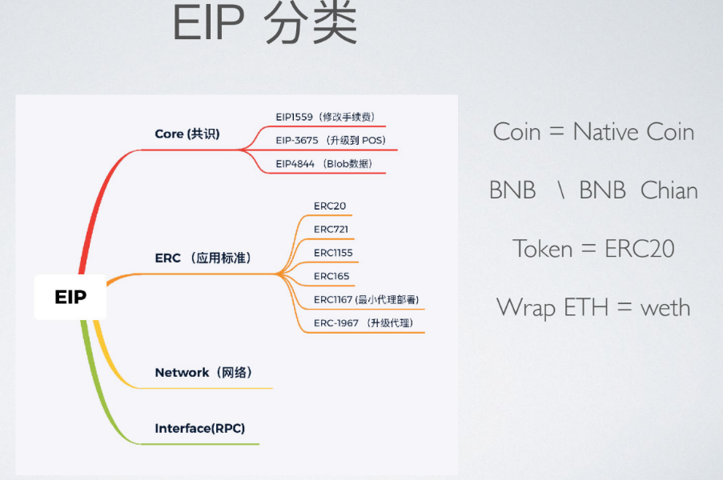

# **solidity 语言学习记录**

# 第一个智能合约代码--代币制造
// SPDX-License-Identifier: MIT
pragma solidity ^0.8.26;
//下面的合约实现了一个最简单的加密货币
//币确实可以无中生有地产生，但是只有创建合约的人才能做到（实现一个不同的发行计划也不难）。
//任何人都可以给其他人转币，不需要注册用户名和密码 —— 所需要的只是以太坊密钥对。

contract Coin {
    // address 类型的公共变量,关键字“public”让这些变量可以从外部读取
    // address 类型是一个160位的值，且不允许任何算数操作。这种类型适合存储合约地址或外部人员的密钥对。
    address public minter;
    //mapping 引用类型 是一种键值对存储结构,作用是高效地通过键（Key）查找对应的值（Value）
    //用于存储每个地址的余额
    mapping (address => uint) public balances;

    // 轻客户端可以通过事件针对变化作出高效的反应
    event Sent(address from, address to, uint amount);

    // 这是构造函数，只有当合约创建时运行，它只会被执行一次。部署完成的状态，字节码中不包含构造函数代码
    constructor()  {
        //msg.sender表示当前合约的部署者的地址。在构造函数中，minter 存储部署合约的人的地址。
        minter = msg.sender;
    }

// 如果 mint 被合约部署者外的其他人调用，则什么也不会发生
// 如果调用mint函数的是合约的部署者，那么就可以用来管理用户的余额，就是铸造代币的数量
    function mint(address receiver, uint amount) public {
        if (msg.sender != minter) return;
        balances[receiver] += amount;//将铸造的金额（amount）加到接收者的余额（balances[receiver]）上
    }

// send 函数可被任何人用于向他人发送币 (当然，前提是发送者拥有符合数量的币)。
    function send(address receiver, uint amount) public {
        if (balances[msg.sender] < amount) return;
        balances[msg.sender] -= amount;
        balances[receiver] += amount;
        emit Sent(msg.sender, receiver, amount);
    }
}

## mapping
mapping 是一种键值对存储结构，类似于其他编程语言中的“字典”或“哈希表”，但它并不是函数，而是语言内置的引用类型。它的核心作用是高效地通过键（Key）查找对应的值（Value）。

###  mapping 的基本语法
mapping(KeyType => ValueType) public variableName;

KeyType：键的类型，通常是 address、uint、bytes32 等简单类型（不能是复杂类型如 struct 或其他 mapping）。
ValueType：值的类型，可以是任意类型（包括 uint、string、struct 甚至嵌套 mapping）。

**举例**：
返回当前合约MappingUser的账户余额：
contract MappingExample {
    mapping(address => uint) public balances;

    function update(uint newBalance) public {
        balances[msg.sender] = newBalance;//msg.sender是MappingUser 合约的地址。
    }
}

contract MappingUser {
    function f() public returns (uint) {
        MappingExample m = new MappingExample();//这相当于在区块链上部署了一个新的 MappingExample 合约。
        m.update(100);
        return m.balances(this)//this 代表 当前合约（MappingUser）的地址。
    }
}

## event
## 事件  event
事件是能方便地调用以太坊虚拟机日志功能的接口。
**举例：**
contract SimpleAuction {
    event HighestBidIncreased(address bidder, uint amount); // 事件

    function bid() public payable {
        // ...
        emit HighestBidIncreased(msg.sender, msg.value); // 触发事件
    }
}

event Sent(address from, address to, uint amount);
event Sent(address indexed from, address indexed to, uint indexed amount);

这行代码定义了一个名为 Sent 的事件。它包含三个参数：
address from：表示发送方的地址。
address to：表示接收方的地址。
uint amount：表示发送的金额。
**作用**
所有的事件都包含了 from ， to 和 amount 三个参数，可方便追踪事务。
当你在智能合约中触发这个事件时，它会将这些**参数记录到区块链的交易日志中**。外部应用程序可以通过监听这些事件来获取合约执行过程中的相关信息。

**特点**
1. 存储在区块链上（在交易日志中，而非合约状态中）
2. 不可被合约直接读取（只能由外部监听）
3. Gas成本低（比存储状态变量便宜得多）
4. **indexed关键字**可以对参数进行索引，使得事件过滤更加高效。

### 日志举例：
以下是1个从钱包给合约地址存款的事件的日志的内容：

0. **前置信息**
from	0xAb8483F64d9C6d1EcF9b849Ae677dD3315835cb2   // 发送方地址,即钱包地址
to	Bank.deposit() 0xd9145CCE52D386f254917e481eB44e9943F39138  // 接收方地址,即合约地址

1. **关键字段解析**

  {
		"from": "0xd9145CCE52D386f254917e481eB44e9943F39138",
		"topic": "0x5548c837ab068cf56a2c2479df0882a4922fd203edb7517321831d95078c5f62",
		"event": "Deposit",
		"args": {
			"0": "0xAb8483F64d9C6d1EcF9b849Ae677dD3315835cb2",
			"1": "0xd9145CCE52D386f254917e481eB44e9943F39138",
			"2": "2000",
			"from": "0xAb8483F64d9C6d1EcF9b849Ae677dD3315835cb2",
			"to": "0xd9145CCE52D386f254917e481eB44e9943F39138",
			"amount": "2000"
		}
	}

字段	                            值	               含义
from	0xd9145CCE52D386f254917e481eB44e9943F39138	事件来源：触发该事件的合约地址。
topic	0x5548c837ab068cf56a2c2479df0882a4922fd203edb7517321831d95078c5f62	事件签名：Deposit(address,uint256) 的哈希（事件唯一标识）。
event	             "Deposit"	                      事件名称。
args	            见下方	                        事件参数（包含存款用户和金额）。

1. **事件参数（args）**

{
    "0": "0xAb8483F64d9C6d1EcF9b849Ae677dD3315835cb2", // 用户地址（索引参数）
    "1": "0xd9145CCE52D386f254917e481eB44e9943F39138", // 接收方地址（索引参数）
    "2": "2000",                                     // 存款金额（非索引参数）
    "from": "0xAb8483F64d9C6d1EcF9b849Ae677dD3315835cb2",//用户地址（索引参数）
		"to": "0xd9145CCE52D386f254917e481eB44e9943F39138",//接收方地址（索引参数）
    "amount": "2000"                                 // 别名
}

# 开篇第一个例子的总结和思考，关于智能合约的基本组装
## 合约中的构造函数
 constructor()  {
//msg.sender表示当前合约的创建者的地址。在构造函数中，minter 存储创建合约的人的地址。
        minter = msg.sender;
    }

msg (以及 tx 和 block ) 是一个神奇的全局变量，其中包含一些允许访问区块链的属性。 msg.sender 始终是当前（外部）函数调用的来源地址。

## 合约中的方法1
铸造代币

## 合约中的方法2
转账

## emit
在智能合约的函数中，你可以使用 emit 关键字来触发event 定义的事件。

## 合约包含的代码类型内容：
- 定义构造函数：用于创建合约对象，它永久存储创建合约的人的地址；
- 定义一般类型属性（状态变量）：合约的状态变量；例如：address，uint，bool等；
- 定义mapping类型的属性（状态变量）：存储在区块链上的键值对类型数据结构；
- 定义event类型的事件：合约执行过程中触发的事件；
- 定义方法：比如铸造代币，转账等。

## 合约部署
在以太坊智能合约中，使用Solidity语言编写的合约代码在部署到区块链上时，**会自动触发合约的构造函数**（constructor）来完成初始化。

## 监听智能合约中定义的事件 --web3.js

web3.js 是一套用来与区块链进行交互的JavaScript API。
使用 web3.js 可以监听智能合约中定义的事件，并实时获取事件参数。

Coin.Sent().watch({}, '', function(error, result) {
    if (!error) {
        console.log("Coin transfer: " + result.args.amount +
            " coins were sent from " + result.args.from +
            " to " + result.args.to + ".");
        console.log("Balances now:\n" +
            "Sender: " + Coin.balances.call(result.args.from) +
            "Receiver: " + Coin.balances.call(result.args.to));
    }
})

# 区块链的一些补充知识

##  交易/事务
区块链是全球共享的事务性数据库，这意味着每个人都可加入网络来阅读数据库中的记录。
如果你想改变数据库中的某些东西，你必须创建一个被所有其他人所接受的事务。
事务一词意味着你想做的（假设您想要同时更改两个值），要么一点没做，要么全部完成。
此外，当你的事务被应用到数据库时，其他事务不能修改数据库。
- **交易总是由发送人（创建者）签名**。

##  区块 
在比特币中，要解决的一个主要难题，被称为**双花攻击 (double-spend attack)**：如果网络存在两笔交易，**都想****花光****同一个账户**的钱时（即所谓的冲突）会发生什么情况？交易互相冲突？

- 网络会为你自动选择一条交易序列，并打包到所谓的“区块”中，然后它们将在所有参与节点中执行和分发。
- 如果两笔交易互相矛盾，那么最终被确认为,后发生的交易将被拒绝，不会被包含到区块中。
- 作为“顺序选择机制”（也就是所谓的“挖矿”）的一部分，**可能有时会发生块（blocks）被回滚**的情况，但仅在链的“末端”。

# 以太坊虚拟机
## 概述
1. 以太坊虚拟机 EVM 是智能合约的运行环境。
2. 它不仅是沙盒封装的，而且是完全隔离的，也就是说在 EVM 中运行代码是无法访问网络、文件系统和其他进程的。
3. EVM 的隔离性是为了保护区块链的安全和稳定，而外部交互则通过特定的机制（如 Oracle 服务，Web3 应用等）来实现。这样既能保证智能合约的安全性，又能使其具备与外部世界交互的能力。

## 账户
以太坊中有两类账户（**它们共用同一个地址空间**）：无论帐户是否存储代码，这两类账户对 EVM 来说是一样的。

1. **外部账户（EOA）：** 由公钥-私钥对（也就是人）控制；也就是web3钱包中创建的公链账户信息；**无代码**，能够主动发起交易；**外部账户的地址是由公钥决定的**
   
2. **合约账户(CA)：**  **由智能合约代码**创建和控制。合约账户的地址是在**部署该合约时确定的**；
由和账户一起存储的智能合约代码控制，正常不能主动发起交易，如果发起主动交易，**需被 EOA 或其他合约触发**。
**合约账户的地址是在部署时生成的**，通常是通过创建者的地址和该交易的随机数（nonce）进行哈希运算得到的。例如，使用以下算法：
合约地址=Keccak256(rlp([sender,nonce]))[12:]
**部署**者：**可以是钱包地址**，**也可以是其他合约地址**。

3. 每个**账户**都有一个**键值对形式的持久化存储**。其中 **key 和 value 的长度都是256位**，我们称之为 **存储** 。

4. 每个**账户**有一个以太币余额（ balance ）（单位是“Wei”）。

## 交易
1. 交易可以看作是从一个帐户发送到另一个帐户的消息，消息能包含**一个二进制数据（合约负载）**和**以太币**。
2. 如果目标账户含有代码，此代码会被执行，并以 payload 作为入参。
3. 如果目标账户是零账户(账户地址为 0)，此交易将创建一个 新合约 :如前文所述，合约的地址不是零地址，而是通过合约创建者的地址和从该地址发出过的交易数量计算得到的（所谓的“nonce”）。
这个用来创建合约的交易的 payload 会被转换为 EVM 字节码并执行。执行的输出将作为合约代码被永久存储。
**注意：**在合约创建的过程中，它的代码还是空的。所以直到构造函数执行结束，你都不应该在其中调用合约自己函数。

## Gas
1. 每笔交易都收取一定数量的 gas ，目的是限制执行交易所需要的工作量和为交易支付手续费。
2. EVM 执行交易时，gas 将按特定规则逐渐耗尽。
gas price 是交易发送者设置的一个值，发送者账户需要预付的手续费= gas_price * gaslimit。详细解释见：study_way\学习记录\gas费计算.md
3. 无论执行到什么位置，一旦 gas 被耗尽（比如降为负值），将会触发一个 out-of-gas 异常。当前调用帧（call frame）所做的所有状态修改都将被**回滚**。
4. 调用帧（call frame），指的是下文讲到的EVM的运行栈（stack）中当前操作所需要的若干元素。

## 存储，内存和栈
### 1. **每个账户**有一块持久化内存区称为 **存储** 。 
存储是将256位字映射到256位字的键值存储区；
**在合约中枚举存储是不可能的；**且读存储的相对开销很高，修改存储的开销甚至更高
，每个账户的存储信息主要包含以下四个关键部分：

**1. Nonce**
定义：Nonce 是一个递增的计数器，**用于记录该账户已经发起的交易数量。**
作用：
对于外部账户（EOA），Nonce 表示该账户已经发送的交易数量。
对于合约账户(CA)，Nonce 表示该合约创建的子合约数量。
重要性：**Nonce 用于防止重放攻击，确保每次交易的唯一性。**

**2. Balance**
定义：Balance 表示**账户的以太币余额**，以 Wei 为单位（1 Ether = 10^18 Wei）。
作用：记录账户当前持有的以太币数量，每次交易或转账都会影响该余额。

**3. StorageRoot**
定义：StorageRoot 是账户存储树的根节点哈希值。
作用：
对于合约账户(CA)，StorageRoot 指向该合约的存储数据区，**存储了合约的状态变量**。
对于外部账户（EOA），StorageRoot **通常为空**。
存储结构：合约的存储数据以键值对的形式组织，**通过 Merkle Patricia Trie（MPT）树结构存储**，以确保数据的高效检索和完整性。

**4. CodeHash**
定义：CodeHash 是**账户代码的哈希值**。
作用：
对于合约账户(CA)，CodeHash 存储了合约代码的哈希值，**用于验证合约代码的完整性**。
对于外部账户（EOA），CodeHash **通常为空**。
不可变性：合约代码一旦部署，CodeHash 就不可更改，这保证了合约代码的不可篡改。

**5. 总结**
以太坊账户的存储信息主要包括以下内容：
Nonce：记录交易数量或合约创建次数。
Balance：记录账户的以太币余额。
StorageRoot：指向合约存储数据区的哈希值（**对于合约账户**）。
CodeHash：存储合约代码的哈希值（**对于合约账户**）。
这些信息共同构成了以太坊账户的状态，并通过区块链的机制确保其持久化和不可篡改

### 2. 合约只能读写存储区内属于自己的部分。storage数据存储区域。
**个人的一些理解：**
其实合约就可以理解为：存储一类型事务的操作过程数据和结果数据的代码逻辑，存储数据的部分可以理解为实体类，执行任务的可以理解为业务逻辑

1.存储数据部分（相当于实体类）
**状态变量1**（State Variables）：相当于类的属性/成员变量
**状态变量2**（Structs/Mappings）：相当于复杂数据结构
这些数据永久存储在区块链上

2.业务逻辑部分
**函数**（Functions）：相当于类的方法
**修饰器**（Modifiers）：相当于AOP或权限控制逻辑
**事件**（Events）：相当于日志系统或通知机制（可以给前端返回数据），

### 3. 第二个内存区称为 **memory** ，合约会试图为**每一次消息调用**获取一块被重新擦拭干净的内存实例。

### 4. EVM 不是基于寄存器的，而是基于栈的，因此所有的计算都在一个被称为 **栈**（stack） 的区域执行。
栈最大有1024个元素，每个元素长度是256位。
栈的总存储容量是：1024 × 32 字节 = 32 KB

**注意**：
1. EVM 的 **栈** 是专门用于 **计算过程 的临时存储**，而 storage 和 memory 是 **数据存储区域**，两者职责不同。
2. 计算时数据需从 storage 或 memory 加载到栈，结果再写回存储区域

## 消息调用（Message Call）
1. **合约**可以通过消息调用的方式来**调用其它合约**或者**发送以太币到非合约账户**。
2. 消息调用和交易非常类似，它们都有一个源、目标、数据、以太币、gas和返回数据。
3. 事实上每个交易都由一个顶层消息调用组成，这个消息调用又可创建更多的消息调用。
4. Solidity中，发起调用的合约默认会触发一个手工的异常，以便异常可以从调用栈里“冒泡出来”；
5. 调用深度被限制为 1024 ，因此对于更加复杂的操作，我们应使用循环而不是递归。

- 广义概念：涵盖所有合约间调用，包括：
- 普通调用（如 A.foo()）
- 底层调用（call/delegatecall/staticcall）
- 甚至内部调用（this.foo()）
- EVM 视角：在 EVM 执行时，任何跨合约操作都是一个 message call，会创建新的调用上下文（msg.sender/msg.value 可能变化）。

## 委托调用/代码调用
### 有一种特殊类型的消息调用，被称为 委托调用(delegatecall) 。
它和一般的消息调用的区别在于，目标地址的代码将在发起调用的合约的上下文中执行，并且 msg.sender 和 msg.value 不变。 
委托调用的目的是允许一个合约调用另一个合约的函数，而不用担心它们的执行环境。
这意味着一个合约可以在运行时从另外一个地址动态加载代码。
存储、当前地址和余额都指向发起调用的合约，只有代码是从被调用地址获取的。
### 这使得 Solidity 可以实现”库“能力：可复用的代码库可以放在一个合约的存储上，如用来实现复杂的数据结构的库。
**源码见：**study_way/src/5day_call&delegatecall.sol

## 日志
有一种特殊的可索引的数据结构，其存储的数据可以一路映射直到区块层级。
这个特性被称为 **日志(logs) ，Solidity用它来实现 事件(events) 。**
因为部分日志数据被存储在 布隆过滤器(Bloom filter) 中，我们可以高效并且加密安全地搜索日志，所以那些没有下载整个区块链的网络节点（轻客户端）也可以找到这些日志。

##  部署
合约甚至可以通过一个特殊的指令来部署其他合约（不是简单的调用零地址）。
部署合约的调用 create calls 和普通消息调用的唯一区别在于，负载会被执行，**执行的结果被存储为合约代码**，调用者/部署者在栈上得到新合约的地址。

## 自毁
合约代码从区块链上**移除的唯一方式**是合约在合约地址上的执行**自毁操作 selfdestruct**。
合约账户上剩余的以太币会发送给指定的目标，然后其存储和代码从状态中被移除。

# 导入其他源文件
虽然 Solidity 不知道 "default export" 为何物， 但是 Solidity 所支持的导入语句，其语法同 JavaScript（从 ES6 起）非常类似。
## 在全局层面上，可使用如下格式的导入语句：
1. 此语句将从 “filename” 中导入所有的全局符号到当前全局作用域中
import "filename";

2. 创建一个新的全局符号 symbolName，其成员均来自 "filename" 中全局符号。
import * as symbolName from "filename";

3. 创建新的全局符号 alias 和 symbol2，分别从 "filename" 引用 symbol1 和 symbol2 。
import {symbol1 as alias, symbol2} from "filename";

4. 这条语句等同于 import * as symbolName from "filename";。
import "filename" as symbolName;

举例：import "github.com/ethereum/dapp-bin/library/iterable_mapping.sol" as it_mapping;
as it_mapping：这是 Solidity 语法的一部分，表示将导入的文件或模块重命名为 it_mapping，以便在当前文件中使用。

## 路径
以 / 作为目录分割符、以 . 标示当前目录、以 .. 表示父目录。
当 . 或 .. 后面跟随的字符是 / 时，它们才能被当做当前目录或父目录。
只有路径以当前目录 . 或父目录 .. 开头时，才能被视为相对路径。

# **合约结构**
在 Solidity 中，合约类似于面向对象编程语言中的类。 
每个合约中可以包含 ：状态变量、 函数、 函数修饰器、事件、 结构类型、 和 枚举类型 的声明，且合约可以从其他合约继承。

## 状态变量
状态变量是永久地存储在合约存储**storage**中的值。

contract SimpleStorage {
    uint storedData; // 状态变量
    // ...
}

## 函数
函数是合约中代码的可执行单元。

contract SimpleAuction {
    function bid() public payable { // 函数
        // ...
    }
}

## 函数修饰器/装饰器
函数修饰器是一种特殊的函数，它可以修改或增强其他函数的行为。
modifier：是一种用于**修改函数行为的工具**，它可以在函数执行之前或之后添加额外的逻辑。
onlyBefore：是一个**函数修饰器**，它的作用是确保函数只能在某个时间点之前被调用。
require: 是一个**断言函数**，用于检查某个条件是否为真.

contract SimpleAuction {
    modifier onlyBefore(uint _time) { //定义函数修饰器
        require(now < _time);//修饰器的核心逻辑
        _;//这是一个特殊的占位符，表示被修饰的函数的主体代码将在这里插入
    }

    function bid() public payable onlyBefore(deadline) { // 函数
        // ...
    }
}

### 函数执行逻辑解释：
1. 当用户调用 bid 函数时，会先检查当前时间（now）是否小于 deadline。
2. 如果当前时间小于 deadline，则继续执行 bid 函数的主体代码；否则，合约会抛出错误，拒绝执行。

### 解释：
1. require(now < _time)
这个条件判断是被onlyBefore(deadline)引用的，所以当调用 bid 函数时，会先检查当前时间是否小于 deadline。
2. _
这个占位符表示被修饰的函数的主体代码将在这里插入。
3. onlyBefore(deadline)
这个修饰器的作用是确保函数只能在某个时间点之前被调用。
4. bid()
这个函数是被修饰的函数，它只能在 deadline 之前被调用。
5. public payable
这个函数的修饰符是 public 和 payable，表示它可以接收以太币作为参数。
6. payable 
- 是一个关键字，用于指定函数或地址可以接收以太币（ETH）。
- 用户在调用这个函数时，可以选择向合约发送一定数量的以太币。
- 在函数内部，可以通过 msg.value 获取用户发送的以太币数量（单位是 Wei）。

### 其他修饰器
**除了 onlyBefore，Solidity 中还可以定义其他修饰器，例如：**
onlyOwner：确保函数只能由合约的所有者调用。
onlyAfter：确保函数只能在某个时间点之后调用。

### 举例1
contract testModifier {
    address public owner;
    uint256 public  deposited;

    constructor() {
        owner=msg.sender;
        deposited=200; // 初始值 200 wei（需合约部署时存入 ETH）
    }

    modifier onlyOwner() {
        require(msg.sender == owner,'not owner stop immediatly');
        _;
    }

    function deposit() public payable {
        deposited+=msg.value;
    }

    function withDraw(uint256 extraQuantity) public onlyOwner {
        require(extraQuantity<= deposited,'Insufficient balance');
        //将以太币从智能合约转账给 owner 地址
        deposited -= extraQuantity;
        payable(owner).transfer(extraQuantity);

/* 将 owner 地址转换为可接收 ETH 的 payable 地址（普通地址无法直接接收 ETH）。

.transfer(extraQuantity)

将合约中存储的 extraQuantity 数量的 ETH（单位：wei）转账给 owner。

如果转账失败（如 gas 不足或对方是恶意合约），会自动回滚交易（revert）。 */
    }
}

### 函数装饰器的替代方式：私有函数
**举例**：
- **装饰器版本**
contract ModifierExample {
    address owner;

    modifier onlyOwner {
        require(msg.sender == owner, "Not owner");
        _;
    }

    function setOwner(address newOwner) public onlyOwner {
        owner = newOwner;
    }
}

- **私有函数版本**
contract PrivateFunctionExample {
    address owner;

    // 私有函数实现权限检查
    function _checkOwner() private view {
        require(msg.sender == owner, "Not owner");
    }

    // 在函数中手动调用私有函数
    function setOwner(address newOwner) public {
        _checkOwner(); // 替代 onlyOwner 修改器
        owner = newOwner;
    }
}

#### **小结**

1. 修改器 是 Solidity 的语法糖，适合简单的、高频的代码复用（如权限检查）。

2. 私有函数 更灵活，适合复杂逻辑或需要返回值的情况。

3. 两者本质上是编译时的代码展开（修改器） vs 运行时的函数调用（私有函数）。

- **何时选择私有函数**？
1. 当修改逻辑需要返回值时（修改器无法返回值）。

2. 当检查逻辑较复杂，或需要在函数中间插入时。

3. 当需要动态控制检查逻辑的位置（修改器只能固定在 _; 处）。

# 类型
Solidity 是一种静态类型语言，这意味着每个变量（状态变量和局部变量）都需要在编译时指定变量的类型（或至少可以推导出变量类型）

## 1. 值类型
值类型的变量将始终按值来传递。 
也就是说，当这些变量被用作函数参数或者用在赋值语句中时，总会进行值拷贝。

### 1.布尔类型 bool
bool ：可能的取值为字面常数值 true 和 false 。
#### 运算符：
! （逻辑非）
&& （逻辑与， "and" ）
|| （逻辑或， "or" ）
== （等于）
!= （不等于）

### 2.整型 int
int / uint ：分别表示有符号和无符号的不同位数的整型变量。 
支持关键字 uint8 到 uint256 （无符号，从 8 位到 256 位）以及 int8 到 int256，以 8 位为步长递增。
 uint 和 int 分别是 uint256 和 int256 的别名。

#### 运算符：
比较运算符： <= ， < ， == ， != ， >= ， > （返回布尔值）
位运算符： & ， | ， ^ （异或）， ~ （位取反）
算数运算符： + ， - ， 一元运算 - ， 一元运算 + ， * ， / ， % （取余） ， ** （幂）， << （左移位） ， >> （右移位）

### 3.定长浮点型
fixed / ufixed：表示各种大小的有符号和无符号的定长浮点型。 
在关键字 ufixedMxN 和 fixedMxN 中，M 表示该类型占用的位数，N 表示可用的小数位数。 M 必须能整除 8，即 8 到 256 位。 N 则可以是从 0 到 80 之间的任意数。 ufixed 和 fixed 分别是 ufixed128x19 和 fixed128x19 的别名。

#### 运算符：
比较运算符：<=， <， ==， !=， >=， > （返回值是布尔型）
算术运算符：+， -， 一元运算 -， 一元运算 +， *， /， % （取余数）

### 4. 地址类型 address
是一种特殊的 值类型（Value Type）
address：地址类型存储一个 **20 字节的值**（以太坊地址的大小）。 
地址类型也有成员变量，并作为所有合约的基础。
是一种特殊的 值类型（Value Type）

#### 成员变量
1. balance 和 transfer
可以使用 balance 属性来查询一个地址的余额， 也可以使用 transfer 函数向一个地址发送 以太币Ether （以 wei 为单位）

**举例：**
address x = 0x123;
address myAddress = this; //this表示当前合约的地址。
if (x.balance < 10 && myAddress.balance >= 10) 
x.transfer(10);

2. send 
send 是 transfer 的低级版本。
如果执行失败，当前的合约不会因为异常而终止，但 send 会返回 false。

**在使用 send 的时候会有些风险**：
- 如果调用栈深度是 1024 会导致发送失败（这总是可以被调用者强制）
- 如果接收者用光了 gas 也会导致发送失败。 
- 所以为了保证 以太币Ether 发送的安全，一定要检查 send 的返回值，
- 使用 transfer 或者更好的办法： 使用一种接收者可以取回资金的模式。

3.  call， staticcall 和 delegatecall
- 此外，为了与不符合 应用二进制接口Application Binary Interface(ABI) 的合约交互，于是就有了可以**接受任意类型任意数量参数**的 call 函数。
- 这些参数会被打包到以 32 字节为单位的连续区域中存放。
 
address nameReg = 0x72ba7d8e73fe8eb666ea66babc8116a41bfb10e2; //合约地址定义
nameReg.call("register", "MyName");//调用了位于 nameReg 地址的合约中的 register 函数，并向该函数传递了一个参数 "MyName"
nameReg.call(bytes4(keccak256("fun(uint256)")), a);//第一个参数被编码成正好 4 个字节

call 返回的布尔值表明了被调用的函数已经执行完毕（true）或者引发了一个 EVM 异常（false）。 
无法访问返回的真实数据（为此我们需要事先知道编码和大小）。

- 可以使用 .gas() 修饰器调整提供的 gas 数量
namReg.call.gas(1000000)("register", "MyName");

- 类似地，也能控制提供的 以太币Ether 的值
nameReg.call.value(1 ether)("register", "MyName");

- 最后一点，这些 修饰器modifier 可以联合使用。每个修改器出现的顺序不重要
nameReg.call.gas(1000000).value(1 ether)("register", "MyName");

**注意：**
这三个函数 call， delegatecall 和 staticcall 是 Solidity 的底层函数，应仅在高级抽象无法满足需求时使用，并需严格验证输入和返回值。因为这些底层调用绕过了 Solidity 的类型检查和安全性机制（如自动异常传播、ABI 编码验证）。

**具体来说，任何未知的合约都可能是恶意的。 你在调用一个合约的同时就将控制权交给了它，它可以反过来调用你的合约， 因此，当调用返回时要为你的状态变量的改变做好准备。**

**合理使用场景**：
函数	             典型场景	                                    替代方案（优先考虑）
call	             动态发送 ETH 或调用未知接口（如多签钱包）	     接口抽象（interface）
delegatecall	    代理合约（如 OpenZeppelin Proxy）、可升级合约	  继承或库（Library）
staticcall	      只读查询外部合约（如获取 ERC20 余额）	           View 函数直接调用

**举例**：
pragma solidity ^0.8.0;
// SPDX-License-Identifier: MIT

contract Counter {
    uint public counter;
    address public sender;

    function count() public {
        counter += 1;
        sender = msg.sender;
    }
    // fallback() external payable {
    // }

}

contract CallTest {
    uint public counter;
    address public sender;

    //调用逻辑：直接调用Counter合约的count()函数
    //调用结果：Counter合约的： counter+1，sender更新为CallTest合约地址
    function callCount(Counter c) public {
        c.count();
    }

    //调用逻辑：让Counter的count()代码在CallTest环境中执行
    //调用结果：CallTest合约的：  counter+1，sender更新为CallTest合约地址
    function lowDelegatecallCount(address  addr) public {
        //用于生成函数调用的ABI编码数据,返回bytes类型的编码结果,bytes 是动态字节数组类型
        bytes memory methodData = abi.encodeWithSignature("count()");
        //delegatecall需要原始ABI编码数据作为输入
        (bool success, ) =addr.delegatecall(methodData);
        require(success, "Delegatecall failed"); // 如果失败，回滚交易
    }

    //调用逻辑：通过call调用Counter合约的count()函数
    //调用结果：Counter合约的counter+1，sender更新为CallTest合约地址
    function lowCallCount(address addr) public {
        bytes memory methodData =abi.encodeWithSignature("count()");
        (bool success, ) =addr.call(methodData);
        require(success, "Delegatecall failed");
        // addr.call{gas:1000}(methodData);
        // addr.call{gas:1000, value: 1 ether}(methodData);
    }

    //call 和 传入合约类型参数直接调用得结果一样
    //delegatecall调用得合约可以比做是类库，调用结果影响当前合约得状态

}

4. 使用call发送以太币（**推荐方式**）
- **举例**：
function safeSendETH(address payable to, uint256 amount) internal {
    (bool success, ) = to.call{value: amount, gas: 30000}("");
    require(success, "ETH transfer failed");
}

- **特点**：

灵活 Gas 控制：可自定义 Gas（默认传递所有剩余 Gas，更安全）。

手动异常处理：需检查 success，否则可能静默失败。

兼容所有场景：支持发送 ETH 到 EOA（外部账户）或合约。

5. selfdestruct(address)（**合约自毁函数，强制发送 ETH**）
前面已经有描述过，现在再补充一下：
**代码**：selfdestruct(payable(address));

**作用**：
强制发送：销毁当前合约，并将余额强制发送到指定地址（无视接收合约的 receive 或 fallback 逻辑）。

使用场景：紧急提款或合约销毁时使用。

**警告**：
一旦调用，合约代码和存储将被永久删除。

在以太坊升级（如 EIP-4758）后，此功能可能被禁用。

### 5.**定长**字节数组--**引用类型**
**关键字有：**bytes1， bytes2， bytes3， ...， bytes32。byte 是 bytes1 的别名。

#### 运算符：
- 比较运算符：<=， <， ==， !=， >=， > （返回布尔型）
- 位运算符： &， |， ^ （按位异或）， ~ （按位取反）， << （左移位）， >> （右移位）
- 索引访问：如果 x 是 bytesI 类型，那么 x[k] （其中 0 <= k < I）返回第 k 个字节（只读）。

#### 成员变量
- .length 表示这个字节数组的长度

### 6. **变长**字节数组--**引用类型**
bytes:
变长字节数组。**它并不是值类型。**
string:
变长 UTF-8 编码字符串类型。**并不是值类型。**

### 7. 地址字面常量（Address Literals）
比如像 0xdCad3a6d3569DF655070DEd06cb7A1b2Ccd1D3AF 这样的通过了地址校验和测试的十六进制字面常数属于 address 类型。 
长度在 39 到 41 个数字的，没有通过校验和测试而产生了一个警告的十六进制字面常数视为正常的有理数字面常数。

### 8. 有理数和整数字面常量
字面常量（Literal Constant）**是指直接写在代码中的固定值，它表示一个具体的、不可变的数据值。字面常量的值在程序运行过程中不会改变，因此被称为“常量”。
字面常量可以是数字、字符串、布尔值、字符等不同类型的数据。

### 9. 字符串字面常量
字符串字面常数是指由双引号或单引号引起来的字符串（"foo" 或者 'bar'）。

### 10. 十六进制字面常量
十六进制字面常数以关键字 hex 打头，后面紧跟着用单引号或双引号引起来的字符串（例如，hex"001122FF"）。

### 11. 结构体类型 struct--**引用类型**
结构是可以将几个变量分组的自定义类型
contract Ballot {
    struct Voter { // 结构
        uint weight;
        bool voted;
        address delegate;
        uint vote;
    }
}

结构体通常用于**定义合约的存储变量**（storage），这些变量会永久存储在区块链上

结构体可以用于表示一个请求，其中包含：
数据：data 字段存储与请求相关的数据。
回调函数：callback 字段存储一个外部函数的引用，用于在某个时刻调用该函数。

必须明确指定结构体的存储位置（storage、memory、calldata），因为它直接影响 Gas 成本和数据生命周期。

## 2. 枚举类型 enum
枚举可用来创建由一定数量的“常量值”构成的自定义类型
contract test {
    enum ActionChoices { GoLeft, GoRight, GoStraight, SitStill }
    ActionChoices choice;
    ActionChoices constant defaultChoice = ActionChoices.GoStraight;

    function setGoStraight() public {
        choice = ActionChoices.GoStraight;
    }

    // 由于枚举类型不属于 |ABI| 的一部分，因此对于所有来自 Solidity 外部的调用，
    // "getChoice" 的签名会自动被改成 "getChoice() returns (uint8)"。
    // 整数类型的大小已经足够存储所有枚举类型的值，随着值的个数增加，
    // 可以逐渐使用 `uint16` 或更大的整数类型。

    function getChoice() public view returns (ActionChoices) {
        return choice;
    }

    //
    function getDefaultChoice() public pure returns (uint) {
        return uint(defaultChoice);
    }
}

//pure 是一个函数修饰符，用于声明函数的特性,用于声明一个函数**不会读取或修改区块链上的任何状态**。它**只进行本地计算**，**不会与区块链交互**。因为本例中，pure修饰的函数，返回的是1个合约内定义的常量。

//defaultChoice 是一个常量,**它的值在合约编译时就已经确定**为 ActionChoices.GoStraight,它的值在合约内部是固定的，不会改变,它**并不存储在区块链上**，而是直接**嵌入到合约的字节码中**。
所以，读取它得值不需要访问区块链，所以，可以使用pure修饰符来修饰getDefaultChoice()。

//view 是一个函数修饰符，用于声明一个函数不会修改区块链上的任何状态，但**可以读取区块链上的状态**。

## 3. 函数类型
1. 函数类型是一种表示函数的类型。
2. 可以将一个函数赋值给另一个函数类型的变量，
3. 也可以将一个函数作为参数进行传递，
4. 还能在函数调用中返回函数类型变量。 

- **内部函数**只能在当前合约内被调用，
调用一个内部函数是通过跳转到它的入口标签来实现的，就像在当前合约的内部调用一个函数。

- **外部函数**由一个地址和一个函数签名组成，可以通过外部函数调用传递或者返回。外部函数类型表示这个函数只能从合约外部调用。

### 函数类型表示形式
function (<parameter types>) {internal|external} [pure|constant|view|payable] [returns (<return types>)]

**注意1：** 
函数返回类型不能为空 -- 如果函数类型不需要返回，则需要删除整个 returns (<return types>) 部分。

**注意2：** 
- 函数类型默认是内部函数，因此不需要声明 internal 关键字。

- 与此相反的是，合约中的函数本身默认是 public 的，只有当它被当做类型名称时，默认才是内部函数。

- 合约中的函数本身默认是 public 的，因此不需要声明 external 关键字；

- **有两种方法可以访问当前合约中的函数**：
- 一种是直接使用它的名字；另一种是使用 this.f 。
-  前者适用于内部函数，
-  后者适用于外部函数。

### 函数选择器
public（或 external）函数也有一个特殊的成员变量称作 selector，可以返回 ABI 函数选择器:

contract Selector {
  function f() public view returns (bytes4) {
    return this.f.selector;
  }
}

### 内部函数类型的例子
#### 库函数定义
库函数是定义在库（library）中的函数，用于提供通用的功能，可以在多个合约中复用。库函数通常被定义为 internal ，因为它们的设计目的是在合约内部使用，而不是直接从外部调用。

//**库函数举例**
library ArrayUtils {
  // 内部函数可以在内部库函数中使用，
  // 因为它们会成为同一代码上下文的一部分
  function map(uint[] memory self, function (uint) pure returns (uint) f)
 //uint[] memory  动态数组，存在内存中，包含了需要被映射的原始数据。
 //第二个参数就是个回调函数，f是回调函数得名字
    internal
    pure
    returns (uint[] memory r)
  {
    r = new uint;
    for (uint i = 0; i < self.length; i++) {
      r[i] = f(self[i]);
    }
  }

  function reduce(
    uint[] memory self,
    function (uint, uint) pure returns (uint) f
  )
    internal
    pure
    returns (uint r)
  {
    r = self[0];
    for (uint i = 1; i < self.length; i++) {
      r = f(r, self[i]);
    }
  }

  function range(uint length) internal pure returns (uint[] memory r) {
    r = new uint;
    for (uint i = 0; i < r.length; i++) {
      r[i] = i;
    }
  }
}
//map、reduce 和 range 函数这些函数被定义为 internal，因为它们是库函数，通常不希望被外部调用.它们是工具函数，用于在合约内部进行数组操作。

//合约
contract Pyramid {
  using ArrayUtils for *;//使用库函数
  function pyramid(uint l) public pure returns (uint) {
    return ArrayUtils.range(l).map(square).reduce(sum);
  }
  function square(uint x) internal pure returns (uint) {
    return x * x;
  }
  function sum(uint x, uint y) internal pure returns (uint) {
    return x + y;
  }
//square 和 sum 函数：这些函数被定义为 internal，因为它们只在合约内部使用，不会被外部调用。
}

**注意：**
在 Solidity 中，当使用 库函数 并通过 using...for 语法附加到某个类型时，会触发一种特殊的语法糖机制——第一个参数会被隐式传递（即调用该方法的实例自身）。
此例中map和reduce函数的第一个参数的值，是由ArrayUtils.range(l)来传递的。这个就是语法糖。

### 外部函数类型得例子
**注意**：这里的回调函数符合一个solidity的规范：**允许将 外部函数（external）的类型 作为参数传递**

//Oracle 合约的作用是接收查询请求（query），通过 事件日志 和 回调函数 实现异步通信。
contract Oracle {
  struct Request {//结构体
    bytes data; //动态字节数组类型得字段,用于存储请求数据
    function(bytes memory) external callback;//函数类型的字段,外部函数，
    //callback 字段是一个函数指针，用于存储一个外部函数的引用。
    //这个字段允许 Request 结构体在某个时刻调用一个外部函数，并将 data 字段中的数据传递给该函数。
  }

  Request[] requests;//定义了一个空的动态数组，用于存储 Request 类型的结构体

  event NewRequest(uint);// 自定义了一个事件，当有新的请求被添加到数组中时会触发。

  //接收一个查询请求，并将其存储到 requests 数组中。
  //表示这个函数只能从合约外部调用。它不能在合约内部直接调用，必须通过合约的地址调用。
  function query(bytes data, function(bytes memory) external callback) public {
   //将请求数据 data 和回调函数 callback 封装为 Request 结构体，存入数组 requests。 
    requests.push(Request(data, callback));//存储请求，并添加到数组中，下标为 requests.length - 1
    emit NewRequest(requests.length - 1);// 触发事件，传递数组下标到外部
  }//NewRequest事件：为整个“请求-回调”机制提供 唯一标识符 和 链上-链下协同的桥梁。
  
  //requestID：请求的索引（由 NewRequest 事件中的数组下标提供）
  //response：查询结果（如价格数据）
  function reply(uint requestID, bytes response) public {
    // 这里要验证 reply 来自可信的源
    requests[requestID].callback(response);//**结构体中的回调函数的调用**
  }
}//通过 requestID 找到对应的回调函数，并将 response 传递给它。

contract OracleUser {
  Oracle constant oracle = Oracle(0x1234567); // 定义了一个常量 oracle，指向一个已部署的 Oracle 合约实例（地址为 0x1234567），**引用已部署的合约。**
  function buySomething() {//通过 Oracle 合约发起一个查询请求。
    oracle.query("USD", this.oracleResponse);
  }//将查询数据（如 "USD"）和回调函数（this.oracleResponse）作为参数传递。

  function oracleResponse(bytes response) public {
    require(msg.sender == address(oracle));//验证调用者是否为 Oracle 合约
    // 使用数据
  }
}

**流程图**：
OracleUser.buySomething() 
    │
    ↓ 调用 query("USD", oracleResponse)
Oracle 合约
    │
    ↓ 存储请求，并触发 NewRequest 事件
链下预言机（监听事件）
    │
    ↓ 获取 USD 价格后调用 reply(requestID, "3000")
Oracle 合约
    │
    ↓ 调用 oracleResponse("3000")
OracleUser.oracleResponse() 处理结果

**核心机制：**
结构体（struct）中可以定义函数类型的成员变量，并且这个函数可以被存储、传递，**甚至通过结构体实例动态调用**。
这是 Solidity 的**高级特性**，也是 Oracle 合约实现异步回调的核心机制。

**链下机制（预言机）：提前学习**
1.链下服务的角色
监听事件：
链下服务通过以太坊节点的 WebSocket 或 HTTP API 监听 NewRequest 事件。
**伪代码**：
oracleContract.events.NewRequest({ fromBlock: 'latest' })
  .on('data', (event) => {
    const requestID = event.returnValues[0];
    // 获取请求数据（需额外调用合约）
    const requestData = await oracleContract.methods.requests(requestID).call();
    // 执行链下逻辑（如查询API）
    const apiResult = fetchExternalData(requestData.data);
    // 调用 reply 函数
    await oracleContract.methods.reply(requestID, apiResult).send();
  });

2. 调用 reply：
链下服务在获取到外部数据（如 API 响应）后，主动发送一笔交易调用 reply 函数。

**注意：事件触发和回调函数的执行，是异步的**

## 4. 引用类型
在处理复杂的类型（即占用的空间超过 256 位的类型）时，我们需要更加谨慎。 
由于拷贝这些类型变量的开销相当大，我们不得不考虑它的存储位置，是将它们保存在 **内存memory** （并不是永久存储）中， 还是 **存储storage** （保存状态变量的地方）中。

### 4.1 数据位置
1. 所有的复杂类型，即 **数组** 和 **结构** 类型，都有一个额外属性，**“数据位置”**
说明数据是保存在 **内存memory** 中还是 **存储storage** 中；
2. 大多数时候数据有默认的位置，但也可以通过在类型名后增加关键字 **storage 或 memory** 进行修改。
3. **函数参数**（包括返回的参数）的数据位置**默认是 memory**
4. 局部变量的数据位置默认是 **memory**
5. 状态变量的数据位置强制是 **storage**
6. 也存在第三种数据位置，**calldata**，这是一块只读的，且不会永久存储的位置，用来存储函数参数。
7. 外部函数的参数（非返回参数）的数据位置被强制指定为 **calldata** ，效果跟 memory 差不多。 

### 4.2 calldata
calldata 是以太坊中用于**存储合约函数调用参数**的一种特殊数据存储模式，专门用于**外部调用**（external calls）**时传递函数参数**。
它是只读的、临时的、低 Gas 成本的数据存储位置。
1. 作用：存储外部调用合约函数时的输入数据（即函数参数）。
2. 位置：不属于合约存储（Storage），也不占用内存（Memory），而是直接来自交易数据（Transaction Data）。
3. ✅ 只读（immutable）：不能在函数内修改。
   ✅ 临时性：仅在本次函数调用期间存在，调用结束后消失。
✅ Gas 成本低：比 memory 和 storage 更省 Gas。

1. **注意**：calldata **只能用于** 数组（array）、结构体（struct）或映射（mapping） 这样的**复杂类型**。

但你在 address 这种 基本类型（值类型） 上使用了 calldata，这是不允许的。

**calldata 的存储模式 vs. Memory vs. Storage**
特性     	calldata	                      Memory	          Storage
存储位置	交易输入（Tx Input）	          临时内存（RAM）	   链上存储（持久化）
可变性	❌ 只读（不可修改）	             ✅ 可修改	         ✅ 可修改
Gas 成本	⚡ 最低（仅读取）	       💰 中等（临时操作）	   💸 最高（链上存储变更）
适用场景	外部函数（external）的参数	  内部计算时的临时变量	     合约状态变量

**public vs. external 函数的区别**
特性	             public函数	                         external 函数
调用者	     内部（合约内）和外部（EOA/其他合约）	    仅外部（EOA/其他合约）
Gas 成本	   略高（支持内部调用）	                  更低（专为外部调用优化）
参数存储	       **默认用 memory**（动态类型）	       **默认用 calldata**（更省 Gas）
常见用途	       需要被内外调用的通用函数	          仅需外部调用的函数（如接口暴露）

**关键区别：**
- public 函数：
可以在合约内部直接调用（如 this.foo() 或直接 foo()）。
参数（如 bytes、string）默认存储在 memory 中，消耗更多 Gas。

- external 函数：
不能在合约内部直接调用（必须通过 this.functionName() 或外部地址调用）。
参数默认用 calldata，适合高频调用的接口（如 ERC-20 的 transfer）。

### 4.2 内存memory 、存储storage 、栈（stack）的区别
(1) storage：链上状态存储
本质：是**合约**的**永久存储空间**，存储在区块链的状态树中（类似数据库）。

非栈特性：

数据持久化，函数调用结束后依然存在。

通过键值对（如状态变量槽位）访问，非后进先出（LIFO）结构。

操作成本高（SSTORE 指令消耗 Gas）。

(2) memory：临时内存区域
本质：是**函数执行时分配的临时线性内存**（类似堆内存，但更简单）。

非栈特性：

动态分配，通过偏移量访问（如数组扩展时需手动管理长度）。

数据在函数调用结束后立即释放。

无层级结构，非后进先出（与 EVM 调用栈无关）。

(3) 真正的栈：EVM 调用栈
用途：存储函数调用的返回地址、局部值类型变量（如 uint、bool）和小型临时数据。

栈特性：

后进先出（LIFO）结构，深度受限（EVM 栈最大深度为 1024）。

极低成本，但无法直接操作（由 EVM 自动管理）。

**核心概念区分**

| 概念       | 物理位置               | 用途                                  | 生命周期                       | 操作成本             | 访问方式         |
|------------|------------------------|---------------------------------------|--------------------------------|----------------------|------------------|
| Storage    | 区块链状态数据库（链上） | 存储合约的状态变量（永久化数据）      | 与合约生命周期一致             | 高（Gas 消耗大）     | 通过槽位（slot）访问 |
| Memory     | EVM 临时内存（RAM）      | 函数内部的临时数据（如数组、结构体）  | 函数执行期间                   | 中                   | 线性偏移量访问     |
| 栈（Stack）| EVM 调用栈             | 存储计算中间结果和函数调用上下文      | 函数调用期间                   | 极低                 | 后进先出（LIFO）   |
| 区块数据   | 区块链网络（链上区块）   | 存储交易、状态根、区块头等全局信息    | 永久存在（除非链重组）         | 无直接操作成本       | 通过区块哈希或高度访问 |

### 4.2 数据位置的意义
1. 数据位置的指定非常重要，因为它们影响着赋值行为： 在 存储storage 和 内存memory 之间两两赋值，或者 存储storage 向状态变量（甚至是从其它状态变量）赋值都会创建一份独立的拷贝。 
2. 状态变量向局部变量赋值时仅仅传递一个引用，而且这个引用总是指向状态变量，因此后者改变的同时前者也会发生改变。
3. 从一个 内存memory 存储的引用类型向另一个 内存memory 存储的引用类型赋值并不会创建拷贝。

举例：
contract C {
    uint[] x; // x 的数据存储位置是 storage

    // memoryArray 的数据存储位置是 memory
    function f(uint[] memoryArray) public {
        x = memoryArray; // 将整个数组拷贝到 storage 中，可行
        var y = x;  // 分配一个指针（其中 y 的数据存储位置是 storage），可行
        y[7]; // 返回第 8 个元素，可行
        y.length = 2; // 通过 y 修改 x，可行
        delete x; // 清除数组，同时修改 y，可行
        // 下面的就不可行了；需要在 storage 中创建新的未命名的临时数组， /
        // 但 storage 是“静态”分配的：
        // y = memoryArray;
        // 下面这一行也不可行，因为这会“重置”指针，
        // 但并没有可以让它指向的合适的存储位置。
        // delete y;

        g(x); // 调用 g 函数，同时移交对 x 的引用
        h(x); // 调用 h 函数，同时在 memory 中创建一个独立的临时拷贝
    }

    function g(uint[] storage storageArray) internal {}
    function h(uint[] memoryArray) public {}
}

总结1：
1. 变量赋值时的数据位置规则
操作方向	              行为	                示例	               Gas 成本
memory → storage	  深拷贝（完整复制）	x = memoryArray;	       高（按元素收费）
storage → 局部变量	 创建引用（指针）	  var y = x;	                 极低
storage → memory	  深拷贝	          h(x);（函数参数隐式拷贝）	     高
calldata → memory	  浅拷贝	            外部函数参数传递	           低

总结2：
1. 强制指定的数据位置：
外部函数的参数（不包括返回参数）： calldata
状态变量： storage
2. 默认数据位置：
函数参数（包括返回参数）： memory
函数局部变量：    栈？memory？
构造函数局部变量：状态变量（storage）
                值类型（如 uint）：默认存储在 栈上。
                引用类型（如数组、结构体）：需显式指定 memory 

##  4.3数组
1. 数组可以在声明时指定长度，也可以动态调整大小。 
2. 对于 存储storage 的数组来说，元素类型可以是任意的（即元素也可以是数组类型，映射类型或者结构体）。
3. 对于 **内存memory 的数组**来说，元素类型**不能**是**映射类型**
4. 如果作为 public 函数的参数，它只能是 ABI 类型。
5. **注意**：bytes 和 string 类型的变量是特殊的数组。本文档的前述内容中，有这两个类型的相关学习文档，虽然归类到了值类型，但是文档中也标注了，其实他们两者是引用类型，可以理解为是**一种特殊的数组。**

### 创建内存数组--变长数组
contract C {
    function f(uint len) public pure {
        uint[] memory a = new uint;
        bytes memory b = new bytes(len);
        // 这里我们有 a.length == 7 以及 b.length == len
        a[6] = 8;
    }
}
new uint 创建的是一个动态长度数组（变长数组），但它在初始化时被固定为长度为 7
**注意**：与 存储storage 数组相反的是，你 不能 通过修改成员变量 .length 改变 内存memory 数组的大小。

### 数组字面常数 / 内联数组
数组字面常数是写成：表达式形式的数组，并且不会立即赋值给变量。
[uint(1), 2, 3] 这就是表达式形式得数组。

contract C {
    function f() public pure {
        g([uint(1), 2, 3]);//声明了一个固定长度为3的数组字面量 
    }//uint(1) 显式指定第一个元素为 uint 类型
    //2 和 3 会隐式转换为 uint 类型（Solidity 自动推断）

    function g(uint[3] _data) public pure {
        // ...
    }
    //该函数明确要求传入一个长度为3的 uint 数组，数据位置默认为 memory
}

**数组字面常数是一种定长的 内存memory 数组类型**，它的基础类型由其中元素的普通类型决定。

**注意：**？？？？
定长的 内存memory 数组，并不能赋值给变长的 内存memory 数组

### 4.4 成员
1. length:
数组有 length 成员变量表示当前数组的长度。 
动态数组可以在 存储storage （而不是 内存memory ）中通过改变成员变量 .length 改变数组大小。 
并不能通过访问超出当前数组长度的方式实现自动扩展数组的长度。 
一经创建，内存memory 数组的大小就是固定的（但却是动态的，也就是说，它依赖于运行时的参数）。

2. push:
变长的 存储storage 数组以及 bytes 类型（而不是 string 类型）都有一个叫做 push 的成员函数，它用来附加新的元素到数组末尾。 这个函数将返回新的数组长度。

### 4.5 大型静态数组的使用
1. 问题：
**如果通过 web3.js 调用**
contract C { function f() returns (uint[]) { ... } } 中的 f 函数，它会返回一些内容，**但通过 Solidity 不可以**

1. 解决方案：大型静态数组
**代码**：
contract ArrayContract {
    uint[2**20] m_aLotOfIntegers;//**数组的长度是固定的**， 2 的 20 次方包含 1,048,576 个元素。

    // 注意下面的代码并不是一对动态数组，
    // 而是一个数组元素为一对变量的动态数组（也就是数组元素为长度为 2 的定长数组的动态数组）。
    bool[2][] m_pairsOfFlags;

    // newPairs 存储在 memory 中 —— 函数参数默认的存储位置
    function setAllFlagPairs(bool[2][] newPairs) public {
        // 向一个 storage 的数组赋值会替代整个数组
        m_pairsOfFlags = newPairs;
    }

    // 访问数组元素
    function setFlagPair(uint index, bool flagA, bool flagB) public {
        // 访问一个不存在的数组下标会引发一个异常
        m_pairsOfFlags[index][0] = flagA;
        m_pairsOfFlags[index][1] = flagB;
    }

    // 改变数组大小
    function changeFlagArraySize(uint newSize) public {
        // 如果 newSize 更小，那么超出的元素会被清除
        m_pairsOfFlags.length = newSize;
    }

    // 数组清空
    function clear() public {
        // 这些代码会将数组全部清空
        delete m_pairsOfFlags;
        delete m_aLotOfIntegers;
        // 这里也是实现同样的功能
        m_pairsOfFlags.length = 0;
    }

    bytes m_byteData;//变长字节数组

    //对字节数组的操作
    function byteArrays(bytes data) public {
        // 字节的数组（语言意义中的 byte 的复数 ``bytes``）不一样，因为它们不是填充式存储的，
        // 但可以当作和 "uint8[]" 一样对待
        m_byteData = data;
        m_byteData.length += 7;
        m_byteData[3] = byte(8);// 将 m_byteData 的第 4 个元素（索引为 3）设置为字节值 8，byte(8) 等价于 uint8(8)
        delete m_byteData[2];
    }

    // 数组的 push 操作
    function addFlag(bool[2] flag) public returns (uint) {
        return m_pairsOfFlags.push(flag);
    }

    // 创建一个动态数组
    function createMemoryArray(uint size) public pure returns (bytes) {
        // 使用 `new` 创建动态 memory 数组：
        uint[2][] memory arrayOfPairs = new uint[2];
        // 创建一个动态字节数组：
        bytes memory b = new bytes(200);
        // 填充动态字节数组：
        for (uint i = 0; i < b.length; i++)
            b[i] = byte(i);
        return b;
    }
}

### 4.6 结构体
//1个简化版的众筹合约
contract CrowdFunding {
    // 定义的新类型包含两个属性。
    struct Funder {
        address addr;
        uint amount;
    }

    struct Campaign {
        address beneficiary;
        uint fundingGoal;
        uint numFunders;
        uint amount;
        mapping (uint => Funder) funders;
    }

    uint numCampaigns;//状态变量，记录当前已创建的众筹项目数量。
    mapping (uint => Campaign) campaigns;//状态变量，记录每个众筹项目的相关信息。

    function newCampaign(address beneficiary, uint goal) public returns (uint campaignID) {
        campaignID = numCampaigns++; // campaignID 作为一个变量返回，初始值默认为 0。
        // 创建新的结构体示例，存储在 storage 中。我们先不关注映射类型。
        campaigns[campaignID] = Campaign(beneficiary, goal, 0, 0);
    }

    function contribute(uint campaignID) public payable {
        Campaign storage c = campaigns[campaignID];
        // 以给定的值初始化，创建一个新的临时 memory 结构体，
        // 并将其拷贝到 storage 中。
        // 注意你也可以使用 Funder(msg.sender, msg.value) 来初始化。
        c.funders[c.numFunders++] = Funder({addr: msg.sender, amount: msg.value});
        c.amount += msg.value;
    }

    function checkGoalReached(uint campaignID) public returns (bool reached) {
        Campaign storage c = campaigns[campaignID];
        if (c.amount < c.fundingGoal)
            return false;
        uint amount = c.amount;
        c.amount = 0;
        c.beneficiary.transfer(amount);
        return true;
    }
}

# 隐式转换
1. 范围小的可以转换成范围更大的，但不能反过来
uint8 可以转换成 uint16
int128 转换成 int256

# 显示转换
int8 y = -3;
uint x = uint(y);

# 类型推断

# 单位和全局变量
## 以太币单位
1. 以太币Ether 单位之间的换算：就是在数字后边加上 wei、 finney、 szabo 或 ether 来实现的
2. 如果后面没有单位，缺省为 Wei。

## 时间单位
1. 秒是缺省时间单位

2. 在时间单位之间，数字后面带有 seconds、 minutes、 hours、 days、 weeks 和 years 的可以进行换算

3. 基本换算关系如下：
- 1 == 1 seconds
- 1 minutes == 60 seconds
- 1 hours == 60 minutes
- 1 days == 24 hours
- 1 weeks == 7 days
- 1 years == 365 days

4. **注意**：
- 由于闰秒造成的每年不都是 365 天、每天不都是 24 小时 leap seconds，所以如果你要使用这些单位计算日期和时间，请注意这个问题。因为闰秒是无法预测的，所以需要借助外部的预言机（oracle，是一种链外数据服务，译者注）来对一个确定的日期代码库进行时间矫正。
- years 后缀已经不推荐使用了，从 0.5.0 版本开始将不再支持。

5. 这些后缀不能直接用在变量后边。
如果想用时间单位（例如 days）来将输入变量换算为时间，你可以用如下方式来完成：
function f(uint start, uint daysAfter) public {
    if (now >= start + daysAfter * 1 days) {
        // ...
    }
}

## 特殊变量和函数
在**全局命名空间中**，已经存在了（预设了）一些**特殊的变量和函数**，
他们主要用来提供关于区块链的信息或一些通用的工具函数。

### 区块和交易属性
- block.blockhash(uint blockNumber) returns (bytes32)：指定区块的区块哈希——仅可用于最新的 256 个区块且不包括当前区块；而 blocks 从 0.4.22 版本开始已经不推荐使用，由 blockhash(uint - blockNumber) 代替
- block.coinbase (address): 挖出当前区块的矿工地址
- block.difficulty (uint): 当前区块难度
- block.gaslimit (uint): 当前区块 gas 限额
- block.number (uint): 当前区块号
- block.timestamp (uint): 自 unix epoch 起始当前区块以秒计的时间戳
- gasleft() returns (uint256)：剩余的 gas
- msg.data (bytes): 完整的 calldata
- msg.gas (uint): 剩余 gas - 自 0.4.21 版本开始已经不推荐使用，由 gesleft() 代替
- msg.sender (address): 消息发送者（当前调用）
- msg.sig (bytes4): calldata 的前 4 字节（也就是函数标识符）
- msg.value (uint): 随消息发送的 wei 的数量
- now (uint): 目前区块时间戳（block.timestamp）
- tx.gasprice (uint): 交易的 gas 价格
- tx.origin (address): 交易发起者（完全的调用链）

**注意：**：
1. 对于每一个**外部函数**调用，包括 msg.sender 和 msg.value 在内所有 msg 成员的值都会变化。这里包括对库函数的调用。
2. 不要依赖 block.timestamp、 now 和 blockhash 产生随机数，除非你知道自己在做什么。

### ABI编码函数
ABI（Application Binary Interface，应用二进制接口）编码是 Solidity 中用于 **合约间调用** 或 **与外部交互时**，**将函数名、参数等数据转换为标准化二进制格式的规则**。
- 它定义了如何 **编码调用数据**和 **解码返回数据**，
- 确保不同合约或外部系统能正确理解传递的信息。

#### 在以下场景中会用到 ABI 编码：
1. 合约调用其他合约（如 call、delegatecall）。
2. 外部交易发送到合约（如 Metamask 发送交易）。
3. 事件日志（Events）的数据存储。
4. 合约返回值传递给外部。

#### ABI 编码的规则
**在以太坊智能合约中，函数调用通过 函数选择器 来识别**
**函数选择器**是函数签名的 Keccak-256 哈希值的前 4 字节
**bytes4 类型常用于表示这些选择器。**

1. **步骤1：**函数选择器（Function Selector）
前 4 字节，是函数签名的 Keccak-256 哈希的前 4 字节。
例如：transfer(address,uint256) 的 selector 是 0xa9059cbb。
计算方式：
bytes4(keccak256("transfer(address,uint256)"))

2. **步骤2：**参数编码（Parameter Encoding）
动态类型（如 string、bytes、数组）和静态类型（如 uint、address）的编码方式不同：
静态类型：直接按 32 字节对齐填充。
动态类型：先存储偏移量，再存储长度和数据。

3. **ABI 编码示例**

**示例 1：简单函数调用**
函数：
function add(uint256 a, uint256 b) public pure returns (uint256) {
    return a + b;
}

  **调用 add(1, 2) 的 ABI 编码：**
-1 函数选择器：
bytes4(keccak256("add(uint256,uint256)")) = 0x771602f7
-2 参数编码：
a = 1 → 0x0000000000000000000000000000000000000000000000000000000000000001
b = 2 → 0x0000000000000000000000000000000000000000000000000000000000000002

**示例 2：动态类型（如 string）**
动态类型需要额外存储 **偏移量（offset） 和 长度（length）**，然后再存储实际数据。

函数：
function setMessage(string memory _msg) public {
    message = _msg;
}

  **调用 setMessage("Hello") 的 ABI 编码：**
-1 函数选择器：
bytes4(keccak256("setMessage(string)")) = 0x368b8772
-2 参数编码：
动态类型 string 的编码规则：
偏移量 32 字节：数据部分的偏移量（这里是 0x20，因为前面有 32 字节的偏移量）。
长度 32 字节：字符串长度（"Hello" 是 5 字节，0x05）。
后续字节：字符串的 UTF-8 编码（"Hello" → 0x48656c6c6f）。
最终编码：
0x368b8772
0000000000000000000000000000000000000000000000000000000000000020 （偏移量）
0000000000000000000000000000000000000000000000000000000000000005 （长度）
48656c6c6f000000000000000000000000000000000000000000000000000000 （数据，右补零）

#### Solidity 中的 ABI 常用编码工具函数

- abi.encode(...) returns (bytes)： ABI - 对给定参数进行编码
- abi.encodePacked(...) returns (bytes)：对给定参数执行 紧打包编码
- abi.encodeWithSelector(bytes4 selector, ...) returns (bytes)： ABI - 对给定参数进行编码，并以给定的函数选择器作为起始的 4 字节数据一起返回
- abi.encodeWithSignature(string signature, ...) returns (bytes)：等价于 abi.encodeWithSelector(bytes4- (keccak256(signature), ...))

#### 在线 ABI 编码工具

# 数学和密码学函数
addmod(uint x, uint y, uint k) returns (uint):
计算 (x + y) % k，加法会在任意精度下执行，并且加法的结果即使超过 2**256 也不会被截取。从 0.5.0 版本的编译器开始会加入对 k != 0 的校验（assert）。
mulmod(uint x, uint y, uint k) returns (uint):
计算 (x * y) % k，乘法会在任意精度下执行，并且乘法的结果即使超过 2**256 也不会被截取。从 0.5.0 版本的编译器开始会加入对 k != 0 的校验（assert）。
keccak256(...) returns (bytes32):
计算 (tightly packed) arguments 的 Ethereum-SHA-3 （Keccak-256）哈希。
sha256(...) returns (bytes32):
计算 (tightly packed) arguments 的 SHA-256 哈希。
sha3(...) returns (bytes32):
等价于 keccak256。
ripemd160(...) returns (bytes20):
计算 (tightly packed) arguments 的 RIPEMD-160 哈希。
ecrecover(bytes32 hash, uint8 v, bytes32 r, bytes32 s) returns (address) ：
利用椭圆曲线签名恢复与公钥相关的地址，错误返回零值。 (example usage)
上文中的“tightly packed”是指不会对参数值进行 padding 处理（就是说所有参数值的字节码是连续存放的，译者注），这意味着**下边这些调用都是等价的**：

keccak256("ab", "c")
keccak256("abc") 
keccak256(0x616263) 
keccak256(6382179) 
keccak256(97, 98, 99)

如果需要 padding，可以使用显式类型转换：keccak256("\x00\x12") 和 keccak256(uint16(0x12)) 是一样的。

请注意，常量值会使用存储它们所需要的最少字节数进行打包。例如：keccak256(0) == keccak256(uint8(0))，keccak256(0x12345678) == keccak256(uint32(0x12345678))。

在一个私链上，你很有可能碰到由于 sha256、ripemd160 或者 ecrecover 引起的 Out-of-Gas。原因是因为这些密码学函数在以太坊虚拟机(EVM)中以“预编译合约”形式存在的，且在第一次收到消息后才被真正存在（尽管合约代码是EVM中已存在的硬编码）。因此发送到不存在的合约的消息非常昂贵，所以实际的执行会导致 Out-of-Gas 错误。在你实际使用你的合约之前，给每个合约发送一点儿以太币，比如 1 Wei。这在官方网络或测试网络上不是问题。

# 地址相关
<address>.balance (uint256):
以 Wei 为单位的 地址类型 的余额。
<address>.transfer(uint256 amount):
向 地址类型 发送数量为 amount 的 Wei，失败时抛出异常，发送 2300 gas 的矿工费，不可调节。
<address>.send(uint256 amount) returns (bool):
向 地址类型 发送数量为 amount 的 Wei，失败时返回 false，发送 2300 gas 的矿工费用，不可调节。
<address>.call(...) returns (bool):
发出低级函数 CALL，失败时返回 false，发送所有可用 gas，可调节。
<address>.callcode(...) returns (bool)：
发出低级函数 CALLCODE，失败时返回 false，发送所有可用 gas，可调节。
<address>.delegatecall(...) returns (bool):
发出低级函数 DELEGATECALL，失败时返回 false，发送所有可用 gas，可调节。

# 合约相关
## 1. this（当前合约的类型）
this 是 Solidity 中的一个特殊关键字，用于引用当前合约的实例。它有以下特点：
类型：this 的类型是当前合约的类型（合约名）。例如，如果合约名为 MyContract，那么 this 的类型就是 MyContract。
### 用途：
获取当前合约的地址：this 可以被显式地转换为地址类型（address），用于获取当前合约的地址。
address currentAddress = address(this);

调用当前合约的函数：this 可以用来调用当前合约的函数，这种方式会通过外部调用（external call）执行函数，而不是直接调用内部逻辑。这在某些情况下很有用，例如当需要触发事件或处理重入攻击时。
this.someFunction();

## 2. selfdestruct(address recipient)
selfdestruct 是一个内置函数，用于销毁当前合约，并将合约的剩余以太币（ETH）发送到指定的地址。
**它有以下特点：**
参数：recipient 是一个地址类型（address），表示接收销毁合约后剩余资金的地址。
效果：
销毁合约：合约被销毁后，合约中的所有代码和存储数据将被移除。
发送余额：合约的剩余资金将发送到指定的地址。
注意事项：
不可逆操作：一旦调用 selfdestruct，合约将无法恢复。
安全性：确保 recipient 地址是可信的，因为资金将被发送到该地址。

## 3. suicide(address recipient) 自杀/ˈsuːɪsaɪd/
suicide 是一个旧的内置函数，与 selfdestruct 等价。
**它也有以下特点：**
- 等价性：suicide 和 selfdestruct 功能完全相同。
**不推荐使用**：suicide 已被弃用，建议使用 selfdestruct，因为 suicide 的名称可能会引起误解（例如，它可能让人联想到自杀行为，而不是合约销毁）。

# 表达式和控制解构
与 Javascript 一样，函数可能需要参数作为输入; 而与 Javascript 和 C 不同的是，它们可能返回任意数量的参数作为输出。

## 输入参数
contract Simple {
    function taker(uint _a, uint _b) public pure {
        // 用 _a 和 _b 实现相关功能.
    }
}

## 输出参数
关键字returns 之后可以声明多个返回值，每个返回值用逗号分隔。
contract Simple {
    function arithmetics(uint _a, uint _b)
        public
        pure
        returns (uint o_sum, uint o_product)
    {
        o_sum = _a + _b;
        o_product = _a * _b;
    }
}

## 控制结构
与js、ts一样的内容为：
if，else，while，do，for，break，continue，return，? : 

**注意**
 Solidity 中非布尔类型数值不能转换为布尔类型，因此 if (1) { ... } 的写法在 Solidity 中 无效 。

## 外部函数调用
如果1个合约内的public函数，要调用合约内的另1个public函数，需要使用this.函数名，进行调用；

**注意：**
不可以在构造函数中通过this来调用函数，因为此时真实的合约实例还没有被创建。

如果想要调用其他合约的函数，需要外部调用。

contract InfoFeed {
    function info() public payable returns (uint ret) { return 42; }
}

contract Consumer {
  //用于存储 InfoFeed 合约的实例
    InfoFeed feed;
  //将传入的地址转换为 InfoFeed 类型的合约实例，并赋值给 feed 变量。
    function setFeed(address addr) public { feed = InfoFeed(addr); }
  //调用 InfoFeed 合约的 info 函数，并将 10 个以太币转账给它。
    function callFeed() public { feed.info.value(10).gas(800)(); }
  //调用 InfoFeed 合约的 info() 函数时，设置了这次调用可以使用的最大gas量为 800
}

## 具名调用和匿名函数参数

contract C {
    function f(uint key, uint value) public {
        // ...
    }

    function g() public {
        // 具名参数
        f({value: 2, key: 3});
    }
}

## 省略函数参数名称
未使用的参数，其名称可以省略。这些参数仍然存在于堆栈中，但它们无法访问。
contract C {
    // 省略参数名称
    function func(uint k, uint) public pure returns(uint) {
        return k;
    }
}

## 通过 new 创建合约（动态创建新合约实例）
contract D {
    uint x;
    function D(uint a) public payable {
        x = a;
    }
}

//合约C的三种创建方式
contract C {
    D d = new D(4); // 当合约 C 被部署时，会自动创建一个 D 的实例，
    //将作为合约 C 构造函数的一部分执行
    //创建的 D 实例地址会永久存储在 C 的状态变量 d 中。

    //调用 createD 时，动态创建一个新的 D 实例，构造函数参数由 arg 指定。
    function createD(uint arg) public {
        D newD = new D(arg);
    }
    //每次调用会生成一个全新的 D 合约，地址不同。
    //创建的实例 newD 仅在函数作用域内可用（若需持久化，需将其保存到状态变量中）。

    function createAndEndowD(uint arg, uint amount) public payable {
                //随合约的创建发送 ether
        D newD = (new D).value(amount)(arg);
    }
}

# 赋值
## 解构赋值和返回多值
**元组**：在编译时，元素数量固定的对象列表，对象中的元素可以是不同类型的对象。
contract C {
    uint[] data;

    function f() public pure returns (uint, bool, uint) {
        return (7, true, 2);
    }

    function g() public {
        //基于返回的元组来声明变量并赋值
        (uint x, bool b, uint y) = f();
        //交换两个值的通用窍门——但不适用于非值类型的存储 (storage) 变量。
        (x, y) = (y, x);
        //元组的末尾元素可以省略（这也适用于变量声明）。
        (data.length,,) = f(); // 将长度设置为 7
        //省略元组中末尾元素的写法，仅可以在赋值操作的左侧使用，除了这个例外：
        (x,) = (1,);
        //(1,) 是指定单元素元组的唯一方法，因为 (1)
        //相当于 1。
    }
}

## 作用域和声明
### 声明
1. **变量声明后将有默认初始值**
2. **其初始值字节表示全部为零。**
3. 任何类型变量的“默认值”是其对应类型的典型“零状态”。
#### 举例
1. bool 类型的默认值是 false 。 
2. uint 或 int 类型的默认值是 0 。
3. 对于静态大小的数组和 bytes1 到 bytes32 ，每个单独的元素将被初始化为与其类型相对应的默认值。
4. 动态大小的数组， bytes 和 string 类型，其默认缺省值是一个空数组或字符串。

### 作用域
遵循了 C99（与其他很多语言一样）：变量将会从它们被声明之后可见，直到一对 { } 块的结束。

**举例**
//**两个变量虽然名字一样，但却在不同的作用域里。**
contract C {
    function minimalScoping() pure public {
        {
            uint same2 = 0;
        }

        {
            uint same2 = 0;
        }
    }
}

//第一次对 x 的赋值会改变上一层中声明的变量值。
//如果外层声明的变量被“影子化”,你会得到一个警告
contract C {
    function f() pure public returns (uint) {
        uint x = 1;
        {
            x = 2; // 这个赋值会影响在外层声明的变量
            uint x;
        }
        return x; // x has value 2
    }
}

//会编译错误，不能先赋值变量，再声明变量
contract C {
    function f() pure public returns (uint) {
        x = 2;
        uint x;
        return x;
    }
}

# 错误处理
Solidity 使用**状态恢复异常**来**处理错误**。
这种异常将撤消对当前调用（及其所有子调用）中的状态所做的所有更改，并且还向调用者标记错误。

## 0.概述

assert(bool condition):
如果条件不满足，则使当前交易没有效果 — 用于检查内部错误。
require(bool condition):
如果条件不满足则撤销状态更改 - 用于检查由输入或者外部组件引起的错误。
require(bool condition, string message):
如果条件不满足则撤销状态更改 - 用于检查由输入或者外部组件引起的错误，可以同时提供一个错误消息。
revert():
终止运行并撤销状态更改。
revert(string reason):
终止运行并撤销状态更改，可以同时提供一个解释性的字符串。

## 1. 函数 assert 和 require 可用于检查条件并在条件不满足时抛出异常。
1. assert 函数只能用于测试内部错误，并检查非变量。
2. require 函数用于确认条件有效性，例如输入变量，或合约状态变量是否满足条件，或验证外部合约调用返回的值。
-  如果使用得当，分析工具可以评估你的合约，并标示出那些会使 assert 失败的条件和函数调用。
-  正常工作的代码不会导致一个 assert 语句的失败；
- 如果这发生了，那就说明出现了一个需要你修复的 bug。

3. revert 函数可以用来标记错误并恢复当前的调用。
调用中包含有关错误的详细信息是可能的，这个消息会被返回给调用者。
- 当子调用发生异常时，它们会自动“冒泡”（即重新抛出异常）。
- 这个规则的**例外是** send 和低级函数 call ， delegatecall --如果这些函数发生异常，
将返回 **false** ，而不是“冒泡”。
- 作为 EVM 设计的一部分，如果被调用合约帐户不存在，则低级函数 call ， delegatecall 和 callcode 将返回 success。

contract Sharer {
    function sendHalf(address addr) public payable returns (uint balance) {
       //require：条件检查，如果不满足则回滚交易
       //msg.value：调用函数时发送的ETH数量（以wei为单位）
       //payable：表示这个函数可以接收ETH
        require(msg.value % 2 == 0, "Even value required.");
        //在转账前记录合约当前的ETH余额
        uint balanceBeforeTransfer = this.balance;

        //向指定地址addr转账发送金额的一半
        //失败会回滚
        addr.transfer(msg.value / 2);
    //余额验证，内部一致性检查，如果失败表示有严重错误
        assert(this.balance == balanceBeforeTransfer - msg.value / 2);
        return this.balance;
    }
}

## require 式异常：
- 调用 throw 。
- 如果你调用 require 的参数（表达式）最终结算为 false 。
- 如果你通过消息调用调用某个函数，但该函数没有正确结束（它耗尽了 gas，没有匹配函数，或者本身抛出一个异常），上述函数不- 包括低级别的操作 call ， send ， delegatecall 。低级操作不会抛出异常，而通过返回 false 来指示失- 败。
- 如果你使用 new 关键字创建合约，但合约没有正确创建（请参阅上条有关”未正确完成“的定义）。
- 如果你对不包含代码的合约执行外部函数调用。
- 如果你的合约通过一个没有 payable 修饰符的公有函数（包括构造函数和 fallback 函数）接收 Ether。
- 如果你的合约通过公有 getter 函数接收 Ether 。
- 如果 .transfer() 失败。

## 特点
在内部， Solidity 对一个 require 式的异常执行回退操作（指令 0xfd ）并执行一个无效操作（指令 0xfe ）来引发 assert 式异常。 
在这两种情况下，都会导致 EVM 回退对状态所做的所有更改。
回退的原因是不能继续安全地执行，因为没有实现预期的效果。 
因为我们想保留交易的原子性，所以最安全的做法是回退所有更改并使整个交易（或至少是调用）不产生效果。 
**请注意，** assert 式异常消耗了所有可用的调用 gas ，而从 Metropolis 版本起 require 式的异常不会消耗任何 gas。

### 举例1
下边的例子展示了如何在 revert 和 require 中使用错误字符串：
contract VendingMachine {
    function buy(uint amount) payable {
        if (amount > msg.value / 2 ether)
            revert("Not enough Ether provided.");
        // 下边是等价的方法来做同样的检查：
        require(
            amount <= msg.value / 2 ether,
            "Not enough Ether provided."
        );
        // 执行购买操作
    }
}

在上边的例子里，revert("Not enough Ether provided."); 会产生如下的十六进制错误返回值：

0x08c379a0                                                         // Error(string) 的函数选择器
0x0000000000000000000000000000000000000000000000000000000000000020 // 数据的偏移量（32）
0x000000000000000000000000000000000000000000000000000000000000001a // 字符串长度（26）
0x4e6f7420656e6f7567682045746865722070726f76696465642e000000000000 // 字符串数据（"Not enough Ether provided." 的 ASCII 编码，26字节）

### 举例2
pragma solidity ^0.8.0;
// SPDX-License-Identifier: MIT

contract Foo {
    function myFunc(uint x) public pure returns (uint) {
        require(x != 0, "if equal 0, require failed");
        assert(x <= 100); // 如果 x > 100，触发 Panic 错误
        return x + 1;
    }
}

contract TryCatch {
    Foo public foo;
    uint public y;
    
    // 定义错误事件
    event ErrorOccurred(string errorType, string reason, bytes lowLevelData);
    
    constructor() {
        foo = new Foo();
    }

    function tryCatchExternalCall(uint i) public {
        try foo.myFunc(i) returns (uint result) {
            y = result; // 成功时更新状态
        } catch Error(string memory reason) {
            // 记录require/revert错误
            emit ErrorOccurred("Require/Revert Error", reason, "");
            revert(reason); // 仍然回滚交易并返回错误信息
        } catch (bytes memory lowLevelData) {
            // 记录assert/panic错误
            string memory errorMsg = "Low-level error occurred";
            emit ErrorOccurred("Assert/Panic Error", errorMsg, lowLevelData);
            revert(errorMsg); // 仍然回滚交易并返回错误信息
        }
    }
}

# 创建合约
## 可以通过以太坊交易“从外部”或从 Solidity 合约内部创建合约。
创建就是编译源代码为ABI形式
 web3.eth.Contract 的方法能够更容易的创建合约。

创建合约时，**会执行一次构造函数**（与合约同名的函数）。
构造函数是可选的。
只允许有一个构造函数，这意味着不支持重载。

## 如果一个合约想要创建另一个合约，那么创建者必须知晓被创建合约的源代码(和二进制代码)。 这意味着不可能循环创建依赖项。

contract OwnedToken {
    // TokenCreator 是如下定义的合约类型.
    // 不创建新合约的话，也可以引用它。
    TokenCreator creator;//自定义的合约类型
    address owner;
    bytes32 name;

    // 这是注册 creator 和设置名称的构造函数。
    function OwnedToken(bytes32 _name) public {
        // 状态变量通过其名称访问，而不是通过例如 this.owner 的方式访问。
        // 这也适用于函数，特别是在构造函数中，你只能像这样（“内部地”）调用它们，
        // 因为合约本身还不存在。
        owner = msg.sender;//赋值为调用合约的地址
        // 将调用合约的地址（msg.sender）显式转换为 TokenCreator 类型 ，是做显式的**类型转换**。
        creator = TokenCreator(msg.sender);
        name = _name;
    }

    //更改 OwnedToken 的name 状态变量
    function changeName(bytes32 newName) public {
        // 只有 creator （即创建当前合约的合约）能够更改名称 —— 因为合约是隐式转换为地址的，
        // 所以这里的比较是可行的。
        if (msg.sender == address(creator))
            name = newName;
    }

   // 转移 OwnedToken 的所有权
    function transfer(address newOwner) public {
        // 只有当前所有者才能发送 token。
        if (msg.sender != owner) return;
        // 我们也想询问 creator 是否可以发送。
        // 请注意，这里调用了一个下面定义的合约中的函数。
        // 如果调用失败（比如，由于 gas 不足），会立即停止执行。
        if (creator.isTokenTransferOK(owner, newOwner))
            owner = newOwner;
    }
}

contract TokenCreator {
    function createToken(bytes32 name)
       public
       returns (OwnedToken tokenAddress)
    {
        // 创建一个新的 OwnedToken 合约并且返回它的地址。
        // 从 JavaScript 方面来说，返回类型是简单的 `address` 类型，因为
        // 这是在 ABI 中可用的最接近的类型。
        return new OwnedToken(name);
    }

    function changeName(OwnedToken tokenAddress, bytes32 name)  public {
        // 同样，`tokenAddress` 的外部类型也是 `address` 。
        tokenAddress.changeName(name);
    }

    function isTokenTransferOK(address currentOwner, address newOwner)
        public
        view
        returns (bool ok)
    {
        // 检查一些任意的情况。
        // msg.sender是 OwnedToken 合约的地址
        address tokenAddress = msg.sender;
        return (keccak256(newOwner) & 0xff) == (bytes20(tokenAddress) & 0xff);
    }
}

# 可见性和 getter 函数

## 可见性
由于 Solidity 有两种函数调用（内部调用不会产生实际的 EVM 调用或称为“消息调用”，而外部调用则会产生一个 EVM 调用）， 函数和状态变量有四种可见性类型。 

1. 函数可以指定为：
- external ：
外部函数作为合约接口的一部分，意味着我们可以从其他合约和交易中调用。 一个外部函数 f 不能从内部调用（即 f 不起作用，但 this.f() 可以）。 当收到大量数据的时候，外部函数有时候会更有效率。
- public ：
public 函数是合约接口的一部分，可以在内部或通过消息调用。对于公共状态变量， 会自动生成一个 getter 函数（见下面）。
- internal ：
这些函数和状态变量只能是内部访问（即从当前合约内部或从它派生的合约访问），不使用 this 调用。
- private ：
private 函数和状态变量仅在当前定义它们的合约中使用，并且不能被派生合约使用。

contract C {
    function f(uint a) private pure returns (uint b) { return a + 1; }
    function setData(uint a) internal { data = a; }
    uint public data;
}

在下面的例子中，D 可以调用 c.getData（） 来获取状态存储中 data 的值，但不能调用 f 。 合约 E 继承自 C ，因此可以调用 compute。

// 下面代码，会存在错误，已经标识出来了

contract C {
    uint private data;

    function f(uint a) private returns(uint b) { return a + 1; }
    function setData(uint a) public { data = a; }
    function getData() public  returns(uint) { return data; }
    function compute(uint a, uint b) internal returns (uint) { return a+b; }
}

contract D {
    function readData() public {
        C c = new C();//创建合约对象实例
        uint local = c.f(7); // 错误：成员 `f` 不可见
        c.setData(3);
        local = c.getData();
        local = c.compute(3, 5); // 错误：成员 `compute` 不可见
    }
}

contract E is C {
    function g() public {
        C c = new C();
        uint val = compute(3, 5); // 访问内部成员（从继承合约访问父合约成员）
    }
}

## getter 函数
1. 编译器自动**为所有 public 状态变量**创建 getter 函数。
对于下面给出的合约，编译器会生成一个名为 data 的函数， 该函数不会接收任何参数并返回一个 uint ，即状态变量 data 的值。可以在声明时完成状态变量的初始化。

contract C {
    uint public data = 42;
}

contract Caller {
    C c = new C();
    function f() public {
        uint local = c.data();
    }
}

2. getter 函数具有外部可见性。
如果在内部访问 getter（即没有 this. ），它被认为一个状态变量。 如果它是外部访问的（即用 this. ），它被认为为一个函数。

contract C {
    uint public data;
    function x() public {
        data = 3; // 内部访问
        uint val = this.data(); // 外部访问
    }
}

## Constant 状态变量
1. 状态变量可以被声明为 constant。在这种情况下，只能使用那些在编译时有确定值的表达式来给它们赋值。
2. 任何通过访问 storage，区块链数据（例如 now, this.balance 或者 block.number）或执行数据（ msg.gas ） 或对外部合约的调用，来给它们**赋值都是不允许的**。  
3. 内建（built-in）函数 keccak256，sha256，ripemd160，ecrecover，addmod 和 mulmod 是允许的

**4.**不是所有类型的状态变量都支持用 constant 来修饰，**当前支持的仅有值类型和字符串。**

# 函数
## view 函数
可以将函数声明为 view 类型，这种情况下要保证不修改状态。

**1.下面的语句被认为是修改状态：**
- 修改状态变量。
- 产生事件。
- 创建其它合约。
- 使用 selfdestruct。
- 通过调用发送以太币。
- 调用任何没有标记为 view 或者 pure 的函数。
- 使用低级调用。
- 使用包含特定操作码的内联汇编。
contract C {
    function f(uint a, uint b) public view returns (uint) {
        return a * (b + 42) + now;
    }
}

# pure 函数
函数可以声明为 pure ，在这种情况下，承诺不读取或修改状态。

除了上面解释的状态修改语句列表之外，以下被认为是从状态中读取：

读取状态变量。
访问 this.balance 或者 <address>.balance。
访问 block，tx， msg 中任意成员 （除 msg.sig 和 msg.data 之外）。
调用任何未标记为 pure 的函数。
使用包含某些操作码的内联汇编。

contract C {
    function f(uint a, uint b) public pure returns (uint) {
        return a * (b + 42);
    }
}

# receive 和 fallback
## 接受以太币函数receive
1. 一个合约最多可以有一个 receive 函数，声明为 receive() external payable { ... } （不带 function 关键字）。 该函数不能有参数，不能返回任何内容，必须具有 external 可见性和 payable 状态可变性。 它可以是虚拟的，可以重写，并且可以有 修改器modifier。
2. 接收函数在调用合约时执行，且没有提供任何 calldata。
3. 这是执行普通以太转账时调用的函数（例如通过 .send() 或 .transfer()）。
4. 如果不存在这样的函数，但存在可支付的 回退函数，则在普通以太转账时将调用回退函数。 
5. 如果**既没有接收以太函数**，**也没有可支付的回退函数**，合约将无法通过调用不可支付函数来接收以太，将**抛出异常**。
6. 在最坏的情况下，receive 函数只有 2300 gas 可用（例如当使用 send 或 transfer 时），几乎没有空间执行其他操作，除了基本的日志记录。

**注意：逻辑解释**：
- 当你的合约用 transfer() 或 send() 给别人转 ETH 时，对方如果是合约，会触发它的 receive() 或 fallback() 函数。
- 这时，以太坊会强行限制：对方合约只能用 2300 Gas 来执行这个函数（就像只给它 2300 块钱的「油费」）。
- 历史安全设计：为了防止黑客攻击（比如重入攻击），故意不给太多 Gas。
- 2300 Gas 能干啥：
  存一个数字到存储（如果之前存过，约 800 Gas）。
  发一个简单的日志事件（约 375 Gas）。
  不够调用其他合约（至少需要 2600 Gas）。
- 解决办法：
  (bool success, ) = 对方地址.call{value: 1 ether, gas: 50000}("");
require(success, "转账失败");

7.个人得一些理解：
- 如果不使用call方法去转账，send和transfer默认是支付2300gas，如果实际转账需要更多得gas，那么转账就可能在消耗了2300gas后，（消耗得gas被矿工收走，不退还），且转账失败，ETH 转账会被撤销（钱退回你的账户），交易状态显示 reverted（失败）。。
- 固定给 2300 Gas：无论你设置的 Gas Limit 是多少，这两个函数强制只给接收合约的 receive() 或 fallback() 2300 Gas。

8. 以下操作将消耗超过 2300 gas 补贴：
- 写入存储
- 部署合约
- 调用消耗大量 gas 的外部函数
- 发送以太币
  
9. **warning1**：
当以太币直接发送到合约（没有函数调用，即发送者使用 send 或 transfer），但接收合约**未定义接收以太币函数或可支付回退函数时**，将抛出异常，退回以太币（在 Solidity v0.4.0 之前是不同的）。

10.  **warning2**：
没有接收以太币函数的合约可以作为 coinbase 交易 （即 矿工区块奖励）的接收者或作为 selfdestruct 的目标接收以太币。
合约无法对这种以太转账做出反应，因此也无法拒绝它们。这是 EVM 的设计选择，Solidity 无法规避。
这也意味着 address(this).balance 可能高于合约中实现的一些手动会计的总和（即在接收以太币函数中更新计数器）。

11.**举例：**
contract Sink {
    event Received(address, uint);
    //接收以太币的函数,当合约收到以太币时，这个函数会被自动调用。
    receive() external payable {//external关键字表示这个函数只能从合约外部调用。
        emit Received(msg.sender, msg.value);
    }
}

## 如何计算以太坊转账得Gas花费
1. EOA → 合约（触发 receive() 或 fallback()）
基础交易费：21,000 Gas（所有交易必须支付）

执行接收合约的 Gas：

如果使用 transfer() 或 send()：固定 2,300 Gas（无论实际需要多少）。

如果使用 call：按接收合约实际消耗计算（可自定义 Gas）。

总 Gas：

transfer/send：21,000 + 2,300 = 23,300 Gas（固定）

call：21,000 + 实际消耗（例如 21,000 + 5,000 = 26,000 Gas）

**示例：**
// 使用 transfer（固定 2,300 Gas 给接收合约）
payable(contractAddress).transfer(1 ether); // 总 Gas: 23,300

// 使用 call（自定义 Gas）
(bool success, ) = payable(contractAddress).call{value: 1 ether, gas: 50_000}("");
// 总 Gas: 21,000 + 实际消耗（≤ 50,000）

2.  EOA → EOA（普通转账）
仅基础交易费：21,000 Gas（外部地址没有代码，不执行任何逻辑）

总 Gas：21,000 Gas（固定）

**示例：**
payable(userAddress).transfer(1 ether); // 总 Gas: 21,000

3. 合约 → 合约（触发 receive() 或 fallback()）
基础交易费：21,000 Gas

执行接收合约的 Gas：

如果使用 transfer() 或 send()：固定 2,300 Gas。

如果使用 call：按实际消耗计算。

总 Gas：

transfer/send：21,000 + 2,300 = 23,300 Gas（固定）

call：21,000 + 实际消耗

**示例：**
// 合约 A 调用合约 B
(bool success, ) = payable(contractB).call{value: 1 ether}("");
// 总 Gas: 21,000 + 实际消耗

## 回退函数fallback
1. **一个合约最多可以有一个 fallback 函数**，声明为 fallback () external [payable] 或 fallback (bytes calldata input) external [payable] returns (bytes memory output) （两者均不带 function 关键字）。
2. 该函数必须具有 external 可见性。回退函数可以是虚拟的，可以重写，并且可以有修改器。
3. 如果没有其他函数与给定的函数签名匹配，或者根本没有提供数据且没有 接收以太函数，则在调用合约时执行回退函数。 
4. 回退函数始终接收数据，但为了接收以太币，它必须标记为 payable。
5. 在最坏的情况下，如果可支付的回退函数也用作接收函数，则它只能依赖于 2300 gas 可用.
6. 像任何函数一样，只要传递给它的 gas 足够，回退函数可以执行复杂的操作。
7.  **warning1**：
如果没有 接收以太币函数，则对于普通以太币转账，也会执行 payable 回退函数。
**建议**：如果你定义可支付回退函数，也始终定义接收以太币函数，以区分以太币转账和接口混淆。
8. **备注**：
如果想解码输入数据，可以检查前四个字节以获取函数选择器，然后可以使用 abi.decode 结合数组切片语法来解码 ABI 编码的数据： (c, d) = abi.decode(input[4:], (uint256, uint256)); 请注意，这应仅作为最后的手段使用，应该使用适当的函数。

10.**举例：**
contract Test {
    uint x;
    // 此函数会被调用以处理发送到此合约的所有消息（没有其他函数）。
    // 向此合约发送以太币将导致异常，因为回退函数没有 `payable`修改器。
    fallback() external { x = 1; }
}

contract TestPayable {
    uint x;
    uint y;
    // 此函数会被调用以处理发送到此合约的所有消息，除了普通的以太币转账（除了接收函数外没有其他函数）。
    // 任何带有非空 calldata 的调用都会执行回退函数（即使在调用时发送了以太币）。
    fallback() external payable { x = 1; y = msg.value; }

    // 此函数会被调用以处理普通的以太币转账
    // 对于每个带有空 calldata 的调用。
    receive() external payable { x = 2; y = msg.value; }
}

contract Caller {
    function callTest(Test test) public returns (bool) {
      //address(test)：将test合约的地址转换为address类型。
      //使用call方法调用test合约上的nonExistingFunction()函数。
        (bool success,) = address(test).call(abi.encodeWithSignature("nonExistingFunction()"));
        require(success);
        //  结果是 test.x 变成 == 1。

        // address(test) 不允许直接调用 ``send``，因为 ``test`` 没有 payable 回退函数。
        // 必须将其转换为 ``address payable`` 类型才能允许调用 ``send``。
        //payable(address(test))	**将普通地址转为可支付地址**（address payable）, 赋值给testPayable变量。
        address payable testPayable = payable(address(test));

        // 如果有人向该合约发送以太币，转账将失败，即这里返回 false。
        //fallback 没有 payable 修饰符，相当于"没开通收款功能"，所以转账被拒绝。
        return testPayable.send(2 ether);
    }

    function callTestPayable(TestPayable test) public returns (bool) {
        (bool success,) = address(test).call(abi.encodeWithSignature("nonExistingFunction()"));
        require(success);
        // 结果是 test.x 变为 == 1，test.y 变为 0。
        (success,) = address(test).call{value: 1}(abi.encodeWithSignature("nonExistingFunction()"));
        require(success);
        // 结果是 test.x 变为 == 1，test.y 变为 1。

        // 如果有人向该合约发送以太币，TestPayable 中的接收函数将被调用。
        // 由于该函数写入存储，它消耗的 gas 比简单的 ``send`` 或 ``transfer`` 更多。
        // 因此，我们必须使用低级调用。
        (success,) = address(test).call{value: 2 ether}("");
        require(success);
        // 结果是 test.x 变为 == 2，test.y 变为 2 ether。

        return true;
    }
}

# 接口 Interface
pragma solidity ^0.8.0;
// SPDX-License-Identifier: MIT

//定义接口协议
interface ICounter {
    function count()  external view returns (uint);
    function increment() external;
}

// 实现接口协议
//Counter合约用来实现接口：实现了接口中声明的所有方法（否则会编译错误）
contract Counter is ICounter {
    //count 变量是 public 的，所以会自动生成一个同名的 getter 函数（满足 count() 接口要求）
    uint  public count;

    function increment() external {
        count += 1;
    }
}

//定义对外的接口
//与合约Counter交互，中介功能，帮助其他代码去和 Counter 合约打交道。
**这个就是真正的接口。**
contract MyContract {
    function incrementCounter(address  _counter)  external {
        //将传入的参数地址，转换为 ICounter 类型，并调用其 increment() 方法
        ICounter(_counter).increment();
    }

    function getCount(address _counter) external view returns (uint) {
        ////将传入的参数地址，转换为 ICounter 类型，并调用其 count() 方法
        return ICounter(_counter).count();
    }

}
### 关键点
#### 概述
这段代码实现了 MyContract 对 Counter 合约的标准化调用
1. 使用接口类型 (ICounter) 进行类型转换，确保调用的合约有相应方法
2. 这种模式**实现了合约间的解耦**，MyContract 可以与任何实现了 ICounter 的合约交互
3. **调用外部合约函数会消耗 gas**（特别是会修改状态的函数）

#### 总结 
1. 交互本质：MyContract 通过接口类型转换 (ICounter(_counter)) 动态调用目标合约的函数。
2. 无需重复定义：接口已声明规范，具体实现在目标合约（如 Counter）中完成。
3. 底层机制：基于 ABI 编码和 EVM 的 CALL 操作码实现跨合约调用。

## 接口当作参数传递
当你将一个接口类型（如 IBank）作为参数传递时，你实际上是在**传递**一个实现了该接口的**合约的地址**。
下面的例子中，有接口定义和参数为接口类型的函数，**实现接口的合约没有提供，自行想象**。

//定义接口协议
interface IBank {
    function deposit() external payable;

    function withdraw() external;

    function getTopUsers()
        external
        view
        returns (address[] memory, uint256[] memory);

    function getUserBalance(address user) external view returns (uint256);

    function getContractBalance() external view returns (uint256);

    function admin() external view returns (address);
}

//实现接口协议
contract Bank is IBank {
    address public admin;

    constructor() {
        admin = msg.sender;
    }

    function deposit() external payable override {
        // 实现存款逻辑
    }

    function withdraw() external override {
        // 实现取款逻辑
    }

    function getTopUsers() external view override returns (address[] memory, uint256[] memory) {
        // 实现获取顶级用户逻辑
    }

    function getUserBalance(address user) external view override returns (uint256) {
        // 实现获取用户余额逻辑
    }

    function getContractBalance() external view override returns (uint256) {
        // 实现获取合约余额逻辑
    }

    function admin() external view override returns (address) {
        return admin;
    }
}

//传入接口类型的参数
function adminWithdraw(IBank bank) external {
        require(msg.sender == owner, "Only owner can perform this operation");
        require(
            bank.admin() == address(this),
            "This contract is not the admin of the bank"
        );
        bank.withdraw();
    }

# 继承
## 举例1
pragma solidity ^0.8.0;

// SPDX-License-Identifier: MIT

//父合约
contract A {
    uint256 public a;

    constructor() {
        a = 1;
    }
}

//子合约
contract B is A {
    uint256 public b;

    constructor() {
        b = 2;
    }
}
/* 1. 子合约 B 自动获得父合约 A 的所有非私有成员（状态变量和函数）;
2. 子合约可以扩展父合约的功能（添加新状态变量和函数）;
3. 子合约可以重写父合约的函数（使用 override 关键字） */

**说明：**
1. 首先执行父合约 A 的构造函数，设置 a = 1
2. 然后执行子合约 B 的构造函数，设置 b = 2

## 举例2 super的用法
contract A {
    uint256 public a;

    constructor() {
        a = 1;
    }
}

contract B is A {
    uint256 public b;

    constructor() {
        // 使用super调用父合约构造函数
        super; // 这会执行A的constructor()
        b = 2;
    }
}

**执行顺序说明**
1. 当部署 B 合约时：
首先自动调用 A 的构造函数（a = 1）
  - 然后执行 B 的构造函数（b = 2）
  - 即使不使用 super，Solidity 也会自动调用直接父合约的构造函数
2. 使用 super 是显式调用，通常在以下情况需要：
  - 父合约构造函数需要参数时
  - 需要控制父合约构造函数的调用顺序时

## 举例3 抽象合约
**举例**

pragma solidity ^0.8.0;

// SPDX-License-Identifier: MIT

abstract contract A {
    uint public a;
    function add(uint x ) public virtual;
}

contract B is A {
    uint public b;
    constructor() {
        b = 2;
    }

    function  add(uint x) public override virtual {
        b +=x;
    }

}

# 双重记账机制
请先查看源码：4day_bankConstractExtend.sol

**这个合约中，采用了双重记账机制，下面我们来解释一下**：
在你的 Bank 合约中，实际上存在两种独立的“余额”记录方式：

## 原生链上余额 (address(this).balance)

由以太坊虚拟机（EVM）自动维护，表示合约地址当前持有的 真实 ETH 数量（单位：wei）。

**通过 payable 函数接收 ETH**（如 deposit）或外部转账直接增加。

## 自定义记账余额 (balances[user])

是你通**过 mapping 手动定义的变量**，仅用于 内部记账，记录每个用户“理论上”存入了多少 ETH。

与合约实际 ETH 余额无自动关联，完全由代码逻辑控制。

# Calldata 的用途
## (1) 交易（Transaction）中调用合约
当你在钱包（如 MetaMask）或 Remix 中调用合约函数时，底层会生成 Calldata 并附加到交易中。
## Calldata 是根据 ABI 规则编码后的二进制数据，实际传递给合约的字节码。

**一个完整的 Calldata  包含两部分：**

(1) 函数选择器（Function Selector）
前 4 字节，由 keccak256(函数名+参数类型) 的前 4 字节生成。

例如：transfer(address,uint256) 的选择器是 0xa9059cbb。

(2) 参数编码（ABI-Encoded Parameters）
参数按 ABI 编码规则 **打包成 32 字节的块**。

**总结一下**：
ABI 的**两种**表现形式

1. JSON ABI	人类可读的合约接口描述，用于开发工具（如Web3.js、Ethers.js），	描述函数名称、参数类型、返回类型等。
**通常由 Solidity 编译器（solc）生成。**

2. 二进制 ABI 编码	机器可读的底层数据格式，用于EVM执行（如交易中的calldata）	函数调用时实际传输的十六进制数据（如0xa9059cbb...）
**由 abi.encode 或函数调用生成.**

# EIP ERC标准

标准:降低沟通协作成本、增强互操作性

•- EIP: Ethereum Improvement Proposal 以太坊改进提案

•- 不是所有的 EIP 都是标准

•- 提交改进 Issue (编号)、社区的讨论(实现及验证) 、形成共识、作为标准

•- ERC20:https://github.com/ethereum/EIPs/issues/20

•- EIP1599:https://github.com/ethereum/EIPs/issues/1599

## ERC20 标准
ERC20 是 以太坊上最基础的代币标准，它定义了智能合约如何发行和管理同质化代币（Fungible Token）。
几乎所有以太坊上的代币（如 USDT、USDC、UNI 等）都遵循 ERC20 标准。

### ERC20 是一个通用的智能合约接口，定义了智能合约必须实现的基本功能。
1. ERC20 是什么？
ERC = Ethereum Request for Comments（以太坊提案），类似互联网的 RFC 标准。

20 = 提案编号，由 Fabian Vogelsteller 在 2015 年提出。

核心作用：规定了一套接口规则，确保不同的代币合约可以互相兼容。

2. 如何理解 ERC20？
可以把 ERC20 看作 代币的「通用语言」：

- 就像 USB 接口一样，不同设备只要遵循 USB 标准就能互相连接。

- 任何支持 ERC20 的钱包（如 MetaMask）、交易所（如 Binance）或 DApp（如 Uniswap）都能自动识别和管理这些代币。

3. ERC20标准包含哪些内容

• 定义统一的函数名:名称、发行量、转账函数、转账事件等

• 以便交易所、钱包进行集成

• 所有实现了这些函数的合约都是 ERC20 Token

• ERC20 可以表示任何同质的可以交易的内容:

• 货币、股票、积分、债券、利息...

• 可以用数量来表示的内容 基本上可以 ERC20 表示

4. 代币合约如何实现 ERC20 标准?
contract ERC20 {
mapping(address => uint256) balanceOf;
}

interface IERC20 {

function name() external view returns (string memory);  // 代币名称
function symbol() external view returns (string memory); // 代币符号
function decimals() external view returns (uint8); // 小数位数

function totalSupply() external view returns (uint256); // 总发行量
function balanceOf(address account) external view returns (uint256); // 账户余额

function transfer(address to, uint256 amount) external returns (bool); // 转账，
//调用者只能是代币的持有者,用户直接将自己的代币转给别人（比如钱包转账）

function approve(address spender, uint256 amount) external returns (bool); // 授权
//用途：设置授权额度（允许 spender 代表你花费一定数量的代币）。
//调用者：代币所有者（owner）。
//允许另一个地址（spender，通常是智能合约）从代币所有者的账户中转出最多 amount的代币。
//举例
function approve(address spender, uint256 amount) external returns (bool) {
    allowances[msg.sender][spender] = amount; // 修改授权映射
    emit Approval(msg.sender, spender, amount); // 触发事件
    return true;
}

function allowance(address owner, address spender) external view returns (uint256); // 授权
//用途：查询授权额度（查看 spender 当前被允许花费的代币数量）。
//调用者：任何人（只读函数，不修改状态）。
//检查 owner 授权给 spender 的代币剩余额度。
//举例
function allowance(address owner, address spender) external view returns (uint256) {
    return allowances[owner][spender]; // 直接返回存储的授权值
}

**注意**：设置授权和查询授权**总结**
✅ approve 是 设置 allowance 的值。
✅ allowance 是 查询 已设置的授权额度。

//  被授权人调用该函数，传入代币拥有者的地址_from,将授权额度内的金额，按需转给第三个账户地址_to
function transferFrom(address _from, address _to, uint256 amount) external returns (bool); // 转账
//允许 某个被授权的地址（通常是智能合约） 从 from 地址转出代币到 to 地址。
//前提：from 必须事先通过 approve 或 increaseAllowance 授权调用者（msg.sender）使用其代币。
//调用者可以是任意地址（但需 from 提前授权）。
//常用于智能合约代理转账（如 DEX 交易、质押等）。

**注意** ### **increaseAllowance 和 decreaseAllowance**
在 ERC-20 代币标准中，increaseAllowance 和 decreaseAllowance 是 OpenZeppelin 等现代合约库推荐使用的更安全的授权函数，**用于替代直接调用 approve**。

function increaseAllowance(address spender, uint256 addedValue) public returns (bool);
// 增加某个授权地址（spender）的可操作代币额度。
//相当于 approve(spender, allowance(owner, spender) + addedValue)，但以原子操作完成（避免安全问题）。
//使用场景
//当你想追加授权额度（例如原本授权 100，现在想再加 50）。
//比直接调用 approve 更安全（无需先读取当前额度，再计算新值）。

function decreaseAllowance(address spender, uint256 subtractedValue) public returns (bool);
//功能
//减少某个授权地址（spender）的可操作代币额度。
//相当于 approve(spender, allowance(owner, spender) - subtractedValue)，但以原子操作完成。
//使用场景
//当你想减少授权额度（例如原本授权 100，现在想减少 30）。
//避免直接调用 approve(0) 后重新授权的麻烦。

event Transfer(address indexed from, address indexed to, uint256 value); // 转账事件
event Approval(address indexed owner, address indexed spender, uint256 value); // 授权事件
}

import "@openzeppelin/contracts/token/ERC20/ERC20.sol";

contract MyERC20 is ERC20 {
constructor() ERC20(“OpenSpace BootCamp”, "CAMP") {
_mint(msg.sender, 10000*10**18);
}
}

# 问题:如何用 uint 表示小数?
contract FixedPointExample {
    uint constant SCALE = 10**18; // 缩放因子（18位小数）

    // 存储 2.5（实际存储为 2.5 * 10^18 = 2500000000000000000）
    uint public value = 25 * 10**17; // 等同于 2.5 * SCALE

    // 加法：2.5 + 1.2 = 3.7
    // 前端调用这个函数得时候，实参需要手动配置 a * SCALE  b * SCALE进行放大计算
    // 然后前端再将返回值进行缩小计算
    function add(uint a, uint b) public pure returns (uint) {
        return a + b; // 直接整数相加（因为缩放因子一致）
    }

    // 乘法：(2.5 * 1.2) / SCALE = 3.0
    // 前端调用这个函数得时候，a 和 b 都需要乘以 SCALE 进行放大计算
    // 然后前端再将返回值进行缩小计算
    function multiply(uint a, uint b) public pure returns (uint) {
        return (a * b) / SCALE; // 需要除以缩放因子
    }

    // 除法：(2.5 / 1.2) * SCALE ≈ 2.083...
    function divide(uint a, uint b) public pure returns (uint) {
        return (a * SCALE) / b; // 先乘缩放因子再除
    }
}

# SOLIDITY - OpenZeppelin
OpenZeppelin 功能丰富:实现了众多 ERC 标准。

• 经过社区反复审计与验证

• 最佳实践

• 善于复用库,不仅提高开发效率,还可以提高安全性

• 文档:https://docs.openzeppelin.com/contracts/5.x/

• 代码库:https://github.com/OpenZeppelin/openzeppelin-
contracts

• 安装(Hardhat):npm install @openzeppelin/contracts —save-dev

• 安装(Foundry): forge install OpenZeppelin/openzeppelin-contracts

设置 Token 名称（name）："BaseERC20"
设置 Token 符号（symbol）："BERC20"
设置 Token 小数位decimals：18
设置 Token 总量（totalSupply）:100,000,000
允许任何人查看任何地址的 Token 余额（balanceOf）
允许 Token 的所有者将他们的 Token 发送给任何人（transfer）；转帐超出余额时抛出异常(require),并显示错误消息 “ERC20: transfer amount exceeds balance”。
允许 Token 的所有者批准某个地址消费他们的一部分Token（approve）
允许任何人查看一个地址可以从其它账户中转账的代币数量（allowance）
允许被授权的地址消费他们被授权的 Token 数量（transferFrom）；
转帐超出余额时抛出异常(require)，异常信息：“ERC20: transfer amount exceeds balance”
转帐超出授权数量时抛出异常(require)，异常消息：“ERC20: transfer amount exceeds allowance”。
注意：
在编写合约时，需要遵循 ERC20 标准，此外也需要考虑到安全性，确保转账和授权功能在任何时候都能正常运行无误。
代码模板中已包含基础框架，只需要在标记为“Write your code here”的地方编写你的代码。不要去修改已有内容！

希望你能用一段优雅、高效和安全的代码，完成这个挑战。

# 1个ERC20代币合约的实现和代币存储合约的实现
## 代币制造合约
// SPDX-License-Identifier: MIT
pragma solidity ^0.8.0;

//ERC20代币  合约实现
// transferFrom + 授权（approve）机制的设计,为了实现更灵活的代币交互逻辑,尤其是在智能合约之间的自动化场景中。
// 核心意义在于解耦代币持有者和代币操作者
// 传统转账（transfer）：只能由代币持有者（钱包A）直接发起转账，操作权限完全集中在持有者手中。
// 授权后操作（transferFrom）：持有者（钱包A）可以预先授权另一个地址（如智能合约TokenBank）
// 在特定额度内支配自己的代币，之后合约TokenBank无需持有者再次签名，即可主动划转代币。
// 典型应用场景： 
//去中心化交易所（DEX），借贷协议（如Aave、Compound），自动付款/订阅服务

contract BaseERC20 {
    string public name; //代币名称
    string public symbol;  //代币符号
    uint8 public decimals;  //代币小数位数，通常为18位

    uint256 public totalSupply; //代币总供应量

    mapping (address => uint256) balances; //地址到余额得映射

    mapping (address => mapping (address => uint256)) allowances; //授权额度映射(owner => (spender => amount)) 

    // 转账事件
    event Transfer(address indexed from, address indexed to, uint256 value);
    // 授权事件
    event Approval(address indexed owner, address indexed spender, uint256 value);

    constructor()  {//用于初始化代币基本信息的合约构造函数
        // write your code here
        // set name,symbol,decimals,totalSupply
        name = 'BaseERC20';
        symbol = 'BERC20';
        decimals = 18;
        totalSupply= 100000000 * (10 ** uint256(decimals));
        balances[msg.sender] = totalSupply;   // 将所有初始代币分配给合约部署者
        }

    //  该函数用于实现账户存入取出代币数量后,结果得查询
    function balanceOf(address _owner) public view returns (uint256 balance) {
        // write your code here
        return balances[_owner];
    }

    //  该函数用于转账，通常用于钱包用户转账的场景
    function transfer(address _to, uint256 _value) public returns (bool success) {
        // write your code here
        require(_to != address(0),'Invalid Address');//检查接收地址，若0，则报错并回滚交易
        require(balances[msg.sender] >= _value,'ERC20: transfer amount exceeds balance');//检查调用该函数得账户地址的余额，若不足,则报错并回滚交易
        balances[msg.sender] -= _value;
        balances[_to] += _value;

        emit Transfer(msg.sender, _to, _value);  
        return true;   
    }

    //  被授权人调用该函数，传入代币拥有者的地址_from,将授权额度内的金额，按需转给第三个账户地址_to
    function transferFrom(address _from, address _to, uint256 _value) public returns (bool success) {
        // write your code here
        require(_to != address(0),'Invalid Address');
        require(balances[_from] >= _value,'ERC20: transfer amount exceeds balance');//_from,身份：代币所有者（owner），即实际转出资金的地址。
        require(allowances[_from][msg.sender] >= _value,'ERC20: transfer amount exceeds allowance');//msg.sender:调用函数者，身份：被授权者（spender）,检查授权额度
        
        balances[_from] -= _value;
        balances[_to] += _value;
        allowances[_from][msg.sender] -= _value; // 关键：更新授权额度

        emit Transfer(_from, _to, _value); 
        return true; 
    }

    
    //代币所有者调用，允许另一个地址（_spender，通常是智能合约)从代币所有者的账户中转出最多 amount的代币
    //在标准的ERC20实现中，确实允许授权（approve）额度大于授权人当前余额，这是设计上的一个重要特性。
    function approve(address _spender, uint256 _value) public returns (bool success) {
        // _spender 通常指代合约地址
        allowances[msg.sender][_spender] = _value; // 代币拥有者调用该函数，将自己的代币授权给_spender账户_value额度
        emit Approval(msg.sender, _spender, _value); 
        return true; 
    }

    function allowance(address _owner, address _spender) public view returns (uint256 remaining) {   
        // write your code here
       return  allowances[_owner][_spender];//返回授权额度
    }
}

## 代币存储合约
// SPDX-License-Identifier: MIT
pragma solidity ^0.8.0;

import "./6day_firstToken.sol";

//授权给 TokenBank合约后，它不仅能接收你批准额度的代币，
//还能在授权范围内自由操作这些代币（比如转给其他地址）

contract TokenBank {
    // 代币合约地址
    BaseERC20 public token;

    // 管理员地址
    address public admin;

    // 记录每个接收代币钱包用户的存款余额
    mapping(address => uint256) public balances;

    // 事件：存款
    event Deposited(address indexed user, address indexed to, uint256 amount);
    // 事件：提款（管理员操作）
    event Withdrawn(address indexed admin, uint256 amount);
    // 事件：提款（用户操作）
    event UserWithdrawn(address indexed user, uint256 amount);

    constructor(address _token) {
        token = BaseERC20(_token); // 传进合约地址,指向1个已部署的合约
        admin = msg.sender; // 合约部署者设为管理员
    }

    // 存入代币，代币持有者调用该函数。 如果函数不涉及原生代币，则不需要 payable。
    // 授权多少，可存入多少
    function deposit(uint256 amount) external {
        //require(amount > 0, "Amount must be greater than 0");

        // 1. 代币拥有者需要先授权（approve）TokenBank 合约可以操作其代币
        // 2. 然后调用 transferFrom 将代币转入 TokenBank
        //3.第1个参数是代币转出地址就是代币拥有者，第2个参数是代币接收地址
        bool success = token.transferFrom(msg.sender, address(this), amount);
        require(success, "Transfer failed");

        //更新代币持有者存款余额
        balances[msg.sender] += amount;

        emit Deposited(msg.sender, address(this), amount);
    }

    // 新增用户提款函数
    function userWithdraw(uint256 amount) external {
        require(amount > 0, "Amount must be greater than 0");
        require(balances[msg.sender] >= amount, "Insufficient balance");

        // 先更新状态防止重入攻击
        balances[msg.sender] -= amount;

        bool success = token.transfer(msg.sender, amount);
        require(success, "Transfer failed");

        emit UserWithdrawn(msg.sender, amount);
    }

    // 管理员提取所有代币
    function withdraw() external {
        require(msg.sender == admin, "Only admin can withdraw");

        //查询合约代币余额
        uint256 totalBalance = token.balanceOf(address(this));
        require(totalBalance > 0, "No tokens to withdraw");

        // 将合约持有的所有代币转给管理员
        bool success = token.transfer(admin, totalBalance);
        require(success, "Withdrawal failed");

        emit Withdrawn(admin, totalBalance);
    }

    // 查询合约当前持有的代币余额
    function getBankBalance() external view returns (uint256) {
        return token.balanceOf(address(this));
    }

    // 查询每个钱包存入的token数量
    function getDepositRecord(address user) external view returns (uint256) {
        return balances[user];
    }

}

# 函数调用的一些理解
场景	               调用方式	                       是否回调
同合约中函数调用	      foo()	                     ❌ 普通调用
外部合约函数调用	   B(bAddress).foo()	           ❌ 普通调用
被动触发的函数	   onERC721Received、fallback	       ✅ 回调
异步事件后的响应	 前端监听合约事件后执行 JS 回调	      ✅ 回调

# **普通调用**的一些理解
方式	                     示例代码	                                  适用场景
合约类型参数	      function f(Receiver receiver)	               同一文件内合约，需灵活传入实例
固定地址初始化	    Receiver receiver = Receiver(0x123...)	          已知目标合约地址时
接口调用	         interface IReceiver { ... }	                 跨文件或未定义合约类型时

# **回调**的一些理解
回调函数 强调的是**被动触发**，而不是主动调用。
回调（Callback） 是一种编程模式，其核心是：
“由调用方定义逻辑，由被调用方在特定条件下触发执行”。

- 正向调用：A 调用 B 的函数，B 同步返回结果。

- 回调调用：在 Solidity 中，一个合约（A）调用另一个合约（B）时，B 在执行完成后主动调用 A 的某个函数来返回结果或触发后续操作。

## 关键特征：

1. 控制反转：逻辑控制权从调用方转移到被调用方。
2. 异步通知：常用于异步操作（如链下数据返回、交易完成通知）。
3. 解耦设计：调用方无需知道被调用方的具体实现，只需约定接口。

## solidity受限的执行环境：
**EVM 无法动态执行未预定义的代码**，
**所有调用必须指向已部署的合约函数。**
函数传递的本质：
传递的是 函数选择器（Selector） + 合约地址，而非函数逻辑本身。

**模式**	         **solidity的代码**
传递内容	        合约地址 + 函数选择器	
灵活性	       仅限预定义的 external 函数	
底层实现	         EVM 的 CALL 指令	

## 举例1--external 方式的回调
参见，本文档前面的**OracleUser合约**，其中的回调函数，就是**典型external的回调模式**。
**解释：**
函数指针模式回调（Oracle）
**特点**
直接传递 函数作为参数（function(bytes) external callback）
回调函数 动态绑定（可以是任意符合签名的函数）
适合：灵活的事件响应，如预言机请求

## 举例2--接口约定（标准化的回调）
这段代码展示了一个 Solidity 合约间通过接口进行交互的经典模式，主要由两部分组成：回调接口定义和处理器合约。

// 定义接口
interface ICallback {
    function handleResult(bytes memory data) external;
}

// 实现接口
contract MyApp is ICallback {
    function startProcess(address processorAddr) public { // ✅ 动态传入地址
    Processor processor = Processor(processorAddr); // 转换为合约实例
    processor.process(address(this), "inputData");
}
    
    function handleResult(bytes memory data) external override {
        // 只有 Processor 合约能调用此方法
        require(msg.sender == address(processor));
        // 使用结果...
    }
}

// 引用接口
//任何想要接收 Processor 合约处理结果的合约，都必须实现这个接口（即包含一个匹配的 handleResult 函数）。
//callbackAddr：一个合约地址，该合约必须实现 ICallback 接口。input：二进制输入数据（待处理的数据）。
//将 callbackAddr 地址强制转换为 ICallback 接口类型。通过 ICallback 接口回调指定的合约。
contract Processor {
    function process(address callbackAddr, bytes memory input) public {
        // 处理逻辑...(会对 input 进行处理，生成 result。)
        ICallback(callbackAddr).handleResult(result); // 通过接口调用
    }
}

**参数流动图示**：
用户钱包
  │
  ↓ (参数: processorAddr)
MyApp.startProcess(processorAddr)
  │
  ↓ (参数: callbackAddr=MyApp自身地址, input="inputData")
Processor.process(callbackAddr, input)
  │
  ↓ (参数: data=result)
MyApp.handleResult(data) ← 回调

**优势：**
强制实现方遵守接口规范（如 ERC721 的 onERC721Received）。

**特点**
通过 接口标准化（ICallback）定义回调函数

使用 合约地址 触发回调（ICallback(callbackAddr).handleResult()）

适合：合约间解耦，需要严格类型检查的场景

## **举例3**：ERC721 代币转账回调 

//继承了 ERC721 抽象合约的 MyNFT 合约，用于管理NFT的创建、转移和所有权等功能。
contract MyNFT is ERC721 {
    function safeTransferFrom(// safeTransferFrom标准中定义的一个方法，用于安全地转移 NFT
        address from,       //表示NFT的当前所有者地址。
        address to,         //表示NFT的新所有者地址。
        uint256 tokenId,    //表示要转移的NFT的唯一标识符（Token ID）。
        bytes memory data   //可选数据，通常用于在转移时携带额外信息。
    ) 
    public override  //_safeTransfer 方法：这是 ERC721 合约内部的一个方法,
    //覆盖了父合约ERC721中同名的safeTransferFrom方法,行为将按照这里的实现来执行.
    {
      //ERC721合约内部的一个私有方法,实现了NFT的安全转移逻辑。
        _safeTransfer(from, to, tokenId, data);
        // 检查from是否是NFT的当前所有者，并确保to地址是有效的
        // 如果to是一个合约地址，它会调用to合约的onERC721Received方法，以确保目标合约能够正确处理接收到的NFT。
        // 如果目标地址是合约，会触发其 `onERC721Received` 回调
    }
}

// to合约
//用于接受 NFT 转账的合约，实现了 onERC721Received 方法
contract Receiver {
    function onERC721Received(
        address operator, // 转账操作者
        address from,  // 转出地址
        uint256 tokenId,  // 转出的 NFT 的唯一标识符
        bytes memory data  // 可选数据
    ) external returns (bytes4) {
        // 处理接收到的 NFT
        return this.onERC721Received.selector;
    }
}

**参数流动图示**
用户钱包
  │
  ↓ (调用并传入参数: from, to, tokenId, data)
MyNFT.safeTransferFrom(from, to, tokenId, data)
  │
  ↓ (内部调用，传递相同参数)
ERC721._safeTransfer(from, to, tokenId, data)
  │
  ↓ (如果 to 是合约地址，触发回调)
Receiver.onERC721Received(operator, from, tokenId, data)
  │
  ↓ (返回选择器: 0x150b7a02)
ERC721 完成转账

**关键点**
用户钱包 → MyNFT → ERC721 → (to是合约?) → Receiver
                │                   │
                └─ (to是EOA?) ──────┘
EOA（外部账户）：直接完成转账，无回调。

合约地址：必须通过回调验证。

#  合约工厂模式
contract Factory {
    function createAndCall(string memory name) external returns (string memory) {
        Receiver receiver = new Receiver(); // 部署新实例
        Caller caller = new Caller();
        return caller.callReceiver(receiver, name); // 传入新实例
    }
}
工厂合约动态创建 Receiver 和 Caller，并自动传递实例。

## 结合前面的所学，代币转入合约进行存储和处理，如果转错会怎么样？
**为什么代币或者eth，转入错误的合约地址，会导致代币或者eth锁死呢？**
资产锁死的本质是：接收方缺乏处理或释放资产的逻辑，而区块链的不可逆性放大了这一风险。
理解合约的“被动性”是避免此类问题的关键。

### 经典锁死案例
(1) 误转入黑洞地址
如将代币发送到 0x000...000（零地址），该地址不是合约，但无法被任何人控制。

(2) 转入未部署的合约地址
地址符合格式，但未部署合约，代币会永久丢失（因为不存在代码可执行）。

### 如何避免？
#### ETH 转账：

确保目标合约有 receive() 或 fallback() 函数。

测试小额转账。

#### 代币转账：

使用 safeTransferFrom（NFT）或检查目标合约是否支持代币标准。

#### 合约开发：

实现紧急提款函数（如 emergencyWithdraw）。

避免硬编码权限。

## ERC777 之NFT的安全转账
### ERC20 问题

• 转账无法携带额外的信息。

• 没有转账回调:

• 依靠:授权、授权、授权

• 误入合约被锁死。

### ERC777:

• ERC777:send(dest, value, data)

• 防止误入合约被锁死。

• 即便是普通地址也可以实现回调(如何实现的呢?)

• ERC777 通过 全局注册表合约( ERC1820)的注册监听回调

import "@openzeppelin/contracts/token/ERC777/ERC777.sol";

#### 示例
contract MyERC777 is ERC777 {

constructor() ERC777("MY777", "M777", new address)
{
_mint(msg.sender, 1000 * 10 ** 18, "", "");
}
}

function send(from, to, amount ...) {
_callTokensToSend(operator, from, to, amount,...);

_move(operator, from, to, amount, userData, operatorData);

_callTokensReceived(operator, from, to, amount, userData,...);

}

// 检查是否有注册回调,有的话就调用一下
function _callTokensToSend( operator, from, to, amount) private {
address implementer = _ERC1820_REGISTRY.getInterfaceImplementer(from,
_TOKENS_SENDER_INTERFACE_HASH);
if (implementer != address(0)) {
IERC777Sender(implementer).tokensToSend(operator, from, to, amount,..);
}
}

#### 源码地址：
https://github.com/OpenZeppelin/openzeppelin-contracts/blob/release-v4.9/contracts/token/ERC777/ERC777.sol

## ERC1363 可支付的回调代币标准
ERC1363 是 ERC20 的扩展标准，在代币转账后自动触发接收合约的逻辑，解决了 ERC20 代币转账后需要手动通知接收方的问题（类似 ERC721 的 safeTransferFrom 回调机制，但适用于可互换代币）。

## ERC20 的一些坑
• 一些 Token 在实现时,转账失败没有回退,而是返回 false。

    • 导致,合约以为转账成功了,但却没有

    • 如:ZRX: https://etherscan.io/address/0xe41d2489571d322189246dafa5ebde1f4699f498#code

• 怎么办? 加一个返回值判断么,然而有些 Token 没有返回值。

    • 如: USDT: https://etherscan.io/address/0xdac17f958d2ee523a2206206994597c13d831ec7#code

• 那该怎么办?

    • ERC20 转账应该总是使用Openzeplin 的 SafeERC20 safeTransfer:

# 第1个ERC20代币合约
sepolia 测试网
地址：0x7C950AFA349F22F9a6E2d3Be48d711CacAa7c3D4
浏览器查看链接：https://sepolia.etherscan.io/tx/0x5513a015fa17ff54ebf1b87437d4d43a2f818bb31636008338f22f785e7a322a
Blockscout查看连接：https://eth-sepolia.blockscout.com//tx/0x5513a015fa17ff54ebf1b87437d4d43a2f818bb31636008338f22f785e7a322a

**交易设定，不动，先留下内容记录**
https://uniswap-testnet.sourcehat.io/#/add/ETH/0x7C950AFA349F22F9a6E2d3Be48d711CacAa7c3D4/500

**交易记录查询**
https://sepolia.etherscan.io/tx/0x4bcc77ef3e078c0f024c53a5a201ff0733b91170e20062522f6a7effc4f04ffc