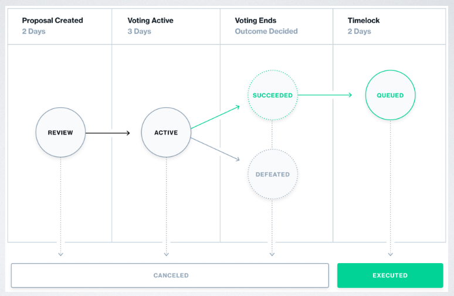
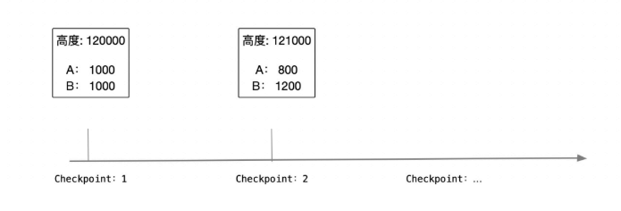
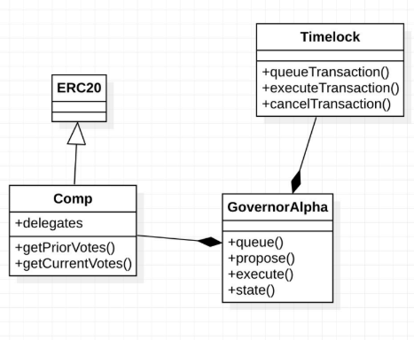
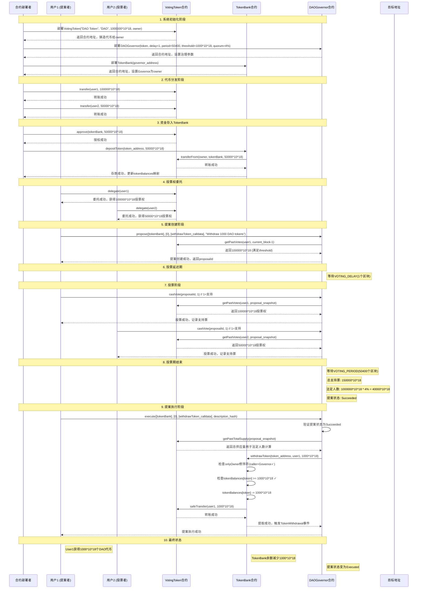

# DAO 治理
## • 治理过程:
提案、投票、执行(若通过,通常延迟执行)

## • DAO治理方法:
• 专制:管理员、多签方式
• Snapshot: 链下投票 、无需 GAS
• 治理代币投票 + 链上执行

## 投票治理

# 链下治理 -Snapshot
- 工作原理:

- • 链下快照所有用户在每个区块高度的余额(Token、NFT)
- • 创建提案:提案内容 + 指定投票的时间和规则
- • 用户签名投票,确认每个用户的投票权。 
- • 链上执行(可选):如多签团队在链上执行决策

## 1.基本概念--快照投票机制
是一个去中心化的投票平台，专门为DAO治理设计：

- 无Gas费投票 ：用户可以在不支付以太坊Gas费的情况下进行投票
- 链下投票 ：投票过程在链下进行，但结果可以在链上执行
- 权重计算 ：基于特定区块高度的代币持有量来计算投票权重

## 2.DAO投票中的"代币"指代什么？
在DAO治理投票中，"代币"通常指的是治理代币（Governance Token），具体含义如下：

1. 治理代币的定义
治理代币是专门用于参与项目治理决策的数字资产，持有者可以：
- 对提案进行投票
- 提交新的治理提案
- 参与协议参数调整
- 决定资金分配等重要事项

2. 常见的治理代币类型
#### - **原生治理代币**
// 专门的治理代币合约
contract GovernanceToken is ERC20 {
    string public constant name = "ProjectDAO Token";
    string public constant symbol = "PDT";
    
    // 治理相关功能
    mapping(address => address) public delegates;
    mapping(address => uint256) public votingPower;
}

#### - **项目代币兼具治理功能**
// 项目的主要代币同时具备治理功能
contract ProjectToken is ERC20, IGovernance {
    // 既是交易代币，也是治理代币
    function balanceOf(address account) public view override returns (uint256) {
        return super.balanceOf(account); // 用于投票权重计算
    }
}

## 3.具体项目中的治理代币示例
### Uniswap - UNI代币
- 代币名称 ：UNI
- 用途 ：Uniswap协议的治理
- 投票内容 ：协议费用、新功能部署、资金分配
### Compound - COMP代币
- 代币名称 ：COMP
- 用途 ：Compound借贷协议治理
- 投票内容 ：利率模型、抵押率、新资产上线
### Aave - AAVE代币
- 代币名称 ：AAVE
- 用途 ：Aave协议治理和安全模块
- 投票内容 ：风险参数、新市场、协议升级

## 4.治理代币的获取方式
### 初始分发
- 空投 ：向早期用户免费分发
- ICO/IDO ：通过代币销售获得
- 团队分配 ：分配给开发团队和顾问
### 持续获得
- 流动性挖矿 ：提供流动性获得奖励
- 质押奖励 ：质押代币获得治理代币
- 参与治理 ：积极参与治理获得奖励

// 流动性挖矿获得治理代币
contract LiquidityMining {
    function claimGovernanceRewards() external {
        uint256 rewards = calculateRewards(msg.sender);
        governanceToken.mint(msg.sender, rewards);
    }
}

## 5.为什么投票需要获取投票者的代币余额？
在DAO治理和区块链投票系统中，获取投票者的代币余额是非常关键的，主要原因如下：

### 1. 投票权重的确定；
代币余额直接决定了**投票者的投票权重** ：
// 基于代币余额计算投票权重
function getVotingPower(address voter) public view returns (uint256) {
    return governanceToken.balanceOf(voter);
}

// 在投票时使用权重
function vote(uint256 proposalId, bool support) external {
    uint256 votingPower = getVotingPower(msg.sender);
    require(votingPower > 0, "No voting power");
    
    if (support) {
        proposals[proposalId].forVotes += votingPower;
    } else {
        proposals[proposalId].againstVotes += votingPower;
    }
}

### 2. 利益相关性原则
#### 经济激励对齐
- 持币越多，利益越大 ：代币持有者对项目成功有更大的经济激励
- 决策影响承担 ：持币多的人承担更大的决策后果
- 长期承诺体现 ：代币持有量反映了对项目的信心和承诺
  
// 示例：基于持币量的分层投票权
function calculateVotingWeight(uint256 tokenBalance) public pure returns (uint256) {
    if (tokenBalance >= 10000 ether) {
        return tokenBalance * 120 / 100;  // 大户获得20%加权
    } else if (tokenBalance >= 1000 ether) {
        return tokenBalance * 110 / 100;  // 中户获得10%加权
    } else {
        return tokenBalance;  // 小户按原始余额
    }
}

### 3. 防止攻击和操纵
#### 女巫攻击防护
// 设置最低投票门槛
function vote(uint256 proposalId, bool support) external {
    uint256 votingPower = governanceToken.balanceOf(msg.sender);
    require(votingPower >= MIN_VOTING_THRESHOLD, "Insufficient tokens to vote");
    // 防止创建大量小额账户进行攻击
}

#### 闪电贷攻击防护
// 使用快照机制防止临时借贷投票
struct Proposal {
    uint256 snapshotBlock;  // 提案创建时的区块高度
    // ... 其他字段
}

function vote(uint256 proposalId, bool support) external {
    Proposal storage proposal = proposals[proposalId];
    // 使用快照时刻的余额，而非当前余额
    uint256 votingPower = governanceToken.balanceOfAt(msg.sender, proposal.snapshotBlock);
}

### 4. 治理参与的公平性
#### 按贡献分配权力
- 投资风险承担 ：持币者承担了项目失败的风险
- 资源贡献 ：通过购买代币为项目提供了资金支持
- 网络效应 ：持币量大的参与者通常对生态系统贡献更多

### 5. 代币余额的其他考虑因素
- 锁定期要求 ：可能要求代币锁定一定时间才能投票
- 委托机制 ：允许小户将投票权委托给专业的治理参与者
- 多重签名 ：大额持有者可能需要多重签名确认
- 时间加权 ：持币时间越长，投票权重越大

## 6.时间点快照
在DAO投票中，"snapshot"指的是在特定区块高度拍摄的"快照"：
**代码示例**：
// 在区块高度18500000时获取用户代币余额
function getVotingPower(address user, uint256 blockNumber) external view returns (uint256) {
    return token.balanceOfAt(user, blockNumber);
}

- 防止操纵 ：确定投票开始前的代币分布，防止临时购买代币来影响投票
- 公平性 ：所有参与者基于同一时间点的持仓进行投票
- 透明度 ：任何人都可以验证在该区块高度的代币分布

### 时间点快照--技术实现原理
#### 常见的快照策略
- 代币持有量 ：基于ERC-20代币余额
- NFT持有 ：基于NFT数量或稀有度
- 流动性提供 ：基于LP代币持有量
- 委托投票 ：支持代币持有者委托他人投票

#### 代码示例
// SPDX-License-Identifier: MIT
pragma solidity ^0.8.0;

interface IERC20Votes {
    function balanceOf(address account) external view returns (uint256);
    function getPastVotes(address account, uint256 blockNumber) external view returns (uint256);
    function totalSupply() external view returns (uint256);
}

// DAO治理合约 - 用于管理去中心化自治组织的提案和投票
contract DAOGovernance {
    
    // 投票延迟期（区块数）- 提案创建后多久开始投票
    uint256 public constant VOTING_DELAY = 1;
    
    // 投票期（区块数）- 投票持续多长时间
    uint256 public constant VOTING_PERIOD = 50400; // 约7天（假设15秒一个区块）
    
    // 提案阈值 - 创建提案需要的最小投票权重
    uint256 public constant PROPOSAL_THRESHOLD = 1000 * 10**18; // 1000个代币
    
    // 法定人数百分比 - 提案通过需要的最小参与度
    uint256 public constant QUORUM_PERCENTAGE = 4; // 4%
    
    // 投票代币合约
    IERC20Votes public immutable token;
    
    // 提案计数器
    uint256 public proposalCount;
    
    // 提案状态枚举
    enum ProposalState {
        Pending,    // 等待投票开始
        Active,     // 投票进行中
        Defeated,   // 被否决
        Succeeded,  // 通过
        Executed    // 已执行
    }
    
    // 提案结构体定义 - 包含提案的所有相关信息
    struct Proposal {
        uint256 id;                          // 提案的唯一标识符
        address proposer;                    // 提案发起者
        string description;                  // 提案的描述内容
        uint256 snapshotBlock;              // 快照区块高度 - 确定投票权重计算的基准区块
        uint256 votingStartBlock;           // 投票开始区块
        uint256 votingEndBlock;             // 投票结束区块
        uint256 forVotes;                   // 支持票数的总计
        uint256 againstVotes;               // 反对票数的总计
        uint256 abstainVotes;               // 弃权票数的总计
        bool executed;                      // 是否已执行
        mapping(address => bool) hasVoted;   // 记录每个地址是否已经投票
    }
    
    // 存储所有提案
    mapping(uint256 => Proposal) public proposals;
    
    // 事件定义
    event ProposalCreated(
        uint256 indexed proposalId,
        address indexed proposer,
        string description,
        uint256 snapshotBlock,
        uint256 votingStartBlock,
        uint256 votingEndBlock
    );
    
    event VoteCast(
        address indexed voter,
        uint256 indexed proposalId,
        uint8 support, // 0=反对, 1=支持, 2=弃权
        uint256 weight
    );
    
    event ProposalExecuted(uint256 indexed proposalId);
    
    // 构造函数
    constructor(address _token) {
        require(_token != address(0), "Invalid token address");
        token = IERC20Votes(_token);
    }
    
    // 创建新提案的函数
    function createProposal(string memory description) external returns (uint256) {
        // 检查提案者是否有足够的投票权重
        uint256 proposerVotes = token.getPastVotes(msg.sender, block.number - 1);
        require(proposerVotes >= PROPOSAL_THRESHOLD, "Insufficient voting power to propose");
        
        // 递增提案计数器
        proposalCount++;
        uint256 proposalId = proposalCount;
        
        // 设置关键区块高度
        uint256 snapshotBlock = block.number - 1;  // 使用前一个区块作为快照
        uint256 votingStartBlock = block.number + VOTING_DELAY;
        uint256 votingEndBlock = votingStartBlock + VOTING_PERIOD;
        
        // 创建提案
        Proposal storage newProposal = proposals[proposalId];
        newProposal.id = proposalId;
        newProposal.proposer = msg.sender;
        newProposal.description = description;
        newProposal.snapshotBlock = snapshotBlock;
        newProposal.votingStartBlock = votingStartBlock;
        newProposal.votingEndBlock = votingEndBlock;
        newProposal.executed = false;
        
        emit ProposalCreated(
            proposalId,
            msg.sender,
            description,
            snapshotBlock,
            votingStartBlock,
            votingEndBlock
        );
        
        return proposalId;
    }
    
    // 投票函数 - 允许代币持有者对提案进行投票
    // support: 0=反对, 1=支持, 2=弃权
    function vote(uint256 proposalId, uint8 support) external {
        require(support <= 2, "Invalid vote type");
        
        // 从存储中获取指定ID的提案引用
        Proposal storage proposal = proposals[proposalId];
        require(proposal.id != 0, "Proposal does not exist");
        
        // 检查投票时间窗口
        require(block.number >= proposal.votingStartBlock, "Voting not started");
        require(block.number <= proposal.votingEndBlock, "Voting ended");
        
        // 检查是否已经投票
        require(!proposal.hasVoted[msg.sender], "Already voted");
        
        // 获取投票者在快照区块时的代币余额作为投票权重
        uint256 votingPower = token.getPastVotes(msg.sender, proposal.snapshotBlock);
        require(votingPower > 0, "No voting power");
        
        // 记录投票
        proposal.hasVoted[msg.sender] = true;
        
        // 根据投票类型更新计数
        if (support == 0) {
            proposal.againstVotes += votingPower;
        } else if (support == 1) {
            proposal.forVotes += votingPower;
        } else {
            proposal.abstainVotes += votingPower;
        }
        
        emit VoteCast(msg.sender, proposalId, support, votingPower);
    }
    
    // 获取提案状态
    function getProposalState(uint256 proposalId) public view returns (ProposalState) {
        Proposal storage proposal = proposals[proposalId];
        require(proposal.id != 0, "Proposal does not exist");
        
        if (proposal.executed) {
            return ProposalState.Executed;
        }
        
        if (block.number < proposal.votingStartBlock) {
            return ProposalState.Pending;
        }
        
        if (block.number <= proposal.votingEndBlock) {
            return ProposalState.Active;
        }
        
        // 投票已结束，检查是否通过
        if (_quorumReached(proposalId) && _voteSucceeded(proposalId)) {
            return ProposalState.Succeeded;
        } else {
            return ProposalState.Defeated;
        }
    }
    
    // 检查法定人数是否达到
    function _quorumReached(uint256 proposalId) internal view returns (bool) {
        Proposal storage proposal = proposals[proposalId];
        uint256 totalVotes = proposal.forVotes + proposal.againstVotes + proposal.abstainVotes;
        uint256 totalSupply = token.totalSupply();
        return totalVotes * 100 >= totalSupply * QUORUM_PERCENTAGE;
    }
    
    // 检查投票是否成功（支持票 > 反对票）
    function _voteSucceeded(uint256 proposalId) internal view returns (bool) {
        Proposal storage proposal = proposals[proposalId];
        return proposal.forVotes > proposal.againstVotes;
    }
    
    // 执行提案（简化版本，实际应用中需要更复杂的执行逻辑）
    function executeProposal(uint256 proposalId) external {
        require(getProposalState(proposalId) == ProposalState.Succeeded, "Proposal not succeeded");
        
        Proposal storage proposal = proposals[proposalId];
        proposal.executed = true;
        
        // 这里应该包含实际的执行逻辑
        // 例如：转移资金、更改参数、调用其他合约等
        
        emit ProposalExecuted(proposalId);
    }
    
    // 获取提案详细信息
    function getProposal(uint256 proposalId) external view returns (
        uint256 id,
        address proposer,
        string memory description,
        uint256 snapshotBlock,
        uint256 votingStartBlock,
        uint256 votingEndBlock,
        uint256 forVotes,
        uint256 againstVotes,
        uint256 abstainVotes,
        bool executed
    ) {
        Proposal storage proposal = proposals[proposalId];
        require(proposal.id != 0, "Proposal does not exist");
        
        return (
            proposal.id,
            proposal.proposer,
            proposal.description,
            proposal.snapshotBlock,
            proposal.votingStartBlock,
            proposal.votingEndBlock,
            proposal.forVotes,
            proposal.againstVotes,
            proposal.abstainVotes,
            proposal.executed
        );
    }
    
    // 检查地址是否已投票
    function hasVoted(uint256 proposalId, address voter) external view returns (bool) {
        return proposals[proposalId].hasVoted[voter];
    }
}

# 链上治理 - 提案
• 提交执行的动作(调用哪个合约的哪个方法)

• 使用底层调用:可以执行所有可能的函数调用。

• 治理合约保存要调用的 calldata 、target 等信息

bytes memory payload = abi.encodeWithSignature("setFee(uint256)", 10);

(bool success, bytes memory returnData) = address(target).call(payload);

require(success);

# 链上治理 - 投票
问题:用户会频繁转账,如何防止转账后,重复投票?

在每次转账的时候,记录一个检查点,检查点上写入区块高度,及对应的票数。
投票时,定位的提案区块高度在哪个检查点上,从对应的检查点上,获取其对应的票数。

# 链上治理 -执行
• TimeClock : 延迟执行

• 提供额外的时间来模拟执行、审查代码,发现执行可能潜在的问题,必要时紧急采取行动。

• 给执行提案不利的一方有时间窗口退出。

- compound链上治理投票的源代码
https://github.com/compound-finance/compound-protocol

# 6月2日任务
源代码路径：D:\uniswapV2\src\DAO
测试文件路径：D:\uniswapV2\test\logs\DAOtest.logs
## DAO治理系统序列图

## 关键交互说明
### 1. 权限控制
- TokenBank的 withdrawToken() 函数使用 onlyOwner 修饰符
- DAOGovernor被设置为TokenBank的owner
- 只有通过治理投票才能执行资金提取
### 2. 投票权机制
- 使用ERC20Votes扩展，支持投票权委托
- getPastVotes() 确保使用历史快照，防止闪电贷攻击
- 投票权基于代币余额，但需要先委托才能激活
### 3. 治理流程
- 提案阈值 : 需要1000*10^18投票权才能创建提案
- 投票延迟 : 1个区块，给用户准备时间
- 投票期 : 50400个区块，约7天
- 法定人数 : 总供应量的4%
### 4. 资金安全
- TokenBank通过 tokenBalances 映射跟踪存款
- 使用SafeERC20防止代币转账漏洞
- ReentrancyGuard防止重入攻击
### 5. 状态变化
- 提案状态: Pending → Active → Succeeded → Executed
- 投票权在委托时立即生效，但历史快照用于投票
- 资金提取会同时更新TokenBank内部账本和实际代币余额
这个序列图展示了完整的DAO治理流程，从初始化到最终执行，体现了去中心化治理的核心机制。

## 快照机制的工作原理
### 1. 自动快照记录
- 每当代币转移时， ERC20Votes 会自动记录检查点（checkpoints）
- 这些检查点包含区块号和该时刻的投票权重
### 2. 投票权重查询
- getPastVotes(address account, uint256 blockNumber) 可以查询任何地址在指定区块的投票权重
- 这确保了投票权重基于提案创建时的快照，而不是投票时的余额
### 3. 防止操纵
- 投票延迟机制确保快照区块是已确定的过去区块
- 防止用户临时购买代币来影响投票