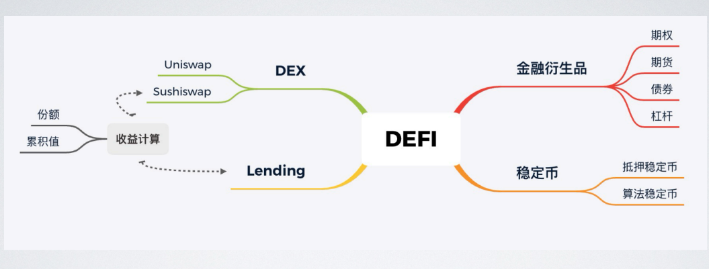
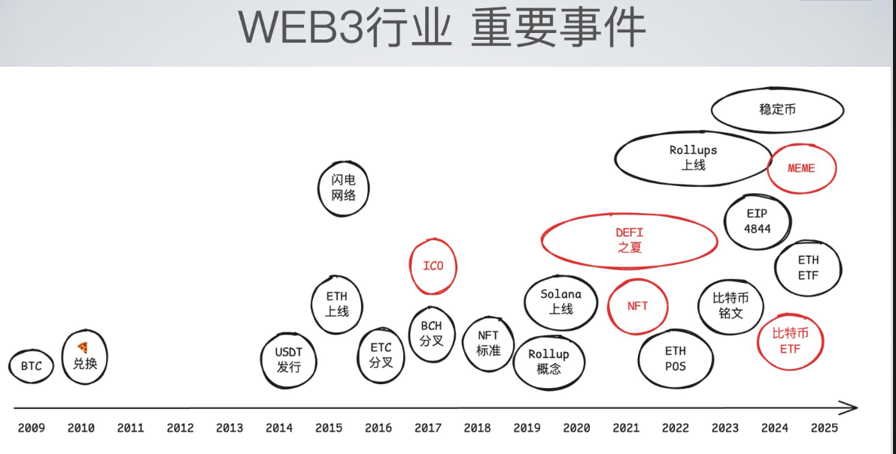
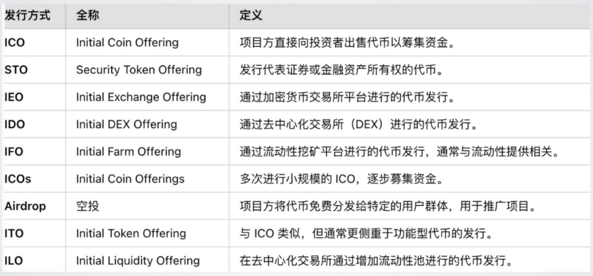
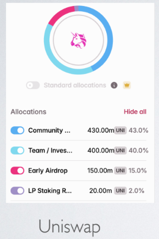
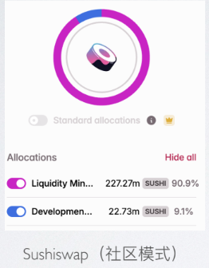

# DEFI
“去中心化金融”（Decentralized Finance）的缩写
/ˌdiːˈsentrəlaɪzd/

## 稳定币
### 1.抵押稳定币
#### 1.**去中心化**
1. DAI：由 MakerDAO 管理，主要通过**抵押以太坊（ETH）**来生成。用户可以将 ETH 存入 MakerDAO 的智能合约中作为抵押品，借出 DAI。**去中心化**

2. sUSD：由 Synthetix 提供，通过 **抵押 Synthetix Network Token (SNX)** 来生成。
用户可以将 SNX 存入 Synthetix 系统中，借出 sUSD。  **去中心化**

3. Fei：由 Fei Protocol 管理，主要通过**抵押 ETH 和 USDC 来生成**。Fei 使用一种独特的机制来保持其与美元的稳定价值。**去中心化**

4. MUSD：由 Mooniswap 提供，通过**抵押 ETH 来生成**。MUSD 使用 Mooniswap 的流动性池来保持其与美元的稳定价值。**去中心化**

5. RSR：由 Reserve Protocol 提供，通过抵押多种加密资产来生成。Reserve 使用一种多抵押品的机制来保持其稳定币（如 USDT、USDC）的稳定价值。**去中心化**

#### 2.**中心化**
由中心化的机构或公司发行和管理的稳定币。这些**机构通常持有相应的法定货币或其他资产作为储备**，以**确保**稳定币的价值与**目标资产（如美元）保持一致**。

1. USDT (Tether)：

- 发行方：Tether 公司。
- 机制：每单位 USDT 与一单位的美元挂钩。
- Tether 公司声称其储备中持有等量的美元或其他法定货币。
- 特点：**通过中心化机构发行和管理**，用户需要信任 Tether 公司来保持其价值稳定。

2. USDC (USD Coin)：

- 发行方：Circle 和 Coinbase 公司联合发行。
- 机制：每单位 USDC 与一单位的美元挂钩。Circle 提供定期的储备- 审计报告，以证明其储备的真实性和透明度。
- 特点：**通过中心化机构发行和管理**，但相比 USDT，USDC 在透明度和监管合规性方面做得更好。

3. BUSD (Binance USD)：

- 发行方：Binance 公司。
- 机制：每单位 BUSD 与一单位的美元挂钩。
- BUSD 由美元和银行存款支持。
- 特点：**通过中心化机构发行和管理**，用户需要信任 Binance 公司来保持其价值稳定。

4. PAX (Paxos Standard)：

- 发行方：Paxos 公司。
- 机制：每单位 PAX 与一单位的美元挂钩。PAX 由美元存款支持，并定期进行储备审计。
- 特点：通过**中心化机构发行和管理**，具有较高的透明度和监管合规性。

5. GUSD (Gemini Dollar)：

- 发行方：Gemini 公司。
- 机制：每单位 GUSD 与一单位的美元挂钩。GUSD 由美元存款支持，并定期进行储备审计。
- 特点：通过**中心化机构发行和管理**，具有较高的透明度和监管合规性。

6. HUSD (Huobi USD)：

发行方：Huobi 公司。
机制：每单位 HUSD 与一单位的美元挂钩。HUSD 由美元和其他法币支持。
特点：通过**中心化机构发行和管理**，用户需要信任 Huobi 公司来保持其价值稳定。

### 2. 算法稳定币
算法稳定币是指通过算法机制来维持其与特定资产（通常是法定货币，如美元）稳定价值的加密货币。这些稳定币不依赖于抵押物，而是通过算法调整市场上的供应量来保持其价值稳定。

1. Ampleforth (AMPL)：**去中心化**
Ampleforth 使用一种名为 Elastic Supply 的算法，根据市场对 AMPL 的需求动态调整其总供应量。
当 AMPL 的价格高于 1 美元时，供应量增加；当价格低于 1 美元时，供应量减少。

2. Fei：**去中心化**
Fei 使用一种混合机制，结合抵押和算法调整来保持与美元的稳定价值。
Fei 通过抵押 ETH 和 USDC 来生成，并使用一个称为 Fei Protocol 的算法来调整 Fei 的供应量。

3.Basq：**去中心化**
Basq 是一种算法稳定币，通过调整其供应量来保持与特定法定货币的稳定价值。
它使用一个名为 Feedback Loop 的算法机制来实现这一点。

4. Basis Cash (BAC) 和 Basis Share (BAS)：**去中心化**
Basis Cash 和 Basis Share 是由 Basis 协议管理的一对互补代币，通过算法调整机制来保持与美元的稳定价值。
Basis Cash 的供应量会根据其价格进行调整，而 Basis Share 用于调整 Basis Cash 的供应量。

5. MIM (Magic Internet Money)：**去中心化**
MIM 是由 Abracadabra Money 提供的一种算法稳定币。
它通过抵押 ETH 和使用特定算法来调整供应量，以保持与美元的稳定价值。

6.Frax (FRAX)：**去中心化**
Frax 是一种算法稳定币，结合了抵押和算法调整机制。
Frax 通过抵押法币支持的代币（如 USDC）和算法调整来维持其价值稳定。
这些算法稳定币通过不同的算法机制来动态调整其供应量，以保持与目标资产的稳定价值。

## DEX
“去中心化交易所”（Decentralized Exchange）

### 特点
1. 去中心化：交易直接在区块链上进行，不依赖于传统的中心化交易所，减少了中心化风险。
2. 透明度：所有交易记录都公开透明，记录在区块链上，任何人都可以查看。
3. 自动化：智能合约自动执行交易，减少了人为干预的可能性。
4. 低交易成本：由于去除了中间机构，交易费用通常较低。
5. 安全性：交易直接与智能合约交互，减少了黑客攻击的风险。
6. 全球可访问性：只要有互联网连接和区块链钱包，任何人都可以使用 DEX，不受地理位置限制。

### 常见的 DEX 平台
1. Uniswap：基于自动做市商机制，通过流动性池来支持交易。
2. Curve：专注于稳定币交易，利用自动做市商机制来优化交易成本。
3. Balancer：允许用户创建自定义的流动性池，并通过智能合约来管理这些池。
4. SushiSwap：基于 Uniswap 的代码进行改进，提供更高的交易佣金给流动性提供者。

## CEX
“中心化交易所”（Centralized Exchange）

### 特点包括：

1. 中心化管理：交易所由一个中心化的机构或公司运营和管理，用户需要信任该交易所来存储和管理他们的资金。
2. 用户友好：通常提供直观的用户界面和客户服务支持，便于用户进行交易和管理账户。
3. 广泛支持：支持多种加密货币和交易对，提供丰富的交易选项。
4. 交易成本：可能收取较高的交易费用或交易佣金。
5. 监管要求：需要遵守各国的金融监管法规，进行定期的审计和报告。
6. 流动性：由于中心化交易所通常拥有较大的资金池，能够提供较高的流动性和较低的交易成本。

### 常见的中心化交易所
1. Coinbase：提供多种加密货币交易，支持法币存取款，并提供客户支持。
2. Binance：全球最大的加密货币交易所之一，支持多种加密货币交易对。
3. Kraken：提供广泛的加密货币和法币交易对，强调安全性和透明度。
4. Huobi：提供多种加密货币交易，支持国际用户，并进行定期的监管审计。

## lending  /ˈlendɪŋ/ （出借贷款）
- 在区块链中，“Lending”指的是加密货币的借贷活动，即用户可以将他们的加密货币借给其他用户或机构，以获得一定的利息收益。
- 这种借贷活动通常在去中心化金融（DeFi）平台上进行，用户不需要通过传统的中心化金融机构（如银行）即可参与。

### 主要概念
#### 1.借贷平台：

区块链上的借贷平台（如 **Aave、Compound、MakerDAO**）使用智能合约来自动管理借贷过程。
这些平台允许用户将加密货币存入作为抵押物，并借出其他类型的加密货币或稳定币。

#### 2.抵押物：

用户需要将一部分加密货币存入平台作为抵押物，以借出其他加密货币。
常见的抵押物包括比特币（BTC）、以太坊（ETH）、稳定币（如 USDT、USDC）等。

#### 3.借款：

用户可以通过提供抵押物来借款，借款通常是其他类型的加密货币或稳定币。
借款人需要支付一定的利息，利率通常由市场供需决定。

#### 4.利息收益：

存款者可以获得利息收益，因为他们将加密货币借给借款人。
利息收益的多少取决于平台的利率设置和市场需求。

#### 5.风险管理：

借贷平台需要管理风险，包括流动性风险、抵押品价值波动风险等。
例如，如果借款人无法偿还借款，平台可能会拍卖抵押物来回收资金。

#### 6.智能合约：

区块链上的借贷活动通过智能合约自动执行，减少了人为干预的可能性。
智能合约可以自动调整利率、检查抵押品价值，并在必要时执行拍卖等操作。

# 资产(TOKEN) 发行   DEX 协议
## WEB3行业 重要事件

## 资产即token
• 资产是所有权的表示

• 链上智能合约可创建不被他人剥夺的资产,Token 即是其链上表示

• ERC20、ERC721 标准让资产发行、管理和交易变得无比简单

## Token 分类
1. 实用型/功能型代币(Utility tokens):持有才可以使用某项服务(使用权)

-• 例如:LINK 、GRT、ETH (不是 ERC20)、WLD(WorldCoin)

-• 支付型代币(Payment tokens): 稳定币 USDC、USDT、USDS (大家场常说的U)

2. 权益型/证券型代币(Security tokens): 代表的是所有权, 享有平台(资产)的未来价值,例如:分红、投票治理、债券等

-• 例如: stETH、LP Token 、UNI (治理)、RWA 类

-• 证券发行需要满足相应的法规,如备案、审批,投资人 KYC、反洗钱检查,有相应的法人主体的。(SEC 诉 Ripple)

## Token 发行 (Token Generation Event, TGE)

### 发行方式

### 典型发行流程
• 1. 项目构思和白皮书撰写:项目团队首先需要构思项目的具体内容和目标,并撰写白皮书,详细描述项目的技术优势、经济模型

• 2. 寻求投资机构融资 (根据需要)

• 3. 产品开发、智能合约开发, Token 的发行和流通。

• 4. 市场推广和社区建设:通过各种渠道进行市场推广,吸引潜在投资者和用户,并建立和维护社区。

• 5. Token 公开发行:通过 ICO、STO 或 IEO 等方式公开发售 Token,募集项目开发所需的资金(根据需要)

• 6. Token 上线交易所:将 Token 上线至各大交易所,提供流动性,方便用户进行交易。

## Token 经济模型
Token 经济模型对项目成败很关键,另外一个关键因素是:团队

**经济模型两个重要考量:**
  -• 项目如何捕获价值(商业模型)、或不捕获价值
  
  -• 如何分享价值(如何激励、是否公平、公正)
  
  -• 如何释放(如何锁仓、增发)
  
  -• 好的经济模型让项目形成正向飞轮:
  
  -• 用户参与 → Token 激励 → 协议使用增长 → 收入上升 → Token 价值上升 → 更多用户参与(社区壮大)

## **Token 分配**
通常用户和社区占大多数份额
价格回归的体现:用户创造的价值,回归用户

通常用户和社区占大多数份额
价格回归的体现:用户创造的价值,回归用户

### 用户获取Token 方式(发行方式):
1. 买 - IDO / 私募
2. 挖矿(作为奖励发放)
3. 空投

https://tokenomist.ai/compound-governance-token
该网站：是一个专注于分析Compound治理代币（COMP）代币经济学的数据平台，提供关于该代币供应量、分配机制、释放计划等详细信息[1]。该网站整合了白皮书内容、链上数据以及代币释放动态，帮助用户追踪市场变化并制定决策[1]。平台的核心功能包括对COMP代币经济模型的深度解析，例如代币分配规则、流通量变化趋势以及与协议治理相关的数据指标[1]。

### IDO - Launchpad  发射台
1. IDO: 在 DEX 上进行的代币发行方式(一级市场,直接卖)；
2. Launchpad 为 IDO 提供发行服务的平台；
• https://polkastarter.com/

• https://www.pump.fun/

3. 中心化交易所也可能有自己的 LaunchPad , 如币安

示例：**Hydro: The RWA DePIN Protocol**
https://polkastarter.com/projects/hydro

### IDO - 常见逻辑
1. 以 0.0001 eth 的单价预售 100 万的 OPS Token
OPS Token 指代某个虚构项目通过Launchpad发行的ERC-20标准代币，具体参数包括：

总供应量：100万枚
单价：0.001 ETH
募资目标：100-200 ETH
参与门槛：0.001 ETH

2. 在某时间内目标凑集 100 ETH, 最多 200ETH

3. 预售门槛为 0.001 ETH

4. 预售用户可 claim-索要 Token,预售失败 refund-退款 本金

示例代码：
https://github.com/lbc-team/hello_foundry/blob/main/src/IDO.sol

# 私募-锁仓
• 私募投资人或项目团队,通常持有的 Token 数量较大,为了避免大量的抛售压力,通常会设定锁仓释放机制

• 锁仓: 指某部分 Token 不能立即出售,而是按照既定节奏逐步解锁(Vesting)

• 锁仓方式:

• 线性释放(Linear Vesting):按时间等额释放(如每月解锁 1/24)

• 周期释放(Step Vesting):每季度或每半年释放一次

• 参与型(milestne)释放:根据任务、指标释放, 如作为社区激励

• 有一些机制会设置 Cliff(悬崖期 )- “首次解锁等待期”:在 cliff 期内,受益人一分钱都拿不到。Cliff 结束后才开始释放。

**示例:**
项目 A 团队总共获得 10% 的代币,采用如下锁仓结构:
• Cliff:12 个月
• 线性释放:接下来的 24 个月
意味着前 12 个月团队完全拿不到任何代币,第 13 个月起开始每月解锁 1/24。

# 5月26日作业
编写一个 Vesting 合约（可参考 OpenZepplin Vesting 相关合约）， 相关的参数有：
beneficiary： 受益人
锁定的 ERC20 地址
Cliff：12 个月
线性释放：接下来的 24 个月，从 第 13 个月起开始每月解锁 1/24 的 ERC20
Vesting 合约包含的方法 release() 用来释放当前解锁的 ERC20 给受益人，Vesting 合约部署后，开始计算 Cliff ，并转入 100 万 ERC20 资产。

对话AI:
在D:\blockchain\foundry\s6\src\tokens  创建erc20合约，文件名叫做：
vestingToken.sol，token的名字叫做vesting，发行量200万，铸造后转给合约部署者；
创建一个 Vesting 合约（必须参考 OpenZepplin Vesting 相关合约），目录位于D:\blockchain\foundry\s6\src\others，文件名为vesting.sol，合约代码如下：
相关的参数有：
beneficiary： 受益人
锁定的 ERC20 地址
Cliff：12 个月
线性释放：接下来的 24 个月，从 第 13 个月起开始每月解锁 1/24 的 ERC20
Vesting 合约包含的方法 release() 用来释放当前解锁的 ERC20 给受益人，Vesting 合约部署后，开始计算 Cliff ，并转入 100 万 ERC20 资产。

# 质押挖矿
## LP 概念理解及应用  
"LP" 是 Liquidity Provider Token（流动性提供者凭证代币） 的缩写。

这是用户**向去中心化交易所**（DEX）**提供流动性后获得的质押凭证**。
**举例：**
例如, Sushi 所有的 Token 的都是**质押 LP** 通过奖励 mint 出来的。

### LP生成机制
当用户向 **AMM（自动化做市商）**类 DEX（如 Uniswap/PancakeSwap）的流动性池**存入配对资产**时（如 ETH/USDC），智能合约会按比例铸造对应数量的 LP 代币。例如存入 1 ETH 和 3000 USDC 到 ETH/USDC 池，可能获得 10 个 UNI-V2 LP 代币。

### 价值锚定
每个 LP 代币对应池中资产的所有权份额。其价值 = （池中代币A总量 × 代币A价格 + 池中代币B总量 × 代币B价格） / LP 代币总供应量。

### 功能载体
📌 赎回权：销毁 LP 代币可提取对应比例的底层资产
📌 收益权：持有 LP 代币自动获得该池交易手续费分成（如 **Uniswap V2 收取 0.3% 手续费**，按 LP 份额分配）
📌 治理权：部分协议允许用 LP 代币参与治理投票（如 Curve）

### 质押 LP 的实际意义
当用户将 LP 代币进行二次质押（如质押到 Yearn/SushiSwap 的收益农场），**本质是在进行流动性挖矿**：

1. 收益叠加
原始收益（交易手续费） + 质押奖励（治理代币/稳定币）。例如在 PancakeSwap 质押 CAKE/BNB LP，可获得 0.17% 手续费 + CAKE 代币奖励。

2. 风险结构

✅ 正向风险：获得双重收益
❌ 负向风险：无常损失（Impermanent Loss） + 智能合约漏洞风险
典型场景

// 伪代码示例：质押 LP 获取奖励
function stakeLP(uint256 amount) external {
    LPToken.safeTransferFrom(msg.sender, address(this), amount); // 转入 LP
    _updateReward(msg.sender); // 计算奖励
    stakedBalance[msg.sender] += amount; // 记录质押量
}

