# DEFI
“去中心化金融”（Decentralized Finance）的缩写
/ˌdiːˈsentrəlaɪzd/

## 稳定币
### 1.抵押稳定币
#### 1.**去中心化**
1. DAI：由 MakerDAO 管理，主要通过**抵押以太坊（ETH）**来生成。用户可以将 ETH 存入 MakerDAO 的智能合约中作为抵押品，借出 DAI。**去中心化**

makerDAO现在叫sky  新的稳定币名字：USDS
DAI还存在

2. sUSD：由 Synthetix 提供，通过 **抵押 Synthetix Network Token (SNX)** 来生成。
用户可以将 SNX 存入 Synthetix 系统中，借出 sUSD。  **去中心化**

3. Fei：由 Fei Protocol 管理，主要通过**抵押 ETH 和 USDC 来生成**。Fei 使用一种独特的机制来保持其与美元的稳定价值。**去中心化**

4. MUSD：由 Mooniswap 提供，通过**抵押 ETH 来生成**。MUSD 使用 Mooniswap 的流动性池来保持其与美元的稳定价值。**去中心化**

5. RSR：由 Reserve Protocol 提供，通过抵押多种加密资产来生成。Reserve 使用一种多抵押品的机制来保持其稳定币（如 USDT、USDC）的稳定价值。**去中心化**

#### 2.**中心化**
由中心化的机构或公司发行和管理的稳定币。这些**机构通常持有相应的法定货币或其他资产作为储备**，以**确保**稳定币的价值与**目标资产（如美元）保持一致**。

1. USDT (Tether)：

- 发行方：Tether 公司。
- 机制：每单位 USDT 与一单位的美元挂钩。
- Tether 公司声称其储备中持有等量的美元或其他法定货币。
- 特点：**通过中心化机构发行和管理**，用户需要信任 Tether 公司来保持其价值稳定。

2. USDC (USD Coin)：

- 发行方：Circle 和 Coinbase 公司联合发行。
- 机制：每单位 USDC 与一单位的美元挂钩。Circle 提供定期的储备- 审计报告，以证明其储备的真实性和透明度。
- 特点：**通过中心化机构发行和管理**，但相比 USDT，USDC 在透明度和监管合规性方面做得更好。

3. BUSD (Binance USD)：

- 发行方：Binance 公司。
- 机制：每单位 BUSD 与一单位的美元挂钩。
- BUSD 由美元和银行存款支持。
- 特点：**通过中心化机构发行和管理**，用户需要信任 Binance 公司来保持其价值稳定。

4. PAX (Paxos Standard)：

- 发行方：Paxos 公司。
- 机制：每单位 PAX 与一单位的美元挂钩。PAX 由美元存款支持，并定期进行储备审计。
- 特点：通过**中心化机构发行和管理**，具有较高的透明度和监管合规性。

5. GUSD (Gemini Dollar)：

- 发行方：Gemini 公司。
- 机制：每单位 GUSD 与一单位的美元挂钩。GUSD 由美元存款支持，并定期进行储备审计。
- 特点：通过**中心化机构发行和管理**，具有较高的透明度和监管合规性。

6. HUSD (Huobi USD)：

发行方：Huobi 公司。
机制：每单位 HUSD 与一单位的美元挂钩。HUSD 由美元和其他法币支持。
特点：通过**中心化机构发行和管理**，用户需要信任 Huobi 公司来保持其价值稳定。

### 2. 算法稳定币
算法稳定币是指通过算法机制来维持其与特定资产（通常是法定货币，如美元）稳定价值的加密货币。这些稳定币不依赖于抵押物，而是通过算法调整市场上的供应量来保持其价值稳定。

1. Ampleforth (AMPL)：**去中心化**
Ampleforth 使用一种名为 Elastic Supply 的算法，根据市场对 AMPL 的需求动态调整其总供应量。
当 AMPL 的价格高于 1 美元时，供应量增加；当价格低于 1 美元时，供应量减少。

2. Fei：**去中心化**
Fei 使用一种混合机制，结合抵押和算法调整来保持与美元的稳定价值。
Fei 通过抵押 ETH 和 USDC 来生成，并使用一个称为 Fei Protocol 的算法来调整 Fei 的供应量。

3.Basq：**去中心化**
Basq 是一种算法稳定币，通过调整其供应量来保持与特定法定货币的稳定价值。
它使用一个名为 Feedback Loop 的算法机制来实现这一点。

4. Basis Cash (BAC) 和 Basis Share (BAS)：**去中心化**
Basis Cash 和 Basis Share 是由 Basis 协议管理的一对互补代币，通过算法调整机制来保持与美元的稳定价值。
Basis Cash 的供应量会根据其价格进行调整，而 Basis Share 用于调整 Basis Cash 的供应量。

5. MIM (Magic Internet Money)：**去中心化**
MIM 是由 Abracadabra Money 提供的一种算法稳定币。
它通过抵押 ETH 和使用特定算法来调整供应量，以保持与美元的稳定价值。

6.Frax (FRAX)：**去中心化**
Frax 是一种算法稳定币，结合了抵押和算法调整机制。
Frax 通过抵押法币支持的代币（如 USDC）和算法调整来维持其价值稳定。
这些算法稳定币通过不同的算法机制来动态调整其供应量，以保持与目标资产的稳定价值。

## DEX
“去中心化交易所”（Decentralized Exchange）
Token 兑换 Token
### 特点
用户始终掌握资产、互操作性好（作为金融底层基础设施）、抗审查 …
1. 去中心化：交易直接在区块链上进行，不依赖于传统的中心化交易所，减少了中心化风险。
2. 透明度：所有交易记录都公开透明，记录在区块链上，任何人都可以查看。
3. 自动化：智能合约自动执行交易，减少了人为干预的可能性。
4. 低交易成本：由于去除了中间机构，交易费用通常较低。
5. 安全性：交易直接与智能合约交互，减少了黑客攻击的风险。
6. 全球可访问性：只要有互联网连接和区块链钱包，任何人都可以使用 DEX，不受地理位置限制。

### 常见的 DEX 平台
1. Uniswap：基于自动做市商机制，通过流动性池来支持交易。
2. Curve：专注于稳定币交易，利用自动做市商机制来优化交易成本。
3. Balancer：允许用户创建自定义的流动性池，并通过智能合约来管理这些池。
4. SushiSwap：基于 Uniswap 的代码进行改进，提供更高的交易佣金给流动性提供者。

## CEX
“中心化交易所”（Centralized Exchange）

### 特点包括：

1. 中心化管理：交易所由一个中心化的机构或公司运营和管理，用户需要信任该交易所来存储和管理他们的资金。
2. 用户友好：通常提供直观的用户界面和客户服务支持，便于用户进行交易和管理账户。
3. 广泛支持：支持多种加密货币和交易对，提供丰富的交易选项。
4. 交易成本：可能收取较高的交易费用或交易佣金。
5. 监管要求：需要遵守各国的金融监管法规，进行定期的审计和报告。
6. 流动性：由于中心化交易所通常拥有较大的资金池，能够提供较高的流动性和较低的交易成本。

### 常见的中心化交易所
1. Coinbase：提供多种加密货币交易，支持法币存取款，并提供客户支持。
2. Binance：全球最大的加密货币交易所之一，支持多种加密货币交易对。
3. Kraken：提供广泛的加密货币和法币交易对，强调安全性和透明度。
4. Huobi：提供多种加密货币交易，支持国际用户，并进行定期的监管审计。

## lending  /ˈlendɪŋ/ （出借贷款）
- 在区块链中，“Lending”指的是加密货币的借贷活动，即用户可以将他们的加密货币借给其他用户或机构，以获得一定的利息收益。
- 这种借贷活动通常在去中心化金融（DeFi）平台上进行，用户不需要通过传统的中心化金融机构（如银行）即可参与。

### 主要概念
#### 1.借贷平台：

区块链上的借贷平台（如 **Aave、Compound、MakerDAO**）使用智能合约来自动管理借贷过程。
这些平台允许用户将加密货币存入作为抵押物，并借出其他类型的加密货币或稳定币。

#### 2.抵押物：

用户需要将一部分加密货币存入平台作为抵押物，以借出其他加密货币。
常见的抵押物包括比特币（BTC）、以太坊（ETH）、稳定币（如 USDT、USDC）等。

#### 3.借款：

用户可以通过提供抵押物来借款，借款通常是其他类型的加密货币或稳定币。
借款人需要支付一定的利息，利率通常由市场供需决定。

#### 4.利息收益：

存款者可以获得利息收益，因为他们将加密货币借给借款人。
利息收益的多少取决于平台的利率设置和市场需求。

#### 5.风险管理：

借贷平台需要管理风险，包括流动性风险、抵押品价值波动风险等。
例如，如果借款人无法偿还借款，平台可能会拍卖抵押物来回收资金。

#### 6.智能合约：

区块链上的借贷活动通过智能合约自动执行，减少了人为干预的可能性。
智能合约可以自动调整利率、检查抵押品价值，并在必要时执行拍卖等操作。

# 资产(TOKEN) 发行   DEX 协议
## WEB3行业 重要事件

## 资产即token
• 资产是所有权的表示

• 链上智能合约可创建不被他人剥夺的资产,Token 即是其链上表示

• ERC20、ERC721 标准让资产发行、管理和交易变得无比简单

## Token 分类
1. 实用型/功能型代币(Utility tokens):持有才可以使用某项服务(使用权)

-• 例如:LINK 、GRT、ETH (不是 ERC20)、WLD(WorldCoin)

-• 支付型代币(Payment tokens): 稳定币 USDC、USDT、USDS (大家场常说的U)

2. 权益型/证券型代币(Security tokens): 代表的是所有权, 享有平台(资产)的未来价值,例如:分红、投票治理、债券等

-• 例如: stETH、LP Token 、UNI (治理)、RWA 类

-• 证券发行需要满足相应的法规,如备案、审批,投资人 KYC、反洗钱检查,有相应的法人主体的。(SEC 诉 Ripple)

## Token 发行 (Token Generation Event, TGE)

### 发行方式

### 典型发行流程
• 1. 项目构思和白皮书撰写:项目团队首先需要构思项目的具体内容和目标,并撰写白皮书,详细描述项目的技术优势、经济模型

• 2. 寻求投资机构融资 (根据需要)

• 3. 产品开发、智能合约开发, Token 的发行和流通。

• 4. 市场推广和社区建设:通过各种渠道进行市场推广,吸引潜在投资者和用户,并建立和维护社区。

• 5. Token 公开发行:通过 ICO、STO 或 IEO 等方式公开发售 Token,募集项目开发所需的资金(根据需要)

• 6. Token 上线交易所:将 Token 上线至各大交易所,提供流动性,方便用户进行交易。

## Token 经济模型
Token 经济模型对项目成败很关键,另外一个关键因素是:团队

**经济模型两个重要考量:**
  -• 项目如何捕获价值(商业模型)、或不捕获价值
  
  -• 如何分享价值(如何激励、是否公平、公正)
  
  -• 如何释放(如何锁仓、增发)
  
  -• 好的经济模型让项目形成正向飞轮:
  
  -• 用户参与 → Token 激励 → 协议使用增长 → 收入上升 → Token 价值上升 → 更多用户参与(社区壮大)

## **Token 分配**
通常用户和社区占大多数份额
价格回归的体现:用户创造的价值,回归用户

通常用户和社区占大多数份额
价格回归的体现:用户创造的价值,回归用户

### 用户获取Token 方式(发行方式):
1. 买 - IDO / 私募
2. 挖矿(作为奖励发放)
3. 空投

https://tokenomist.ai/compound-governance-token
该网站：是一个专注于分析Compound治理代币（COMP）代币经济学的数据平台，提供关于该代币供应量、分配机制、释放计划等详细信息[1]。该网站整合了白皮书内容、链上数据以及代币释放动态，帮助用户追踪市场变化并制定决策[1]。平台的核心功能包括对COMP代币经济模型的深度解析，例如代币分配规则、流通量变化趋势以及与协议治理相关的数据指标[1]。

### IDO - Launchpad  发射台
1. IDO: 在 DEX 上进行的代币发行方式(一级市场,直接卖)；
2. Launchpad 为 IDO 提供发行服务的平台；
• https://polkastarter.com/

• https://www.pump.fun/

3. 中心化交易所也可能有自己的 LaunchPad , 如币安

示例：**Hydro: The RWA DePIN Protocol**
https://polkastarter.com/projects/hydro

### IDO - 常见逻辑
1. 以 0.0001 eth 的单价预售 100 万的 OPS Token
OPS Token 指代某个虚构项目通过Launchpad发行的ERC-20标准代币，具体参数包括：

总供应量：100万枚
单价：0.001 ETH
募资目标：100-200 ETH
参与门槛：0.001 ETH

2. 在某时间内目标凑集 100 ETH, 最多 200ETH

3. 预售门槛为 0.001 ETH

4. 预售用户可 claim-索要 Token,预售失败 refund-退款 本金

示例代码：
https://github.com/lbc-team/hello_foundry/blob/main/src/IDO.sol

# 私募-锁仓
• 私募投资人或项目团队,通常持有的 Token 数量较大,为了避免大量的抛售压力,通常会设定锁仓释放机制

• 锁仓: 指某部分 Token 不能立即出售,而是按照既定节奏逐步解锁(Vesting)

• 锁仓方式:

• 线性释放(Linear Vesting):按时间等额释放(如每月解锁 1/24)

• 周期释放(Step Vesting):每季度或每半年释放一次

• 参与型(milestne)释放:根据任务、指标释放, 如作为社区激励

• 有一些机制会设置 Cliff(悬崖期 )- “首次解锁等待期”:在 cliff 期内,受益人一分钱都拿不到。Cliff 结束后才开始释放。

**示例:**
项目 A 团队总共获得 10% 的代币,采用如下锁仓结构:
• Cliff:12 个月
• 线性释放:接下来的 24 个月
意味着前 12 个月团队完全拿不到任何代币,第 13 个月起开始每月解锁 1/24。

# 5月26日作业
编写一个 Vesting 合约（可参考 OpenZepplin Vesting 相关合约）， 相关的参数有：
beneficiary： 受益人
锁定的 ERC20 地址
Cliff：12 个月
线性释放：接下来的 24 个月，从 第 13 个月起开始每月解锁 1/24 的 ERC20
Vesting 合约包含的方法 release() 用来释放当前解锁的 ERC20 给受益人，Vesting 合约部署后，开始计算 Cliff ，并转入 100 万 ERC20 资产。

对话AI:
在D:\blockchain\foundry\s6\src\tokens  创建erc20合约，文件名叫做：
vestingToken.sol，token的名字叫做vesting，发行量200万，铸造后转给合约部署者；
创建一个 Vesting 合约（必须参考 OpenZepplin Vesting 相关合约），目录位于D:\blockchain\foundry\s6\src\others，文件名为vesting.sol，合约代码如下：
相关的参数有：
beneficiary： 受益人
锁定的 ERC20 地址
Cliff：12 个月
线性释放：接下来的 24 个月，从 第 13 个月起开始每月解锁 1/24 的 ERC20
Vesting 合约包含的方法 release() 用来释放当前解锁的 ERC20 给受益人，Vesting 合约部署后，开始计算 Cliff ，并转入 100 万 ERC20 资产。

# DEX类型
## 订单薄
• 类似于传统的中⼼化交易所，通过买卖订单的撮合来完成交易。
• 以 0x 协议为代表，链下订单撮合和链上结算

## 流动性池
• 流动性池合约作为交易的对手方，⽤户可以将资⾦存⼊流动性池，作为流动性提供者
（LP），并通过提供流动性赚取交易费⽤。
• 以 Uniswap 为代表，自动作市商协议， 类似的还有：SushiSwap/Balancer/ Curve/ 
Pancakeswap/dod

# 质押挖矿
## LP 概念理解及应用  
"LP" 是 Liquidity Provider Token（流动性提供者凭证代币） 的缩写。

这是用户**向去中心化交易所**（DEX）**提供流动性后获得的质押凭证**。
**举例：**
例如, Sushi 所有的 Token 的都是**质押 LP** 通过奖励 mint 出来的。

### LP生成机制
当用户向 **AMM（自动化做市商）**类 DEX（如 Uniswap/PancakeSwap）的流动性池**存入配对资产**时（如 ETH/USDC），智能合约会按比例铸造对应数量的 LP 代币。例如存入 1 ETH 和 3000 USDC 到 ETH/USDC 池，可能获得 10 个 UNI-V2 LP 代币。

### 价值锚定
每个 LP 代币对应池中资产的所有权份额。其价值 = （池中代币A总量 × 代币A价格 + 池中代币B总量 × 代币B价格） / LP 代币总供应量。

### 功能载体
📌 赎回权：销毁 LP 代币可提取对应比例的底层资产
📌 收益权：持有 LP 代币自动获得该池交易手续费分成（如 **Uniswap V2 收取 0.3% 手续费**，按 LP 份额分配）
📌 治理权：部分协议允许用 LP 代币参与治理投票（如 Curve）

### 质押 LP 的实际意义
当用户将 LP 代币进行二次质押（如质押到 Yearn/SushiSwap 的收益农场），**本质是在进行流动性挖矿**：

1. 收益叠加
原始收益（交易手续费） + 质押奖励（治理代币/稳定币）。例如在 PancakeSwap 质押 CAKE/BNB LP，可获得 0.17% 手续费 + CAKE 代币奖励。

2. 风险结构

✅ 正向风险：获得双重收益
❌ 负向风险：无常损失（Impermanent Loss） + 智能合约漏洞风险
典型场景

// 伪代码示例：质押 LP 获取奖励
function stakeLP(uint256 amount) external {
    LPToken.safeTransferFrom(msg.sender, address(this), amount); // 转入 LP
    _updateReward(msg.sender); // 计算奖励
    stakedBalance[msg.sender] += amount; // 记录质押量
}

##  Uniswap AMM
• AMM协议： AutoMated Market Making
• AutoMate(d)： 自动，没有中间机构进行资金交易
• Market Making: 做市商（保证订单得以执行），也称为流动性提供者（LP: liquidity providers）
• 流动性指的是如何快速和无缝地购买或出售一项资产
• LP 是提供资产的人以实现快速交易。
• Uniswap 使用常量乘积模型： K = x * y

### 常量乘积模型
常量乘积模型： K = x * y
• AMM 的执行引擎， 没有价格预言机，价格用公式推导
• x：token0 的储备量（reserve0）
• y：token1 的储备量（reserve1）
• 提供流动性：
• 转入token0、token1，增加reserve0、reserve1，拿到流动性凭证（LP Token) = sqrt(x * y) 
• 兑换时，K 保持不变
• 减少reserve0，就必须增加reserve1
• 减少reserve1，就必须增加reserve0
• 移除流动性

### 原理解释
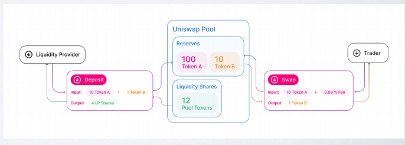
**图中包含以下几个关键角色：**

- Liquidity Provider（流动性提供者）：为流动性池提供资金，成为流动性的贡献者。
- Trader（交易者）：在流动性池中进行交易，通常是买入或卖出代币。
- Uniswap Pool（流动性池）：存放资产的中央池，交易者通过这个池进行代币兑换。

**步骤 1：**流动性提供者存款（Deposit）
输入：流动性提供者向流动性池存入 10 Token A 和 1 Token B。
输出：流动性提供者获得 **4 个流动性代币**（**LP Shares**）。
这代表流动性提供者对流动性池的份额，以后可以用来提取池中的资产。

**流动性池中的储备（Reserves）：**
Token A：100 + 10 = 110 个 Token A
Token B：10 + 1 = 11 个 Token B
流动性池的核心是 储备（Reserves），即池中持有的两种代币的总量。在这一步中，代币 A 和 B 的数量被添加到池的储备中。

流动性代币（Liquidity Shares）：
流动性池中共有 12 个流动性代币（Pool Tokens），其中流动性提供者持有 4 个。

**步骤 2**：交易者进行交易（Swap）
输入：交易者向流动性池存入 10 个个 Token A。
输出：交易者从流动性池中获得 1 个Token B，并支付 0.03% 的手续费。
手续费（Fee）：
每次交易都会有 0.03% 的手续费，这笔手续费会加到流动性池的储备中，增加了池中的资产总量。

**步骤 3：**流动性池的状态更新
Token A：110 - 10 = 100 个 Token A
Token B：11 + 1 = 12 个 Token B（加上交易者支付的手续费收入）。
流动性代币（LP Shares）：维持不变，仍然是 12 个流动性代币。

### 提供流动性
在 Uniswap 或其他 AMM（自动做市商）中，通常会将 稳定币（Stablecoin） 和 ERC-20 代币 配对，这种配对非常常见

### Mini AMM Demo
100 行代码理解AMM
https://github.com/lbc-team/hello_foundry/blob/main/src/MiniSwapPool.sol

这段代码得序列图：

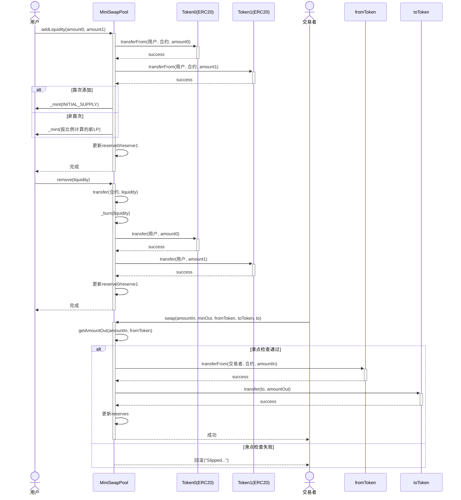

### 滑点
在 Uniswap 等**去中心化交易所**（DEX）中，滑点（Slippage） 是指用户预期的交易价格与实际执行价格之间的差异。
与订单簿不同，在 AMM（自动做市商）模型中，他人的交易可能会影响你的交易价格；
滑点是预期的交易价格的差异，**在流动性较小（也称为 LP 深度）或交易金额较大时滑点更为明显。**
• 在交易函数中，amountOutMin 是控制滑点参数，以便在滑点过大时，停止交易，作为主动防御
机制。
• 深度更大池子设置更小的滑点，小池子设置大一点的滑点

以下是通俗易懂的解释：

一、滑点产生的原因
恒定乘积公式（x*y=k）
当大额交易发生时，池子中代币数量的变化会导致价格波动。例如：

用 ETH 购买 DAI 时，ETH 储备增加 → DAI 储备减少 → DAI 价格上升
交易量越大，价格偏移越明显
市场波动
在交易确认前（区块链需要时间打包），市场价格可能已发生变化。

流动性深度不足
如果资金池规模小，大额交易会显著影响价格。

二、滑点计算示例
假设一个 ETH/DAI 池：

当前储备：100 ETH + 200,000 DAI
（1 ETH = 2,000 DAI）
用户想用 10 ETH 买 DAI：

交易后池子变为：110 ETH + (k/110) ≈ 110 ETH + 181,818 DAI
用户获得：200,000 - 181,818 = 18,182 DAI
实际价格：18,182 DAI / 10 ETH = 1,818.2 DAI/ETH
滑点：(2,000 - 1,818.2)/2,000 ≈ 9.09%

**关键解释**：为什么是 (k/110)？
当用户存入 10 ETH 后：

新的 ETH 储备量 x_new = 100 + 10 = 110
根据公式 x_new * y_new = k，可得：
y_new = k/110 = 20000000/110 约= 181818.18 DAI
物理意义：为了保证 k 不变，DAI 的储备量必须减少到约 181,818 DAI。

三、一些思考
**为什么大额交易会产生滑点？**
- **恒定乘积公式的数学约束**
Uniswap 使用 x * y = k 模型，当大额交易发生时：

存入大量代币 A → 池中 A 数量增加 → 代币 B 必须按 k/(x+Δx) 减少；
代币 B 的减少幅度是非线性的，导致实际成交价劣于初始价格。

- **价格冲击（Price Impact）**
举例说明：

池子初始状态：100 ETH + 200,000 DAI（1 ETH = 2,000 DAI）
用户用 50 ETH 购买 DAI：
新 ETH 储备：100 + 50 = 150
新 DAI 储备：20,000,000 / 150 ≈ 133,333 DAI
用户获得：200,000 - 133,333 = 66,667 DAI
实际价格：66,667 DAI / 50 ETH = 1,333 DAI/ETH
滑点损失：(2,000 - 1,333)/2,000 = 33.35%

四、滑点损失的流向
损失的这部分价值并未消失，而是分配给了以下角色：

| 受益方 | 获取方式 | 
|--------|----------| 
| 流动性提供者（LP） | 滑点导致资金池比例变化，LP 获得额外的代币储备（套利者会平衡价格，最终提升 LP 资产价值） | 
| 套利者 | 当大额交易造成价格偏离市场价时，套利者会通过低价买入/高价卖出赚取差价 | 
| 后续交易者 | 交易后的新价格成为池子的基准价，后续交易者可能获得更优价格 |

五、如何验证损失的去向？
LP 收益计算

上例中，交易后池子变为 150 ETH + 133,333 DAI
若市场价格恢复 1 ETH = 2,000 DAI，则 LP 资产总价值：
150 ETH * 2,000 + 133,333 DAI = 433,333 DAI
比初始 100 ETH * 2,000 + 200,000 DAI = 400,000 DAI 增值 33,333 DAI（正好等于用户的滑点损失）
套利过程
套利者会向池子注入 DAI 取出 ETH，直到价格回归市场价，在此过程中赚取差价。

六、关键概念
| 术语 | 说明 | 
|------|------| 
| 滑点容忍度 | 用户设置的最大可接受价格偏差（如 0.5%） | 
| 最小接收量 | 根据滑点计算的最低应得代币量（交易失败条件） | 
| 前端运行 | 机器人在用户交易前抢跑，加剧滑点（需支付更高 Gas 费避免） |

七、如何降低滑点
- **拆分为小额交易**
将大额交易分成多笔，减少单次对价格的影响。

- **选择深度大的池子**
查看池子的总锁仓量（TVL），流动性越高滑点越低。

- **设置合理滑点容忍度**

常规交易：0.1%-0.5%
低流动性代币：1%-3%
使用限价单模式
部分 DEX（如 Uniswap V3）支持设定精确成交价格。

八、Uniswap 的滑点保护
当实际价格偏差 > 用户设置的滑点容忍度时，交易会自动回滚。代码逻辑如下：

// 在 swap() 函数中
(uint amountOut, , ) = getAmountOut(amountIn, fromToken);
require(amountOut >= minAmountOut, "Slippage limit reached"); 
// minAmountOut = 预期数量 * (1 - 滑点率)
CopyInsert

九、特殊场景
高波动时期：极端行情下滑点可能突然飙升（如黑天鹅事件）
新代币交易：流动性池刚建立时，微小交易量就会导致巨大滑点
理解滑点有助于优化交易策略，避免意外损失。

# Uniswap V2
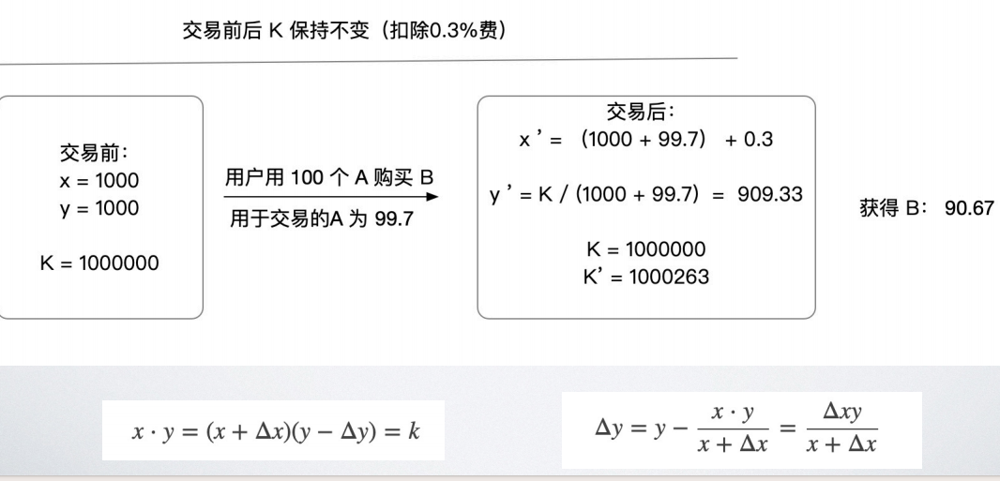
**一些理解：**
Uniswap V2 是在上面amm得基础规则治丧，又增加了手续费
Uniswap V2 在基础的 AMM（自动做市商）模型之上，新增了 0.3% 的交易手续费，这是对原始恒定乘积公式（x * y = k）的重要升级。以下是关键改进和运作机制：

一、Uniswap V2 的核心新增规则
手续费机制

每笔交易收取 0.3% 手续费，直接注入流动性池（LP 共享）。

**源码：**
https://github.com/Uniswap/v2-core https://github.com/Uniswap/v2-periphery

# 三明治攻击 - 夹子机器人
当滑点设置较大时，交易容易被夹 - “三明治攻击” 
• 攻击者通过操纵交易排序，从中牟取利益。
• 原理：
• 1. 监听内存池（eth_subscribe：newPendingTransactions ），发现用户(Bob)买入交易之后
• 2. 攻击者用更好的 gas 发起一笔买入交易（从而推高价格）- 抢先交易（front-run）
• 3. 执行 Bob 买入交易（但原本能以较低价格买入，现在应该价格升高拿到了更少的目标 Token）
• 4. 攻击者反向操作卖出（Bob 的买入交易进一步推高了价格，攻击者此时卖出可获取差价收益。）
• 如何防御：设置合理滑点、分批交易、使用私人交易路由广播(BloXroute)
攻击者通常使用 Flashbots 来提交三明治交易，保证两笔攻击交易和用户交易在一个区块中连续执行

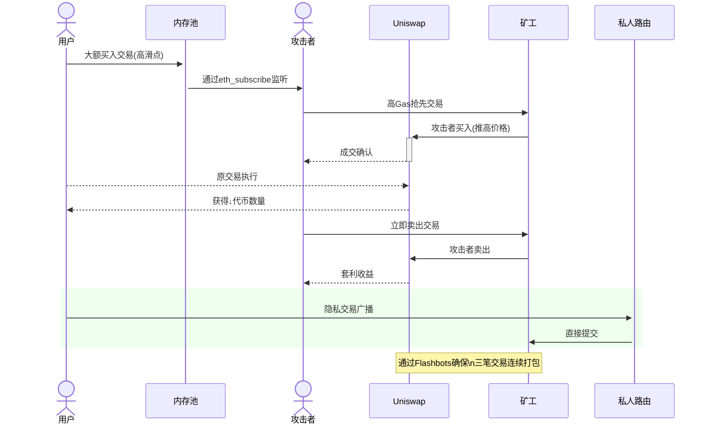

# 兑换 ETH - WETH
• WETH 是 Ether 的 ERC20 包装(Wrap-ETH), 以便方便的和 ERC20 对接

• 1 WETH = 1 ETH

• WETH 合约(WETH9)

• https://etherscan.io/token/0xc02aaa39b223fe8d0a0e5c4f27ead9083c756cc2#code

• deposit()

• withdraw()

• 在兑换(卖)或添加流动性时,先调用一次 WETH.deposit()

## 看看核心源码
pragma solidity ^0.4.18;

contract WETH9 {
    string public name     = "Wrapped Ether";
    string public symbol   = "WETH";
    uint8  public decimals = 18;

    event  Approval(address indexed src, address indexed guy, uint wad);
    event  Transfer(address indexed src, address indexed dst, uint wad);
    event  Deposit(address indexed dst, uint wad);
    event  Withdrawal(address indexed src, uint wad);

    mapping (address => uint)                       public  balanceOf;
    mapping (address => mapping (address => uint))  public  allowance;

    function() public payable {
        deposit();
    }
    function deposit() public payable {
        balanceOf[msg.sender] += msg.value;
        Deposit(msg.sender, msg.value);
    }
    function withdraw(uint wad) public {
        require(balanceOf[msg.sender] >= wad);
        balanceOf[msg.sender] -= wad;
        msg.sender.transfer(wad);
        Withdrawal(msg.sender, wad);
    }

    function totalSupply() public view returns (uint) {
        return this.balance;
    }

    function approve(address guy, uint wad) public returns (bool) {
        allowance[msg.sender][guy] = wad;
        Approval(msg.sender, guy, wad);
        return true;
    }

    function transfer(address dst, uint wad) public returns (bool) {
        return transferFrom(msg.sender, dst, wad);
    }

    function transferFrom(address src, address dst, uint wad)
        public
        returns (bool)
    {
        require(balanceOf[src] >= wad);

        if (src != msg.sender && allowance[src][msg.sender] != uint(-1)) {
            require(allowance[src][msg.sender] >= wad);
            allowance[src][msg.sender] -= wad;
        }

        balanceOf[src] -= wad;
        balanceOf[dst] += wad;

        Transfer(src, dst, wad);

        return true;
    }
}

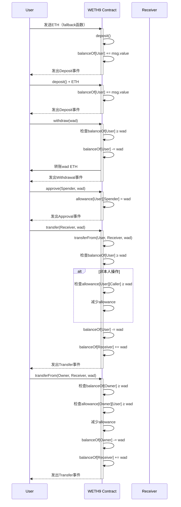

## 第一个利用lauchpad和uniswapV2的工程
实现meme上架流动性，价格降低的时候，判断买入
先看序列图：

### 首先是部署和初始化流程：
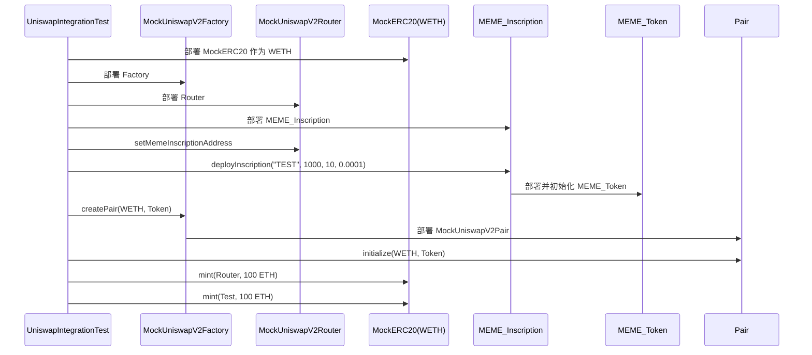

### 铸币流程：
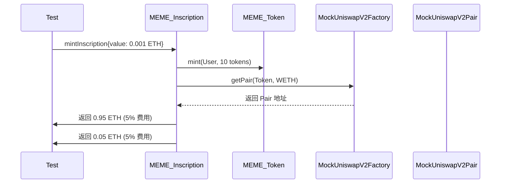

### 添加流动性流程：
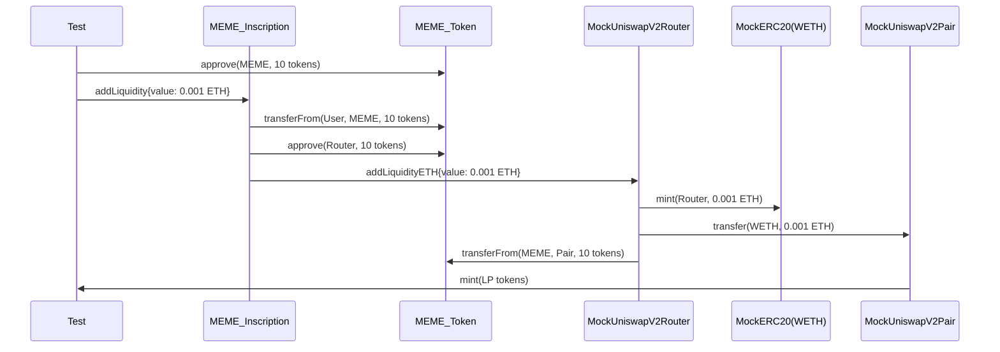

### 交易流程：
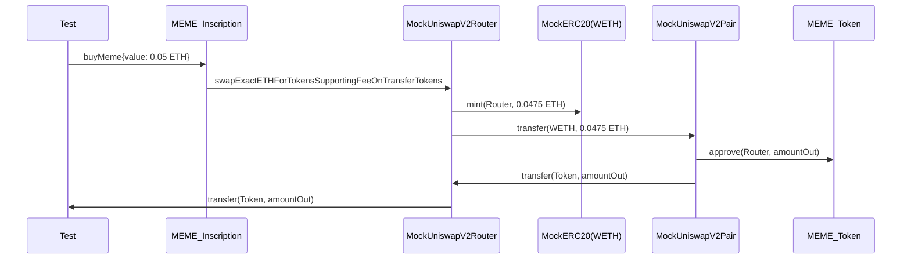

### 关键点说明：
ETH 和 WETH 的转换：
铸币时使用原生 ETH
添加流动性和交易时，Router 将 ETH 转换为 WETH
使用 mint 函数模拟 ETH 到 WETH 的转换（测试环境）
价格计算：
使用 Uniswap V2 的恒定乘积公式：x * y = k
交易时确保新的 k 值大于等于原来的 k 值
授权流程：
添加流动性前需要授权 MEME_Inscription 使用代币
MEME_Inscription 需要授权 Router 使用代币
Pair 需要授权 Router 使用代币
费用处理：
铸币时收取 5% 的费用
交易时收取 0.3% 的费用（通过 k 值检查实现）
这个流程展示了完整的 Uniswap V2 集成，包括：
代币部署和初始化
铸币和费用收取
流动性添加
交易执行
每个步骤都遵循 Uniswap V2 的协议规范，确保了价格发现和流动性提供的正确性。

**代码位置：D:\uniswap**

# 稳定币的一些深入理解
## USDS  -- 抵押稳定币
USDS 是 Sky(之前叫 MakerDAO) 发行的去中心化稳定币,是最大的去中心化稳定币

• USDS 本质是一个借贷协议,所借资产是 mint 出来的稳定币
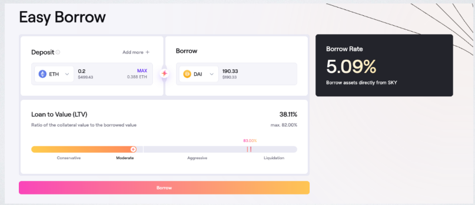
https://app.spark.fi/borrow
这个网站主要提供通过加密资产作为抵押来借款的金融服务，特别使用的是USDS（去中心化稳定币）作为借款选项之一[1]。用户可以利用多种加密资产，如ETH、stETH、weETH、rETH和cbBTC作为抵押物，以透明的利率借款[1]。
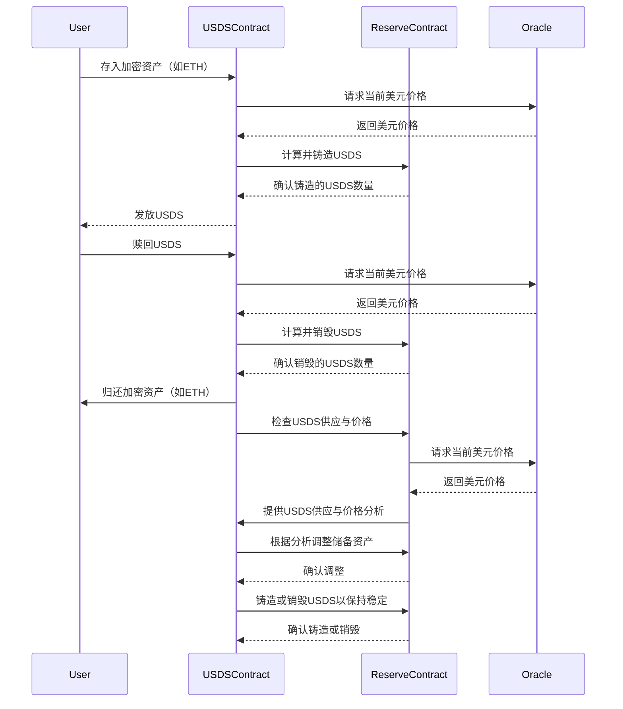
合约地址：
https://etherscan.io/token/0xdC035D45d973E3EC169d2276DDab16f1e407384F

## Ampleforth  -- 算法稳定币
如何调控每个账号的余额? 
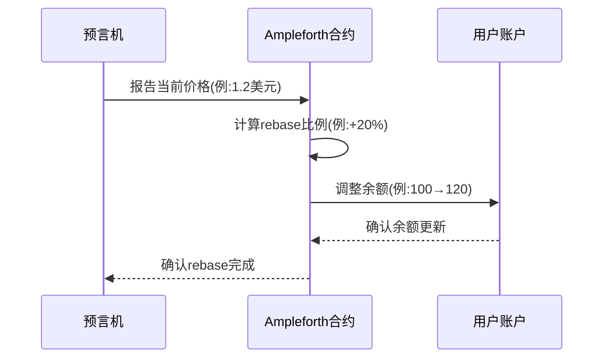

价格偏离1美元目标时触发rebase
所有账户余额同比例调整
用户持有数量变化但占比不变
通过供应量弹性调节实现价格稳定

### rebase机制

Ampleforth Rebase机制详解
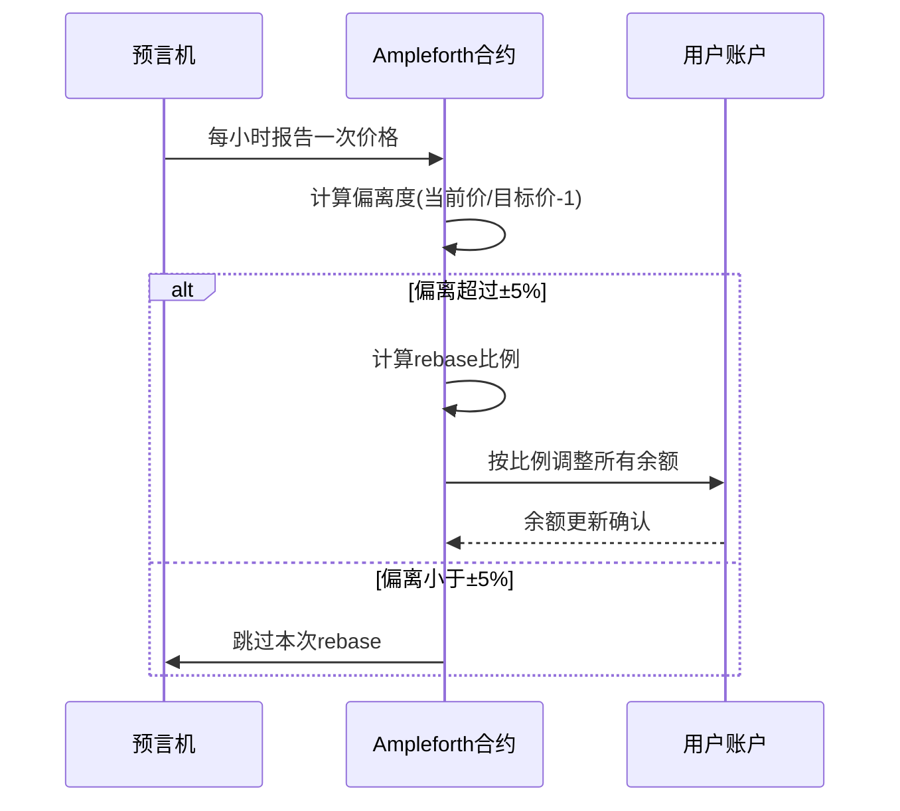

**核心机制：**
- 触发条件：

每小时检查一次（以太坊区块时间）
当价格偏离1美元目标超过5%时触发
最大单次调整幅度为±20%（防止剧烈波动）
计算公式：

rebase比例 = (当前价格 - 目标价格) / 目标价格
新余额 = 旧余额 × (1 + rebase比例)
示例：当前价1.2美元 → (1.2-1)/1=20% → 100代币变为120

- 用户影响：

钱包余额自动变化（无需用户操作）
持有比例不变（不影响所有权占比）
交易对价格会立即反映变化
与传统稳定币区别： 
| 特性 | Ampleforth | USDT/USDC |
|------|------------|----------| 
| 稳定方式 | 供应量调整 | 法币储备 | 
| 价格波动 | 允许短期波动 | 严格锚定 | 
| 抵押品 | 无需抵押 | 需要100%储备 |

- 系统设计目的：

通过供应弹性建立长期价格稳定性
避免依赖抵押品带来的中心化风险
创造具有货币政策原语的加密资产

## 稳定币改良 Basis Cash
• 除 BAC 外,引入债券 Basis Bond(BAB),Basis Shares(BAS)

• 当 BAC <$1 时, 可折价兑换 BAB( BAB 价格 = BAC 价格的平方), 等BAC

回到 1 美元的时候,可以 1:1 赎回 BAC(减轻用户币变少的心理负担)

• 当 BAC >$1 时,若赎回之后,仍 >$1 增发BAC作为分红给质押的 BAS

• 号称”野生美联储”

稳定币改良 Basis Cash

**Basis Cash三币种机制图示**
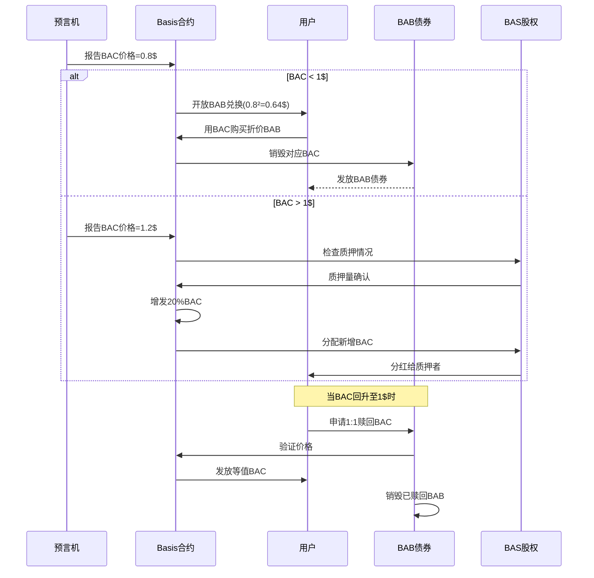

**注意：他已经失败了**

主流稳定币供应量调节机制对比
| 特性 | USDT(法币抵押) | USDS(算法抵押) | BAC(三币种算法) | Ampleforth(纯算法) | 
|---------------------|---------------|---------------|----------------|-------------------| 
| 价格>1时不调节增发回购抵押品增发分红所有余额同比例增加价格时 | 不调节 | 销毁赎回抵押品 | 折价出售BAB债券 | 所有余额同比例减少 | 
| 调节频率 | 人工决定 | 实时 | 每小时 | 每日 | | 抵押品 | 100%法币 | 加密资产抵押 | 无 | 无 | 
| 用户余额变化 | 不变 | 可能变化 | 可能变化 | 必然变化 | | 价格稳定机制 | 法币担保 | 抵押品清算 | 债券+股权 | 供应量弹性调节 | 
| 最大优势 | 价格稳定 | 资本效率高 | 心理接受度好 | 完全去中心化 |