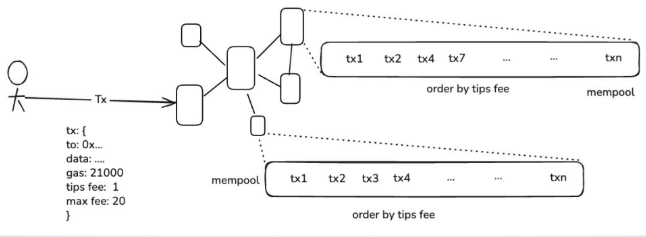
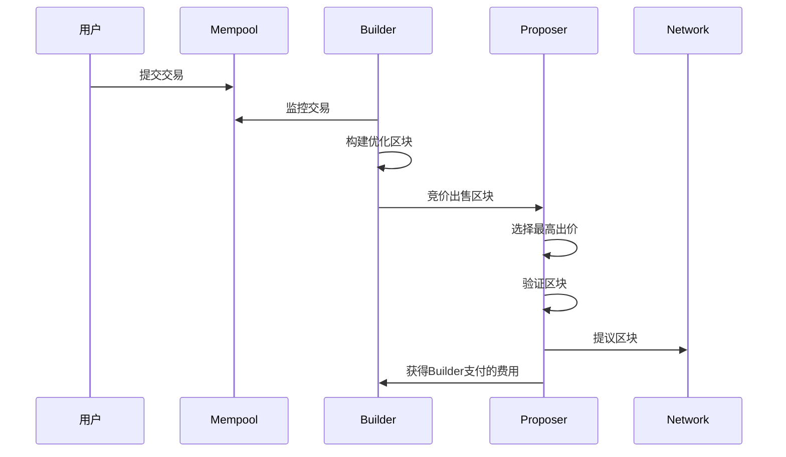
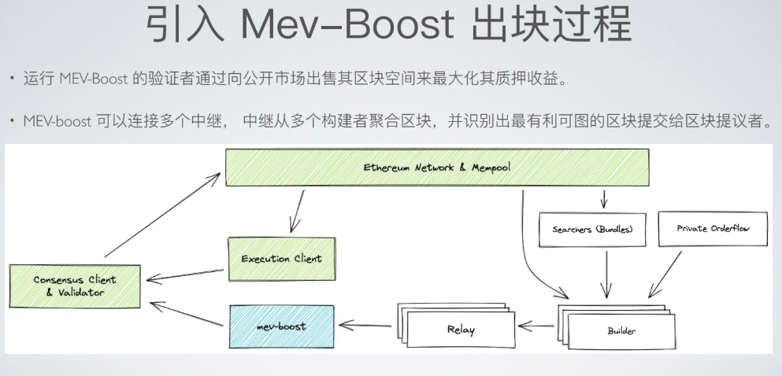
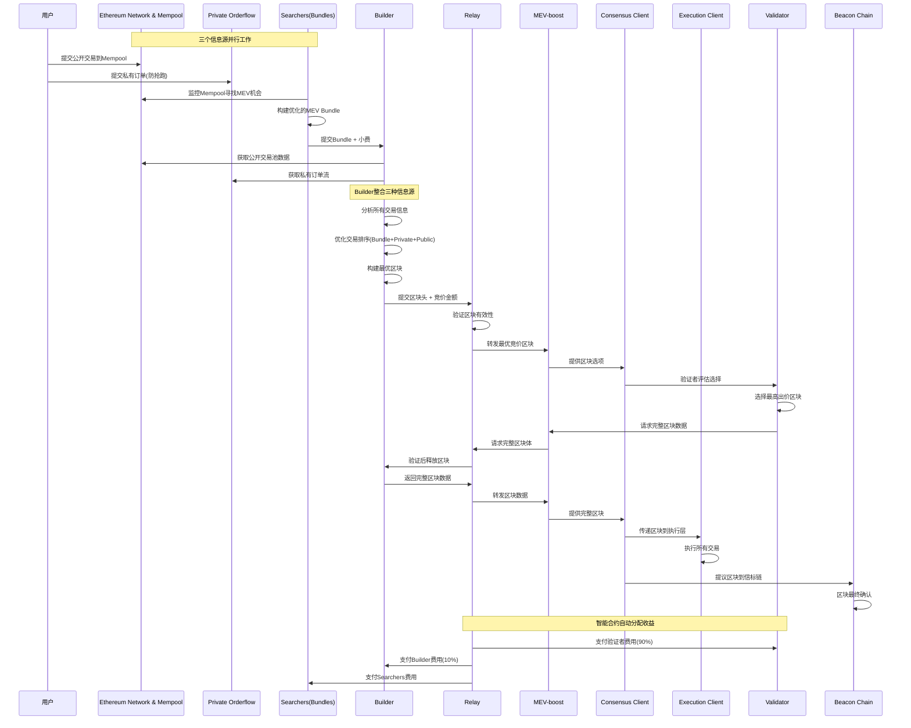
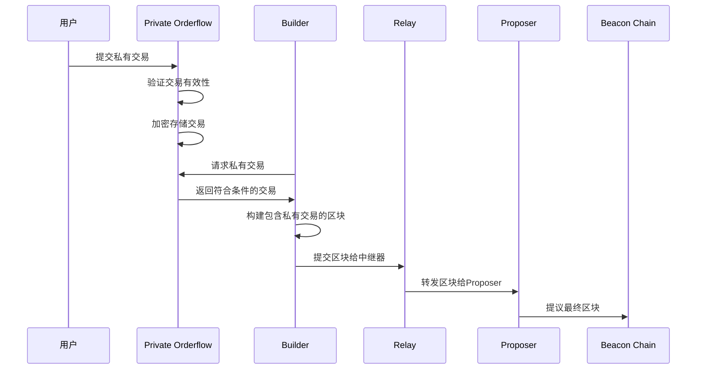

# 回顾交易内存池 mempool
- 交易打包之前,  (pending)会进入 mempool
- pending交易,按tips 排序
- 节点之间会广播 mempool 的交易(节点有自己的mempool)
- • 用户可监听 mempool: eth_subscribe:newPendingTransactions
- 验证者从 mempool 挑选最有利可图的交易打包(按 Tips 排序 )

# MEV
- MEV:Maximal(miner) Extractable Value 最大可提取价值,指的是矿工(验证者)通过对交易排序(或排除交易、额外添加交易)来提取最大可能的收益(除交易手续费之外)
- 以太坊是一个黑暗森林, 一旦暴露就会被打击(也有针对 MEV 的陷阱)
- MEV 策略(或类型)有:
  - • 抢跑交易(Front-running):利用未确认交易的信息,提前进行相同交易以获取利润。(例如某些开奖奖励)
  
  - • 尾随交易(back-running): 紧接在一个未确认的目标交易后面交易,(例如监听新的交易对创建)
  
  - • 三明治攻击(Sandwich Attack):在**目标交易前后插入自己的交易**,以操纵市场价格获取利润。
  
  - • 套利(Arbitrage):利用不**同交易所或市场**之间的**价格差异**,进行**快速买卖**以获取差价利润。
  
  - • 清算(Liquidations):通过**触发借贷平台上的清算机制**,从清算中获利。
  
  - • 矿池提取:在去中心化交易所(DEX)中,通过**操控流动性池中的交易顺序**,获取最大收益。
  
## MEV 利弊
- 利: 
  • 帮助 DEFI, 如 及时清算、抹平 DEX 、EX 价差
  • 提升验证者收益

- 弊: 
  • Gas 战争及 Gas 不稳定(尤其是提取者的竞争导致)
      • jaredfromsubway.eth 疯狂的时候,MEV操作几乎覆盖每个区块
  • 对普通用户不公平(被夹、没机会抢购等)
  • 导致更多失败交易浪费链上空间

- 查看MEV获利情况：
https://eigenphi.io/

- 套利案例
https://eigenphi.io/mev/ethereum/tx/
0xd3fdec3185e58be74f6c2f035efc999a1ed84cd06c3b156e8193d7936ab416fb

- 三明治案例
https://eigenphi.io/mev/ethereum/tx/0x7ae27effe1c9c8a4e43411d5520002e25bdaa4b8d55115967560dc5da3b8b6e9

**如何应对黑暗森林(如何防范或提取套利)**
# Flashbots 诞生
## 概述
• 在 POW 矿工自己 MEV,POS 时代,验证者没有能力提取 MEV
• Flashbots 致力于研究与缓解**以太坊 MEV **的**研发组织**(开始受以太坊资助,后独立融
资),目标:

• 透明化:构建透明的排序市场,不再是黑暗森林,量化影响,优化分配

• 民主化: MEV 访问更加公平,开放所有人,充分竞争

• **推动去中心化PBS  (排序权与出块权分离)**

## PBS (Proposer-Builder Separation) 基本概念
PBS = Proposer-Builder Separation （提议者-构建者分离）

### 传统模式 vs PBS模式 
#### 传统模式（合并前）
验证者 = 排序权 + 出块权
├── 选择交易
├── 排序交易
├── 构建区块
└── 提议区块

#### PBS模式（分离后）
排序权（Builder）     出块权（Proposer）
├── 选择交易    ←→    ├── 选择最优区块
├── 排序交易          ├── 验证区块
├── 构建区块          └── 提议区块
└── 竞价出售

## 核心机制解析
### 1. 角色分离
#### Builder（构建者）- 拥有排序权：

- 从内存池收集交易
- 优化交易排序（MEV提取）
- 构建完整区块
- 向Proposer竞价出售区块

#### Proposer（提议者）- 拥有出块权：

- 从多个Builder中选择最高出价的区块
- 验证区块有效性
- 向网络提议区块
- 获得Builder支付的费用

## 工作流程

## 去中心化PBS的优势
### 1. 解决MEV问题
// 传统模式：验证者直接提取MEV
contract TraditionalValidator {
    function proposeBlock() external {
        // **验证者既排序又出块，容易产生MEV垄断**
        Transaction[] memory txs = selectAndOrderTransactions();
        Block memory block = buildBlock(txs);
        proposeToNetwork(block);
    }
}

// PBS模式：专业化分工
contract Builder {
    function buildBlock() external returns (Block) {
        // 专业的MEV提取和区块构建
        Transaction[] memory optimizedTxs = optimizeForMEV();
        return buildOptimizedBlock(optimizedTxs);
    }
}

contract Proposer {
    function selectAndPropose() external {
        // 选择最优区块并提议
        Block memory bestBlock = selectHighestBid();
        proposeToNetwork(bestBlock);
    }
}

### 2. 提高效率和公平性
|方面| 传统模式 |PBS模式 |
|....|....|....|
|MEV分配| 验证者垄断| 竞争性市场| 
|专业化| 验证者需全能 |角色专业化 |
|准入门槛 |高技术要求| 降低验证者门槛|
| 收益分配| 集中化| 更公平分配|
| 网络效率| 可能次优| 优化的区块构建|

### 3.去中心化的重要性
1. 防止中心化风险
中心化PBS风险：
├── 少数大型Builder垄断
├── 审查交易的能力
├── MEV收益集中
└── 网络安全风险

去中心化PBS目标：
├── 多样化的Builder生态
├── 抗审查性
├── 公平的MEV分配
└── 增强网络韧性

### 4. 实现机制
1. 技术层面：
- 开放的Builder协议
- 标准化的竞价机制
- 透明的选择算法
- 抗审查的交易包含

2. 经济层面：
- 降低Builder准入门槛
- 激励机制设计
- 防止垄断的治理机制

# • Flashbot 主要的项目(或产品):

## • MEV-Boost (含 relay):
开源中间件,配合共识层客户端,实现将区块构建工作外包给第三方 Builder

## • BuilderNet / rbuilder: 
构建者开源实现及网络

## • Flashbot Protect:
提供一个 RPC 端点(隐私节点),帮助用户**避免被抢跑和三明治攻击**。

## 完整的MEV-Boost架构
• 运行 MEV-Boost 的验证者通过向公开市场出售其区块空间来最大化其质押收益。

• MEV-boost 可以连接多个中继, 中继从多个构建者聚合区块,并识别出最有利可图的区块提交给区块提议者。

### 图中名词解释
• searcher(套利者): 找到有利可图的 bundle ,例如包含了套利的一批交易。

• searcher 将 bundle 交易发给 builder (可多个) - 隐私交易

• Builder 执行一系列的算法来决定一个区块中应该包含哪些bundles和交易来最大化区块的最大利润(Builder 还会
接收自己的私有交易,及公开的内存池交易)

• Relayer 检查区块的有效性以及评估 builder打包的块的价值, 挑出价值最大的区块, 发给验证者.对比打包某一个区块前后Buidler 余额差值.

• 验证者打包区块

### 私有交易（Private Orderflow）详解
私有交易是Builder接受的三种交易来源之一，它为用户提供了绕过公共内存池的直接交易通道，具有重要的隐私保护和MEV防护功能。
#### 私有交易的核心逻辑
 1. 基本概念
私有交易是指用户直接向Builder或特定的交易池提交交易，而不经过公共以太坊内存池（Mempool）的交易处理方式。

**关键特点：**
- 隐私保护 ：交易在被打包前不会暴露给公众
- MEV防护 ：避免被套利机器人抢跑或夹击
- 优先处理 ：通常获得更快的确认速度
- 费用优化 ：可能享受更低的Gas费用

2. 技术实现架构
// 私有交易池合约示例
contract PrivateOrderflow {
    struct PrivateTransaction {
        address from;           // 发送者
        address to;             // 接收者
        uint256 value;          // 转账金额
        bytes data;             // 交易数据
        uint256 gasLimit;       // Gas限制
        uint256 gasPrice;       // Gas价格
        uint256 nonce;          // 交易序号
        uint256 deadline;       // 截止时间
        bytes signature;        // 签名
        bool isPrivate;         // 私有标识
    }
    
    mapping(bytes32 => PrivateTransaction) public privateTxs;
    mapping(address => bool) public authorizedBuilders;
    mapping(address => uint256) public userNonces;
    
    event PrivateTransactionSubmitted(
        bytes32 indexed txHash,
        address indexed user,
        uint256 timestamp
    );
    
    modifier onlyAuthorizedBuilder() {
        require(authorizedBuilders[msg.sender], "Unauthorized builder");
        _;
    }
    
    // 用户提交私有交易
    function submitPrivateTransaction(
        address to,
        uint256 value,
        bytes calldata data,
        uint256 gasLimit,
        uint256 gasPrice,
        uint256 deadline,
        bytes calldata signature
    ) external payable {
        require(block.timestamp <= deadline, "Transaction expired");
        require(msg.value >= gasLimit * gasPrice, "Insufficient gas payment");
        
        uint256 nonce = userNonces[msg.sender]++;
        
        PrivateTransaction memory privateTx = PrivateTransaction({
            from: msg.sender,
            to: to,
            value: value,
            data: data,
            gasLimit: gasLimit,
            gasPrice: gasPrice,
            nonce: nonce,
            deadline: deadline,
            signature: signature,
            isPrivate: true
        });
        
        bytes32 txHash = keccak256(abi.encode(privateTx));
        privateTxs[txHash] = privateTx;
        
        emit PrivateTransactionSubmitted(txHash, msg.sender, block.timestamp);
    }
    
    // Builder获取私有交易
    function getPrivateTransactions(
        uint256 limit
    ) external view onlyAuthorizedBuilder returns (PrivateTransaction[] memory) {
        // 实现获取待处理私有交易的逻辑
        // 这里简化处理，实际需要更复杂的队列管理
        PrivateTransaction[] memory result = new PrivateTransaction;
        // ... 填充逻辑
        return result;
    }
}

#### 私有交易的处理流程

## 通过 Flashbot 可实现
• 通过 Flashbot **在链外构建了一个交易排序市场**,
支持:

• 发送隐私交易

• 发送多个交易

• 指定交易顺序

• 指定成交区块/时间

• 撤回失败交易

# 如何利用Flashbot
• 选择一个支持隐私节点 RPC (通常由 Builders 提供)

• titanbuilder.xyz、Flashbots Protect 、beaverbuild 、bloxroute... 列表

• 支持额外的 RPC 接口: eth_sendBundle 、mev_sendBundle、eth_sendPrivateTransaction(或 eth_sendRawTransaction 自动支持隐
私)

• 构建多个交易,打包发送

# 捆绑交易场景
• 防止交易在 mempool 被攻击
• MEV,例如监听 mempool 的交易(套利、抢购)
• 拯救被恶意监控钱包的资产
• 减少交易失败带来的损失

1. 选择RPC:relay.flashbots.net
2. Tx1:监听 MemPool 中的 enablePresale 交易
3. Tx2: 签名 presale(1024) 交易,但不发送
4. 捆绑交易,并发送

## 捆绑交易场景
https://docs.flashbots.net/flashbots-auction/libraries/bundle-relay

使用js，利⽤ flashbot API eth_sendBundle 捆绑 OpenspaceNFT 的开启预售和 presale 交易

预售的交易(sepolia 测试⽹络)，并使⽤ flashbots_getBundleStats 查询状态，最终打印交易哈希和 stats 信息
提交内容：

和 flashbot API 交互代码
最终提交到 sepolia 网络的 enablePresale 和 presale 交易哈希
flashbot flashbots_getBundleStats 对本次捆绑的返回信息。