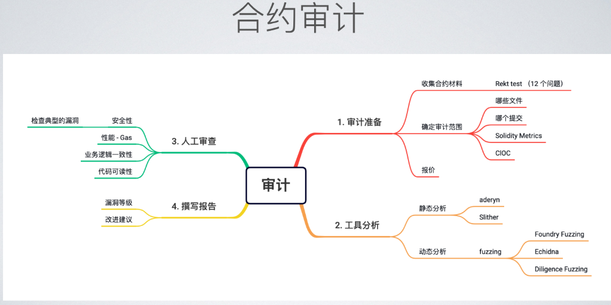
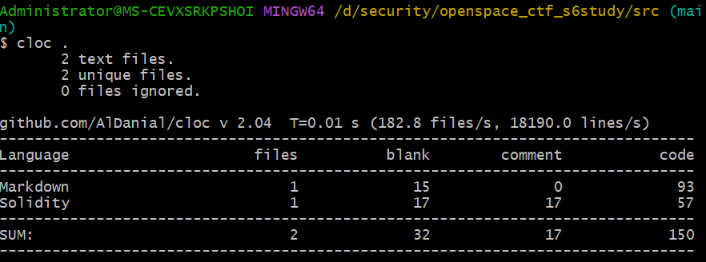
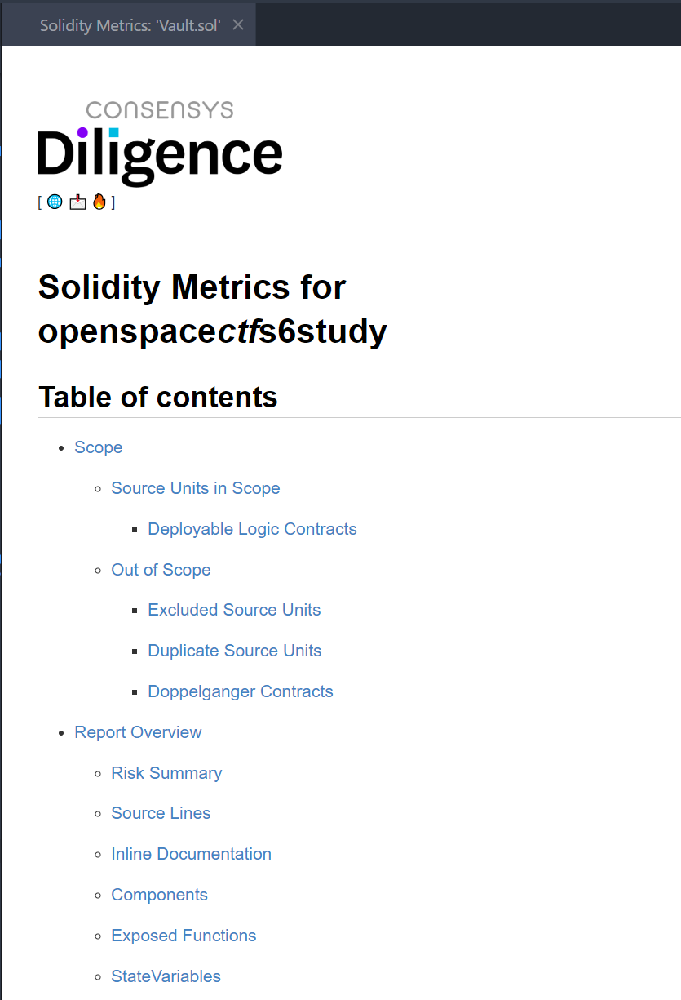
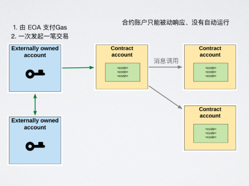
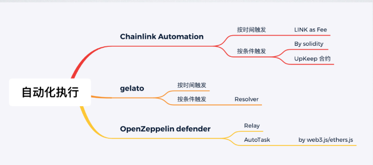
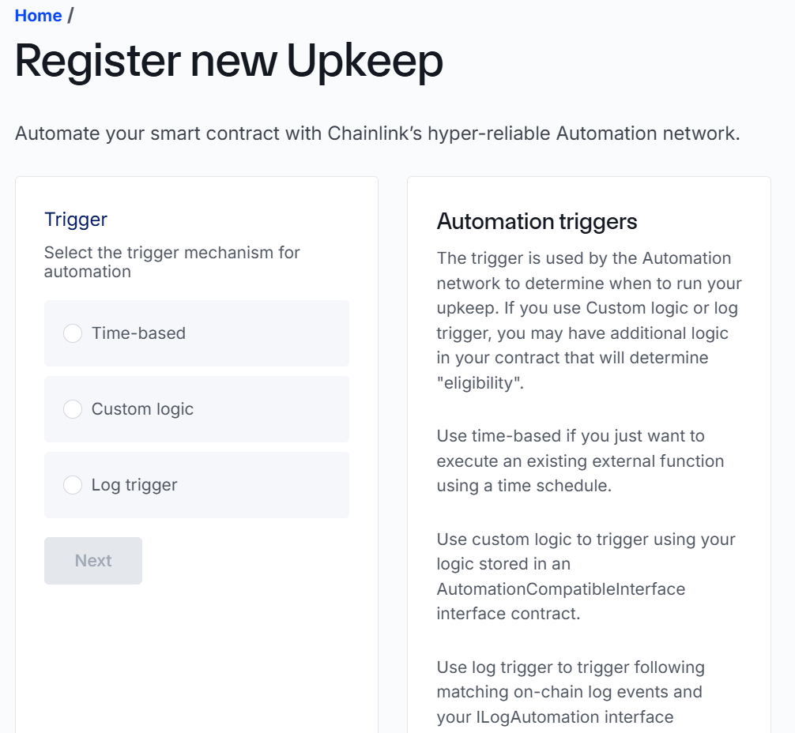
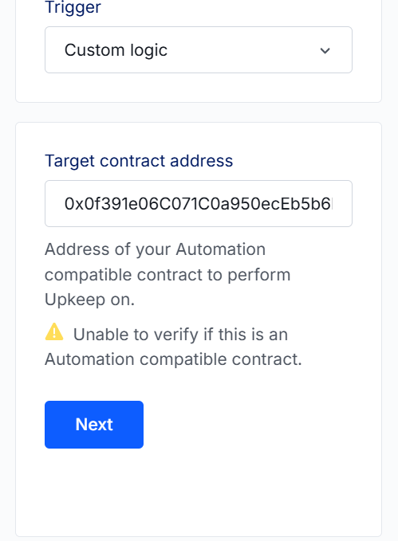
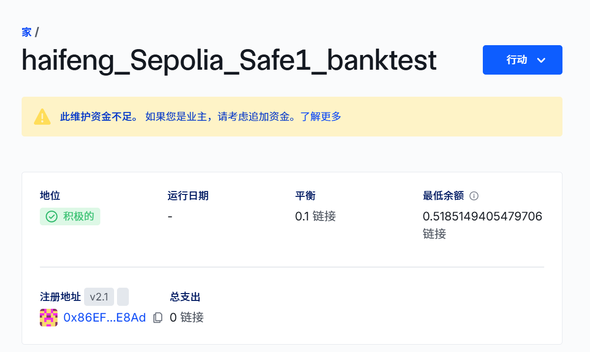

# smart contract audit

## 审计准备
完整的工程、详细的文档、完备的测试

### 相关知识学习网站
• Rekt Test: 比特之路博客
https://blog.trailofbits.com/2023/08/14/can-you-pass-the-rekt-test/

Trail of Bits 的官方博客（https://blog.trailofbits.com/）是一个专注于**网络安全、软件工程和密码学**的高质量技术资源平台，由知名安全公司 Trail of Bits 维护。

## Rekt 测试以Joel 测试为蓝本。
- Joel 测试由软件开发者 Joel Spolsky 于 1998 年前开发，它用 12 个简单的“是”或“否”问题取代了用于评估软件团队成熟度和质量的拜占庭式流程。

- Rekt 测试侧重于最简单、最通用的安全控制措施，帮助团队评估安全态势并衡量进展。

- 组织对这些问题的回答越“是”，就越能信赖其运营质量。
- 这并非区块链安全团队的权威清单，但它可以作为开启重要安全控制措施知情讨论的一种方式。

### 工具(初评代码): 初步了解代码量、代码结构

#### CLOC:https://github.com/AlDanial/cloc
- cloc 可以计算许多编程语言中源代码的**空行、注释行和物理行数**。给定两个版本的代码库，cloc 可以计算空行、注释行和源代码行之间的差异。它完全用 Perl 编写，不依赖 Perl v5.6 及更高版本标准发行版之外的任何代码（一些外部模块的代码嵌入在 cloc 中），因此具有很高的可移植性。cloc 可以在 Linux、FreeBSD、NetBSD、OpenBSD、macOS、AIX、HP-UX、Solaris、IRIX、z/OS 和 Windows 等多种操作系统上运行。

- 除了计算单个文本文件、目录和 git 存储库中的代码之外，cloc 还可以计算存档文件中的代码，例如.tar（包括压缩版本）.zip、Python wheel .whl、Jupyter Notebook .ipynb、源 RPM.rpm 或.src（需要rpm2cpio）和 Debian.deb文件（需要dpkg-deb）。

- 下载页面：
https://github.com/AlDanial/cloc/releases/tag/v2.04
windows需要把.exe文件所在得目录放入环境变量PATH中。
注意，我下载得是cloc-2.04.exe，这个文件所在目录设置了环境变量，然后修改了文件名为cloc.exe  方便命令行使用,可以直接cloc 执行.

我测试得情况:

####  Solidity Metrics (VS Code extensions)   
• https://marketplace.visualstudio.com/items?itemName=tintinweb.solidity-metrics

我测试的情况:**就是1个更多内容类型和衡量指标得sol代码审查工具**
vscode中,输入ctrl +  shit + p 输入以下内容,表示对当前打开得sol文件进行分析.
solidity metrices: Report metrices for current open file for the single file

报告会自动生成为新得页面,如下图所示:

####  Solidity Visual developer (VS Code extensions) :
• https://marketplace.visualstudio.com/items?itemName=tintinweb.solidity-visual-auditor

我测试得情况:
高亮显示不同类型代码,可以生成当前代码得uml或者是drwaio可用得csv格式得uml图
还可以**生成表格**

## 静态分析
### 概念
在不执行程序代码的情况下,分析程序的源代码、AST、中间表示或二进制代码
来发现潜在的漏洞。
• 控制流分析:分析程序所有可能的执行路径

• 数据流分析:跟踪变量、如:检查可能的溢出

• 规则检测:根据预定义的规则集检查代码,

## 工具
### slither
地址:https://github.com/crytic/slither?tab=readme-ov-file#how-to-install
官方建议:如果您希望通过 Git 安装 Slither，我们建议您使用 Python 虚拟环境（详情请参阅开发者安装说明）。
这个语言是python写的,个人建议直接在本机中安装python3,然后使用如下命令安装:
python3 -m pip install slither-analyzer

**暂时先不装,看起来有点麻烦,后期如果用到,再来补充.**

-- 特点:
• 开源、灵活强大、可自定义检查器、生态活跃

• 误报有点多

### Aderyn
需要使用linux环境,windows环境需要wsl
curl --proto '=https' --tlsv1.2 -LsSf https://github.com/cyfrin/aderyn/releases/latest/download/aderyn-installer.sh | bash

如果wsl不能直接下载安装脚本,则需要在cmd中将脚本下载下来:
curl  '=https' --tlsv1.2 -LsSf https://github.com/cyfrin/aderyn/releases/latest/download/aderyn-installer.sh

wsl环境执行脚本,暂时不行,先放弃.

## 动态分析
通过模拟环境来运行代码,观察各种输入下的表现,来发现潜在的漏洞或性能问题。

• 方法:模糊测试 (Fuzzing) - 基于属性的测试方法 、代码覆盖率分析

• 模糊测试 , 优秀的 Fuzzer 很关键

• Foundry Fuzzing

• Echidna

• Diligence Fuzzing (云平台): https://fuzzing-docs.diligence.tools/

## 人工审查
一个优秀的合约审计工程师:

• 熟悉EVM特性、常见协议、常见安全问题

• https://github.com/ZhangZhuoSJTU/Web3Bugs

• 跟踪安全事件、了解新攻击点

• https://substack.com/@blockthreat

• https://solodit.xyz/

• https://rekt.news/

## 审计报告模板
https://github.com/Cyfrin/audit-report-templating

# 监控
• 及时知晓问题(消息通知)及处理问题(自动化处理)

• 监控大额资金的变化

• 监控权限的转移

• 监控关键参数的修改

## 自建监控

## 很多第三方节点服务提供 WebHook 服务
• OpenZepplin Defender Monitor:

 https://defender.openzeppelin.com/v2/#/monitor

• Tenderly Alerting:https://tenderly.co/alerting

• Forta (Detection Bots): https://app.forta.network/bots

# 合约自动化执行
应对:周期任务、紧急情况

## 合约只能被动响应

## 运行中:合约自动化执行

- 如何实现周期任务/定时任务/条件任务?

• 编写后端程序,常驻后端执行

• 主要问题:单点故障、热钱包泄漏

## Chainlink Automation
超可靠和去中心化的自动化平台

• 根据时间或条件自动执行合约函数

• 若按条件,需编写 Upkeep 合约

• checkUpKeep()

• performUpKeep()

### ChainLink Automation- 按时间执行
开发步骤:

• 在 https://automation.chain.link/ 注册

• 选择“Time-based”

• 填入要执行的合约地址

• 填入时间周期

### ChainLink Automation - 按条件执行
编写 UpKeep 合约处理进行逻辑判断及调用

• checkUpkeep (判断条件)

• performUpkeep(执行)

## Gelato Functions
• 按时间执行, 无需代码 (automated-transaction)

• 按链上条件执行 (Solidity Functions), checker 合约

• 按链下条件执行 (Typescript Functions)

## OpenZepplin Defender Action
https://www.openzeppelin.com/defender

• 通过 web3.js / ethers.js 来定制执行

• Relay: 生成独立的账户

• AutoTask

# 事故分析
https://phalcon.blocksec.com/explorer

• https://www.youtube.com/watch?v=eXeirKUy1XA

• https://www.youtube.com/watch?v=uiqCrhIU0To

• Foundry Transaction Replay Trace/Debugger

• Cast run

• Tenderly Debugger

5月23日  作业记录
我有个需求,你帮我分析一下:https://automation.chain.link/
我要用上述这个服务商得自动化执行合约得服务,我得需求是当某个合约存储得eth到达了1个设定得值,就自动转1半给其他人,我应该用什么方式触发这个自动任务,上述网站在注册得时候给出了一些选项,你帮我!
选择了custom 模式,自己来定义
每存一笔款,就去检查一下,如果满足条件,就给别人转账一半

你帮我复制Bank.sol合约,复制到目录:D:\blockchain\foundry\s6\src\banks
复制得合约名字命名为:5_23automation_bot_Bank.sol
复制好以后进行修改,修改得要求是:
当存款总额度大于0.1得时候,就自动将存款额度得一半,既0.05,转账给0x44f08Ed7D8F63b345F0fc512aEcfaA4F16831643  这个地址

1. 先去sepolia ,部署一个bank合约 
用remix部署得结果
contract address	0xa3db77da108c98ee789c7d1b7cc4156ead505a2a

2. automation.chain阶段

注册内容:可以把部署得bank地址填入,继续注册了

注册成功

以上两个图是样例，不是本次得合约地址

3. 注意：link得获得，自己google吧，我做得有点乱，反正找到1个25link得铸造，就行了，一次给你得钱包返还25个link，这些link用来支付自动化任务得费用。

4. 执行合约中预定义得任务，执行成功会在details里面显示执行结果得hash，可以到sepolia测试网上看
你也可以登录sepolia测试网，查看bank合约得余额是否符合自动任务得预期。

