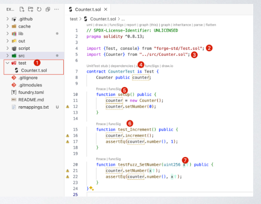
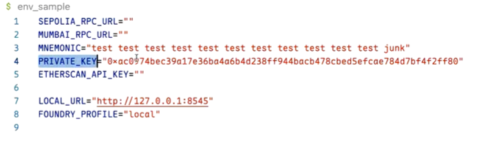
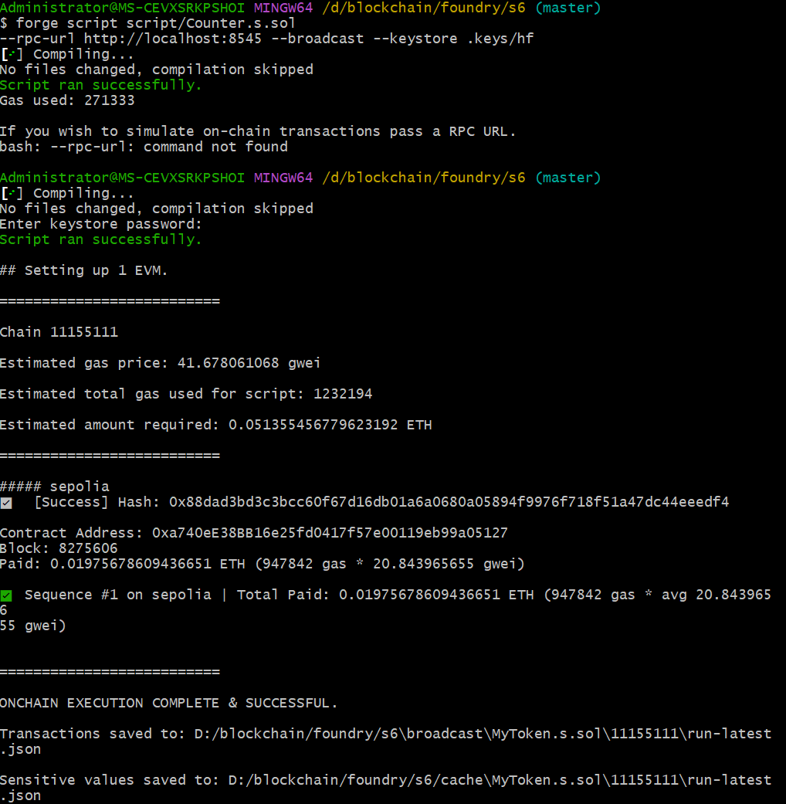

# 安装 foundry
## 安装 mingw-w64
1. 下载 mingw-w64-install.exe
https://link.zhihu.com/?target=https%3A//sourceforge.net/projects/mingw-w64/files/

2. 设置环境变量
下载好后，解压到任意一个目录，然后右键 “此电脑–>属性–>高级系统设置–>环境变量“，设置 PATH 变量

注：这里的环境变量根据自身电脑的具体路径来设置

3. 检查是否安装成功
win + R 键输出 cmd 打开命令行，然后输入 gcc -v

当出现这种提示时，表明 mingw-w64 安装成功

## 安装  仅限windows系统
详细安装步骤
1. 下载 rustup.rs
2. rustup-init安装包
https://win.rustup.rs/x86_64

1. 下载好打开之后，我们会看到
2. 
3. 在 Windows 开发 Rust，需要安装 C++ Build Tools 等工具，而 C++ Build Tools 被 Visual Studio 绑定了，要下载 C++ Build Tools 就必须下载 Visual Studio，但是 Visual Studio 安装包非常庞大，而且下载速度时好时差。

假如电脑配置差，或者不想要下载大约10G的文件，建议选择3。

这里选择3，因为需要下载的文件非常小，mingw-w64 也是 C/C++ 编译器，就是 GCC 的 Windows 版本 。

然后输入2，回车，就是自定义安装，出现提示

然后回来之前第一步的提示，输入1，回车，然后出现

等待其下载文件完毕，这里需要等待的时间有点长，但耐心就好，假如下载出现错误，就重设上面的设定，再来一次流程。

下载完毕之后，按下 win + R 键输入 cmd，并输入 rustc -V （注：是大写的V）

## 最后的安装 Foundry
 curl -L https://foundry.paradigm.xyz | bash  // 下载foundryup
source /c/Users/Administrator/.bashrc  // 刷新环境变量
 which foundryup // 查看foundryup的路径及环境变量是否设置成功
 foundryup   // 下载forge和anvil

### 验证安装：
 forge --version
anvil --version

# 学习记录

## 命令创建初始化项目:
forge init [project_name]

## 目录介绍
• cache : forge 缓存信息,在 forge build 后出现

• lib :存放依赖库(默认安装 forge-std)

• out:存放编译输出文件

• script:合约脚本,可用于部署合约、广播交易

• src: 合约源代码

• test: 测试合约代码

• foundry.toml : 项目foundry 配置

## 编译命令
1. forge build  
编译完成后，会在项目根目录下生成一个 out 文件夹，里面包含编译后的合约字节码文件。
**注意不加参数**：直接运行 forge build（不带任何参数）会编译项目中的所有 Solidity 文件，包括：src、test、script 文件夹中的合约。

2. 指定编译单个文件
forge build --match-path <文件路径>

**举例：**
forge build --match-path src/Counter.sol

**举例：**forge build 执行情况
forge build  
[⠊] Compiling...
[⠘] Compiling 23 files with Solc 0.8.19
[⠃] Solc 0.8.19 finished in 717.88ms
Compiler run successful!

## 查看合约的各种编译产物和元信息
 forge inspect src/Counter.sol  abi

 ╭----------+---------------------------------+------------╮
| Type     | Signature                       | Selector   |
+=========================================================+
| function | increment() nonpayable          | 0xd09de08a |
|----------+---------------------------------+------------|
| function | number() view returns (uint256) | 0x8381f58a |
|----------+---------------------------------+------------|
| function | setNumber(uint256) nonpayable   | 0x3fb5c1cb |
╰----------+---------------------------------+------------╯

## 合约测试
### 编写测试用例:

1. 测试文件默认用 t.sol 结尾,也可 CounterTest.sol

2. 导入Test合约: 提供了基本的日志和断言功能

3. 导入测试目标合约

4. 继承 Test 合约,使用 Test 功能

5. Setup函数(可选):每个测试用例运行前都调用

6. 前缀为 test 的函数将作为测试用例运行

7. testFuzz 模糊测试:测试用例的参数值,由 foundry 随机抽样

**系统自动生成的源码：**
// SPDX-License-Identifier: UNLICENSED
pragma solidity ^0.8.13;

import {Test, console} from "forge-std/Test.sol";
import {Counter} from "../src/Counter.sol";

contract CounterTest is Test {
    Counter public counter;

    function setUp() public {
        counter = new Counter();
        counter.setNumber(0);
    }

    function test_Increment() public {
        counter.increment();
        assertEq(counter.number(), 1);
    }

    function testFuzz_SetNumber(uint256 x) public {
        counter.setNumber(x);
        assertEq(counter.number(), x);
    }
}

### Forge 合约测试
执行测试用例:
forge test  全部测试用例

forge  test test/CounterTest.t.sol    指定测试用例文件

## 合约部署
### 本地启动: **anvil是本地区块链环境**，可以部署合约到本地区块链环境中。
anvil

• 在127.0.0.1:8545 启动服务

• 默认配置 10个 账号

• anvil --fork-url <RPC_RUL> 基于网络的状态启动一个本地模拟环境
举例：**测试网部署合约前，需要先启动本地模拟环境****
 anvil --fork-url   https://eth-sepolia.public.blastapi.io

### 合约部署
#### 方式1：forge create
**举例**
 forge create src/Counter.sol:Counter  --private-key  0xac0974bec39a17e36ba4a6b4d238ff944bacb478cbed5efcae784d7bf4f2ff80  --rpc-url http://localhost:8545
[⠊] Compiling...
No files changed, compilation skipped
Warning: Dry run enabled, not broadcasting transaction

Contract: Counter
Transaction: {
  "from": "0xf39fd6e51aad88f6f4ce6ab8827279cfffb92266",
  "to": null,
  "maxFeePerGas": "0x77359401",
  "maxPriorityFeePerGas": "0x1",
  "gas": "0x46d73",
  "input": "0x608060405234801561001057600080fd5b5061044f806100206000396000f3fe60
8060405234801561001057600080fd5b50600436106100415760003560e01c80633fb5c1cb146100
465780638381f58a14610062578063d09de08a14610080575b600080fd5b61006060048036038101
9061005b919061025c565b61008a565b005b61006a6100d5565b6040516100779190610298565b60
405180910390f35b6100886100db565b005b806000819055506100d2604051806040016040528060
0f81526020017f4e6577206e756d6265722069733a20000000000000000000000000000000000081
5250600054610135565b50565b60005481565b6000808154809291906100ed906102e2565b919050
55506101336040518060400160405280601b81526020017f496e6372656d656e7465642074686520
6e756d62657220746f3a200000000000815250600054610135565b565b6101cd8282604051602401
61014b9291906103ba565b6040516020818303038152906040527fb60e72cc000000000000000000
000000000000000000000000000000000000007bffffffffffffffffffffffffffffffffffffffff
ffffffffffffffff19166020820180517bffffffffffffffffffffffffffffffffffffffffffffff
ffffffffff83818316178352505050506101d1565b5050565b6101e8816101e06101eb61020c565b
63ffffffff16565b50565b60006a636f6e736f6c652e6c6f679050600080835160208501845afa50
5050565b610217819050919050565b61021f6103ea565b565b600080fd5b6000819050919050565b
61023981610226565b811461024457600080fd5b50565b60008135905061025681610230565b9291
5050565b60006020828403121561027257610271610221565b5b600061028084828501610247565b
91505092915050565b61029281610226565b82525050565b60006020820190506102ad6000830184
610289565b92915050565b7f4e487b71000000000000000000000000000000000000000000000000
00000000600052601160045260246000fd5b60006102ed82610226565b91507fffffffffffffffff
ffffffffffffffffffffffffffffffffffffffffffffffff820361031f5761031e6102b3565b5b60
0182019050919050565b600081519050919050565b600082825260208201905092915050565b6000
5b83811015610364578082015181840152602081019050610349565b60008484015250505050565b
6000601f19601f8301169050919050565b600061038c8261032a565b6103968185610335565b9350
6103a6818560208601610346565b6103af81610370565b840191505092915050565b600060408201
905081810360008301526103d48185610381565b90506103e36020830184610289565b9392505050
565b7f4e487b71000000000000000000000000000000000000000000000000000000006000526051
60045260246000fdfea264697066735822122013558a443d8d287bc41a5c639e0e8af93f8721a9db
53169ed611aae94904724564736f6c63430008130033",
  "nonce": "0x0",
  "chainId": "0x7a69"
}
ABI: [
  {
    "type": "function",
    "name": "increment",
    "inputs": [],
    "outputs": [],
    "stateMutability": "nonpayable"
  },
  {
    "type": "function",
    "name": "number",
    "inputs": [],
    "outputs": [
      {
        "name": "",
        "type": "uint256",
        "internalType": "uint256"
      }
    ],
    "stateMutability": "view"
  },
  {
    "type": "function",
    "name": "setNumber",
    "inputs": [
      {
        "name": "newNumber",
        "type": "uint256",
        "internalType": "uint256"
      }
    ],
    "outputs": [],
    "stateMutability": "nonpayable"
  }
]

#### 方式2：forge script
**执行脚本**文件来部署合约

**举例**：
contract CounterScript is Script {
Counter public counter;

function setUp() public {}

function run() public {
    vm.startBroadcast();
    counter = new Counter();
    vm.stopBroadcast();
}
}

**举例：**
forge script script/Counter.s.sol --private-key
0xac0974bec39a17e36ba4a6b4d238ff944bacb478cbed5efcae784d7b
f4f2ff80 --rpc-url http://localhost:8545 --broadcast

# Forge 管理依赖库
## 安装依赖库
forge install OpenZeppelin/openzeppelin-contracts
## 更新依赖库
forge update openzeppelin-contracts
## 移除依赖库
forge remove openzeppelin-contracts
## 依赖库重映射 
项目根目录下执行
forge remappings > remappings.txt

**举例**：
Administrator@MS-CEVXSRKPSHOI MINGW64 /d/blockchain/foundry/s6 (master)
$ forge remappings > remappings.txt

Administrator@MS-CEVXSRKPSHOI MINGW64 /d/blockchain/foundry/s6 (master)
$ ll
total 10
-rw-r--r-- 1 Administrator 197121 1046 May  7 15:25 README.md
drwxr-xr-x 1 Administrator 197121    0 May  7 15:40 cache/
-rw-r--r-- 1 Administrator 197121  170 May  7 15:25 foundry.toml
drwxr-xr-x 1 Administrator 197121    0 May  7 17:15 lib/
drwxr-xr-x 1 Administrator 197121    0 May  7 15:40 out/
-rw-r--r-- 1 Administrator 197121  279 May  7 17:26 remappings.txt
drwxr-xr-x 1 Administrator 197121    0 May  7 15:25 script/
drwxr-xr-x 1 Administrator 197121    0 May  7 15:36 src/
drwxr-xr-x 1 Administrator 197121    0 May  7 15:25 test/

Administrator@MS-CEVXSRKPSHOI MINGW64 /d/blockchain/foundry/s6 (master)
 cat remappings.txt
@openzeppelin/contracts/=lib/openzeppelin-contracts/contracts/
erc4626-tests/=lib/openzeppelin-contracts/lib/erc4626-tests/
forge-std/=lib/forge-std/src/
halmos-cheatcodes/=lib/openzeppelin-contracts/lib/halmos-cheatcodes/src/
openzeppelin-contracts/=lib/openzeppelin-contracts/

# 部署设置
在项目根目录下，创建.env 文件，可以写入：
私钥，助记词等一些不能公开的信息，防止上传到github
**因为，该文件会被github忽略掉**
.**env举例**：

## keystore 文件管理（加密管理）
见下方Cast中的 keystore 文件管理

# Cast 命令
## 基本概念
**与链交互瑞士军刀**
主要用于与以太坊网络交互、执行低级调用、编码/解码数据、管理钱包等。
链上数据查询，交易与合约交互，数据编码/解码，钱包管理。

**创建钱包/导入**
cast wallet -h # 查看所有的命令选项

cast wallet new [DIR] <ACCOUNT_NAME>    # 生成一个新的随机密钥对（钱包），并保存到指定目录。

cast wallet new-mnemonic              # 生成一个新的助记词（12或24个单词），用于创建一组关联的钱包。

cast wallet address [PRIVATE_KEY]     # 通过私钥计算对应的以太坊地址。

cast wallet import -i -k <KEYSTORE_DIR> <ACCOUNT_NAME> # 

cast wallet import --mnemonic "test test test test test test test test test test
test junk” -k <KEYSTORE_DIR> <ACCOUNT_NAME>

**举例**：通过助记词**导入钱包**到本地环境，并将私钥保存到指定文件。
1. 本质上是将助记词对应的私钥和地址载入当前工具中，恢复对该钱包的控制权，之后就可以直接使用这个钱包进行交易、查询或开发测试。
2. “导入钱包”是指通过已有的密钥信息（如助记词、私钥或Keystore文件）恢复对某个区块链账户的访问权限。

在项目根目录下执行，SKEY 是文件名,.keys目录默认创建在项目根目录下
cast wallet import --mnemonic "test test test test test test test test test test test junk" -k .keys hf

## 使用 cast wallet 账号部署合约
### 用 keystore 账号部署合约
forge script script/Counter.s.sol --account <ACCOUNT_NAME>
--rpc-url http://localhost:8545 --broadcast

**我测试使用的命令方式：**
**注意：**
1. 该命令在项目根目录下执行；
2. 需要输入 keystore 密码；
   
forge create Counter --keystore .keys/SKEY --rpc-url http://localhost:8545 --broadcast
[⠊] Compiling...
No files changed, compilation skipped
Enter keystore password:
Deployer: 0xf39Fd6e51aad88F6F4ce6aB8827279cffFb92266
Deployed to: 0x5FbDB2315678afecb367f032d93F642f64180aa3
Transaction hash: 0xb0bbc1f78c647445505ce91711f82e4edb686572a85f2940a6b5750e51f5e7bc

# 5月7日作业
## 1. 用真实钱包，在sepolia测试网部署合约，采用foundry工具。
**工作顺序：**
1. 编写合约，合约编译，配置foundry.toml 文件，增加如下内容：sepolia = "https://eth-sepolia.public.blastapi.io"
将助记词导入到本地环境，并将私钥保存到指定文件。
2. 使用cast wallet 方式导入钱包账户到本地环境，并将私钥保存到指定文件。
3. 使用脚本方式部署合约。
forge script script/MyToken.s.sol --rpc-url https://eth-sepolia.public.blastapi.io  --broadcast --keystore .keys/hf 

## 部署结果：

2. 后期开源验证 
如何申请ETHERSCAN_API_KEY，可以直接问AI
**注意事项：** 已经将申请得key写入.env文件中，并且已经source .env文件，**请不要上传到github**。

forge verify-contract \
0xa740eE38BB16e25fd0417f57e00119eb99a05127 \
src/MyToken.sol:MyToken \
--constructor-args $(cast abi-encode "constructor(string,string)" "MyToken"  "MTK") \
--verifier etherscan \
--verifier-url https://api-sepolia.etherscan.io/api \
--etherscan-api-key $ETHERSCAN_API_KEY \
--chain-id 11155111

## ETHERSCAN_API_KEY得作用
Etherscan 的 API Key 不区分网络（主网、Sepolia、Goerli 等均可使用同一个 Key）。
Etherscan 的 API Key 主要用于通过程序化方式与 Etherscan 提供的区块链数据服务交互
**自动验证合约源码**
当你通过 Foundry、Hardhat 等工具部署合约后，可以用 API Key 调用 Etherscan 的验证接口，将合约源代码和 ABI 上传到 Etherscan，实现合约的开源透明化（用户可在 Etherscan 页面上直接阅读合约代码）。

**验证构造函数参数**
如果合约构造函数需要参数（如代币名称 name 和符号 symbol），API Key 用于提交这些参数的编码数据，确保 Etherscan 能正确解析。