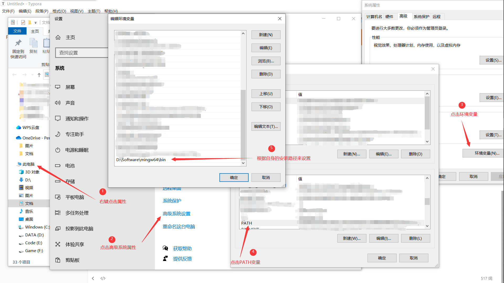
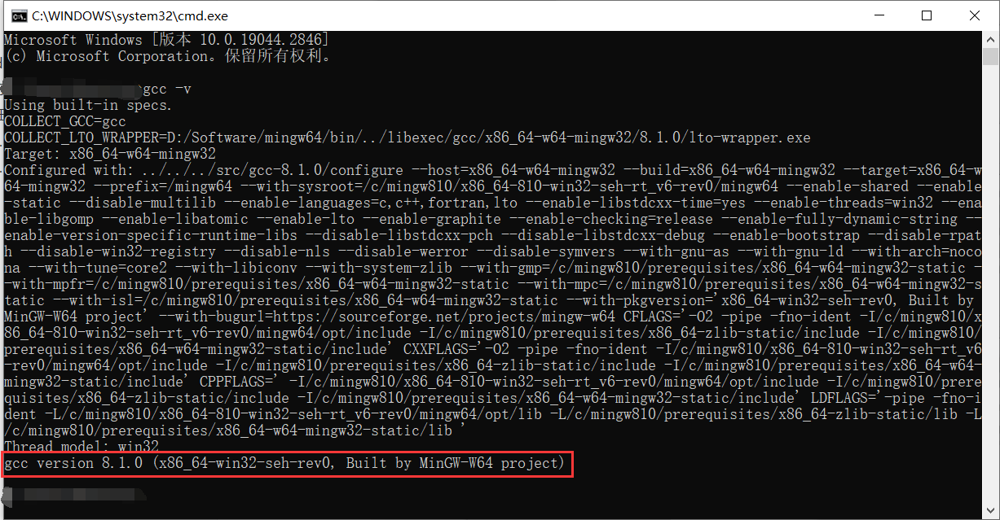
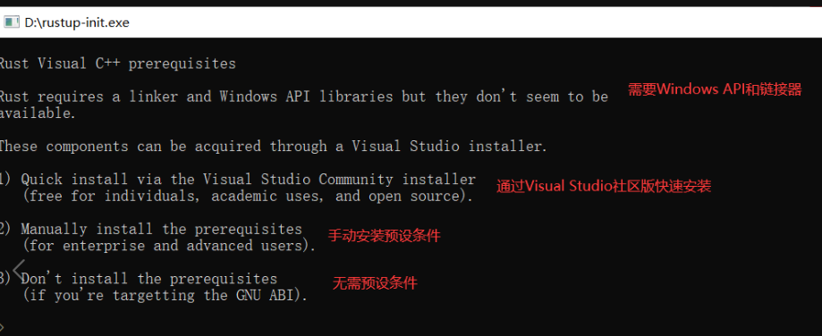
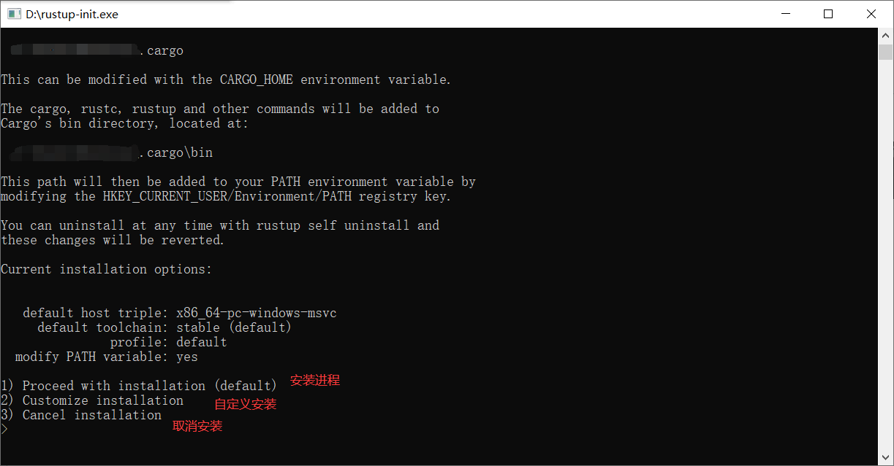
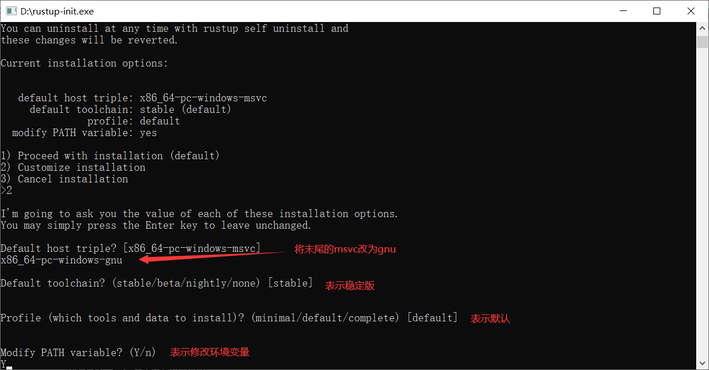
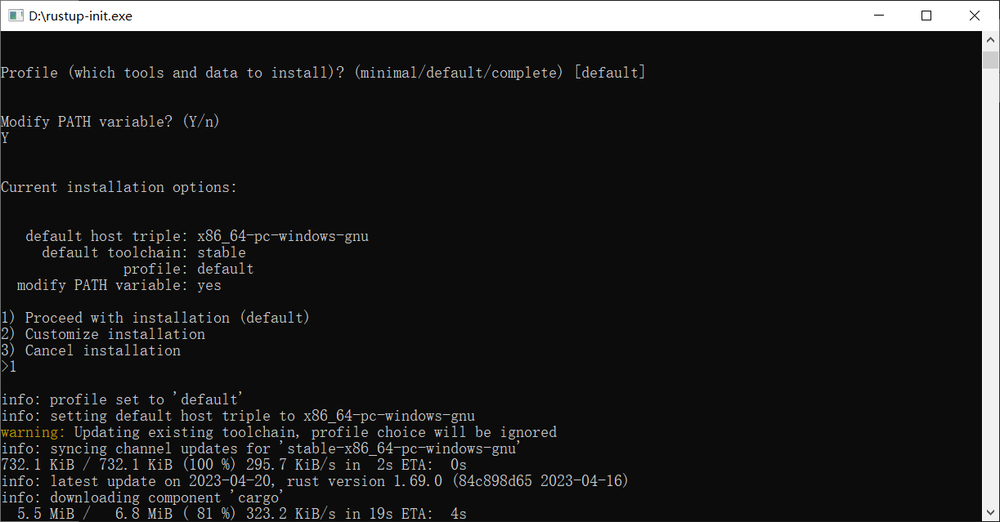
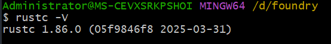

# 安装 foundry
## 安装 mingw-w64
1. 下载 mingw-w64-install.exe
https://link.zhihu.com/?target=https%3A//sourceforge.net/projects/mingw-w64/files/

2. 设置环境变量
下载好后，解压到任意一个目录，然后右键 “此电脑–>属性–>高级系统设置–>环境变量“，设置 PATH 变量

注：这里的环境变量根据自身电脑的具体路径来设置

3. 检查是否安装成功
win + R 键输出 cmd 打开命令行，然后输入 gcc -v

当出现这种提示时，表明 mingw-w64 安装成功

## 安装  仅限windows系统
详细安装步骤
1. 下载 rustup.rs
2. rustup-init安装包
https://win.rustup.rs/x86_64

1. 下载好打开之后，我们会看到
2. 
3. 在 Windows 开发 Rust，需要安装 C++ Build Tools 等工具，而 C++ Build Tools 被 Visual Studio 绑定了，要下载 C++ Build Tools 就必须下载 Visual Studio，但是 Visual Studio 安装包非常庞大，而且下载速度时好时差。

假如电脑配置差，或者不想要下载大约10G的文件，建议选择3。

这里选择3，因为需要下载的文件非常小，mingw-w64 也是 C/C++ 编译器，就是 GCC 的 Windows 版本 。

然后输入2，回车，就是自定义安装，出现提示

然后回来之前第一步的提示，输入1，回车，然后出现

等待其下载文件完毕，这里需要等待的时间有点长，但耐心就好，假如下载出现错误，就重设上面的设定，再来一次流程。

下载完毕之后，按下 win + R 键输入 cmd，并输入 rustc -V （注：是大写的V）

## 最后的安装 Foundry
 curl -L https://foundry.paradigm.xyz | bash  // 下载foundryup
source /c/Users/Administrator/.bashrc  // 刷新环境变量
 which foundryup // 查看foundryup的路径及环境变量是否设置成功
 foundryup   // 下载forge和anvil

### 验证安装：
 forge --version
anvil --version

# 学习资料
https://juejin.cn/post/7381349596646031397

