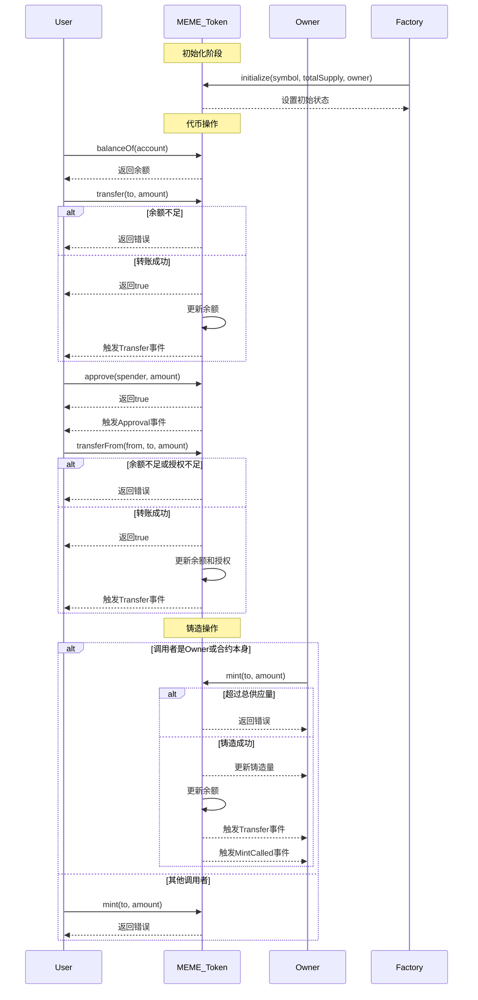
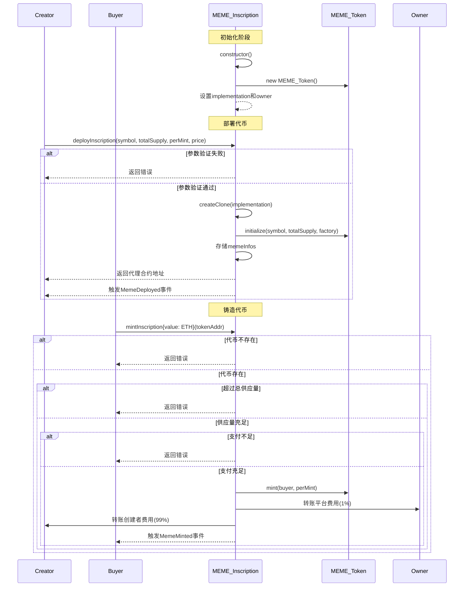

# 以太坊的铭文铸造   铭文：inscription
## 概念
  铭文铸造，是指将**文字、图片、音频**等信息**编码进区块链上**，并**赋予**其独特的**铭文ID**，
以便于区块链上数据的追溯、溯源、验证等。
  铭文铸造的**核心逻辑**是：将信息编码进区块链上，并赋予其独特的铭文ID，
以**便于**区块链上数据的**追溯、溯源、验证**等。

## 1. 核心逻辑
想象你在以太坊上寄一封挂号信：

信封（交易）：需要支付邮费（Gas费）
信纸（数据）：把内容写在inputdata字段（类似信封内的纸条）
邮戳（铭文ID）：由交易哈希+数据位置生成唯一编号

## 2. 代码示例（简化版）

// SPDX-License-Identifier: MIT
pragma solidity ^0.8.0;

contract SimpleInscription {
    // 记录所有铭文内容
    mapping(bytes32 => string) public inscriptions;

    // 铸造铭文（数据写入交易inputdata）
    function inscribe(string calldata inputdata) external payable {
        require(msg.value >= 0.001 ether, "Fee too low");
        
        // 生成唯一铭文ID = 交易哈希 + 数据哈希
        bytes32 id = keccak256(abi.encodePacked(tx.origin, block.timestamp, data));
        
        // 存储数据
        inscriptions[id] = inputdata;
    }

    // 读取铭文
    function getInscription(bytes32 id) external view returns (string memory) {
        return inscriptions[id];
    }
}

# 以太坊的MEME铸造

## 概念
Meme币是以网络流行文化（梗图/段子）为价值支撑的加密货币，本质是「社区共识驱动的投机性资产」，核心特征如下：
1. 核心特点
娱乐属性：基于网络梗图（如狗狗币的柴犬形象）
零实用功能：无技术或业务支撑，纯靠社区炒作
高波动性：价格完全由市场情绪驱动

2. 关键机制
| 机制      | 说明                  | 示 例           |
|---------------|------------------|--------------------|
| 病毒传播 | 依赖社交媒体炒作（如Elon Musk推文） | SHIB、DOGE |
| 无限供应 | 多数无硬顶，可随意增发 | PEPE（总量420万亿）|
| 交易税 | 部分项目抽税用于营销/回购 | 5%每笔交易转入金库 |

3. 与正规代币的区别
|          | Meme币           | 正规代币（如BTC/ETH） |
|----------|---------------   |--------------------------|
| 价值来源 | 社区共识（梗图热度）   | 技术/应用场景 |
| 波动性   | 极端（24小时±50%常见） | 相对稳定 |
| 生命周期 | 通常3-6个月（90%归零） | 长期存在 |

4. 典型生命周期
诞生 → 社交媒体炒作 → 交易所上市 → 暴涨暴跌 → 归零/成新梗

5. 一句话总结
Meme币是「用加密货币形式包装的网络梗图」，本质是一场群体投机游戏，核心盈利逻辑是早进场、会炒作、跑得快。

## 核心代码示例
// SPDX-License-Identifier: MIT
pragma solidity ^0.8.0;

import "@openzeppelin/contracts/token/ERC20/ERC20.sol";

contract MemeCoin is ERC20 {
    address public owner;
    uint256 public constant MAX_SUPPLY = 1000000 * 10**18; // 100万代币

    constructor() ERC20("Meme Coin", "MEME") {
        owner = msg.sender;
        _mint(owner, MAX_SUPPLY); // 初始发行
    }

    // 社区空投功能（Meme币常见操作）
    function airdrop(address[] calldata receivers, uint256 amount) external {
        require(msg.sender == owner, "Only owner");
        for (uint i=0; i<receivers.length; i++) {
            _transfer(owner, receivers[i], amount);
        }
    }
}

# 两者的区别
| 维度        |     您的铭文合约 |        Meme币(ERC20) | 
|------------|-----------------|----------------------| 
| 标准       | 自定义存储合约    | 必须符合ERC20标准 | 
| 数据      | 存储任意字符串     | 管理代币数量(单位: wei) | 
| 功能      | 仅记录数据         | 需实现transfer()/mint() | 
| 使用场景   | 存证/NFT元数据    | 投机/社区代币 |

# 作业任务
假设你（项目方）正在EVM的测试链sepolia 链上，创建一个Meme 发射平台，每一个 MEME 都是一个 ERC20 token ，你需要编写一个通过最⼩代理方式来创建 Meme的⼯⼚合约，以减少 Meme 发行者的 Gas 成本，编写的⼯⼚合约包含两个方法：

• deployInscription(string symbol, uint totalSupply, uint perMint, uint price), Meme发行者调⽤该⽅法创建ERC20 合约（实例）.
 参数描述如下： 
 - symbol 定义为：xuhai
 - totalSupply 定义为：1000
 - perMint 表示一次铸造 Meme 的数量（为了公平的铸造，而不是一次性所有的 Meme 都铸造完），定义为：10；
 - price 表示每个 Meme 铸造时需要支付的费用，定义为：100wei。
 - 每次铸造费用分为两部分，一部分（1%）项目方（你）来支付，剩余部分由 Meme 的发行者（即调用该方法的用户）来支付。
• mintInscription(address tokenAddr) payable: 购买 Meme 的用户每次调用该函数时，会发行 deployInscription 确定的 perMint 数量的 token，并收取相应的费用。

质量要求：
包含测试用例（需要有完整的 forge 工程）：
费用按比例正确分配到 Meme 发行者账号及项目方账号。
每次发行的数量正确，且不会超过 totalSupply.

合约文件目录：D:\blockchain\foundry\s6\src\tokens
接口文件目录：D:\blockchain\foundry\s6\src\interfaces
合约文件名称：MEME_Inscription.sol
测试文件目录：D:\blockchain\foundry\s6\test
测试文件名称：MEME_Inscription.t.sol
部署文件目录：D:\blockchain\foundry\s6\script

## 代码逻辑：
ERC20合约的逻辑：
D:\blockchain\foundry\s6\src\tokens\MEME_Token.sol

### 工厂合约的逻辑：
D:\blockchain\foundry\s6\src\tokens\MEME_Inscription.sol

总体逻辑：
1. 项目方创建meme平台，初始化ERC20合约，作为平台的基础合约，作为代理合约的实现。
2. 用户可以调用 deployInscription 函数，来创建 ERC20 代理合约，调用初始化函数initalize，传入meme代币的自定义属性参数，记录属性到对应的状态变量中。
3. 用户可以根据条件铸造 Meme 代币，支付相关费用。
