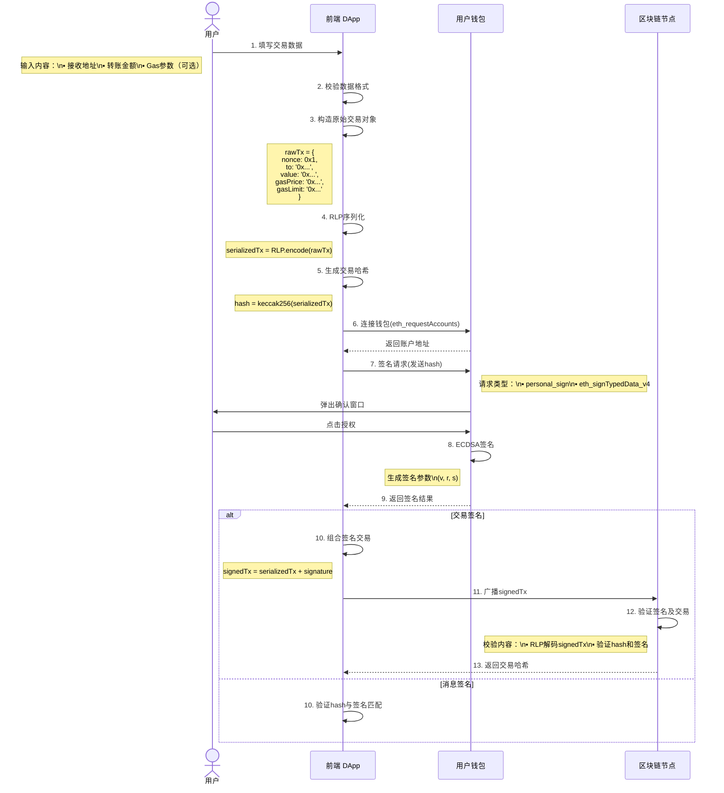

```mermaid
sequenceDiagram
    actor 用户
    participant 前端 as 前端 DApp
    participant 钱包 as 用户钱包
    participant 区块链 as 区块链节点

    # 用户输入环节
    用户->>前端: 1. 填写交易数据
    Note left of 用户: 输入内容：\n▪ 接收地址\n▪ 转账金额\n▪ Gas参数（可选）
    前端->>前端: 2. 校验数据格式

    # 交易构造与序列化
    前端->>前端: 3. 构造原始交易对象
    Note left of 前端: rawTx = {<br/>  nonce: 0x1,<br/>  to: '0x...',<br/>  value: '0x...',<br/>  gasPrice: '0x...',<br/>  gasLimit: '0x...'<br/>}
    前端->>前端: 4. RLP序列化
    Note left of 前端: serializedTx = RLP.encode(rawTx)
    前端->>前端: 5. 生成交易哈希
    Note left of 前端: hash = keccak256(serializedTx)

    # 钱包连接与签名
    前端->>钱包: 6. 连接钱包(eth_requestAccounts)
    钱包-->>前端: 返回账户地址
    
    前端->>钱包: 7. 签名请求(发送hash)
    Note right of 钱包: 请求类型：\n▪ personal_sign\n▪ eth_signTypedData_v4
    钱包->>用户: 弹出确认窗口
    用户->>钱包: 点击授权
    
    钱包->>钱包: 8. ECDSA签名
    Note left of 钱包: 生成签名参数\n(v, r, s)
    
    钱包-->>前端: 9. 返回签名结果
    alt 交易签名
        前端->>前端: 10. 组合签名交易
        Note left of 前端: signedTx = serializedTx + signature
        前端->>区块链: 11. 广播signedTx
        区块链->>区块链: 12. 验证签名及交易
        Note left of 区块链: 校验内容：\n▪ RLP解码signedTx\n▪ 验证hash和签名
        区块链-->>前端: 13. 返回交易哈希
    else 消息签名
        前端->>前端: 10. 验证hash与签名匹配
    end

```
