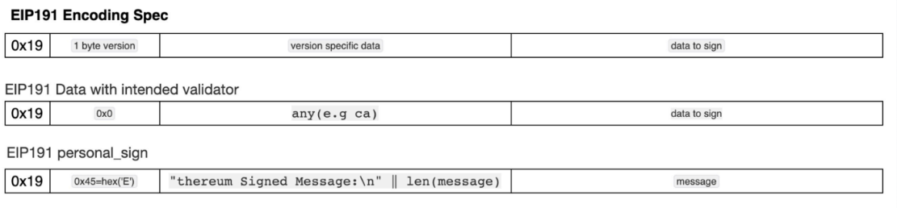
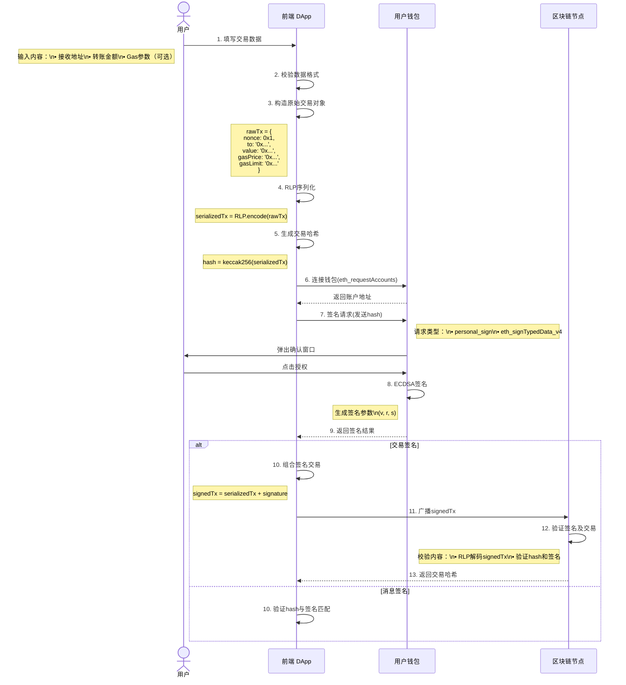
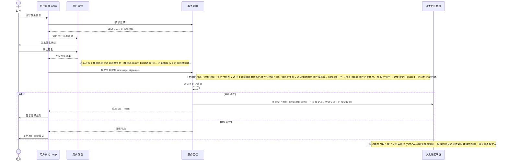
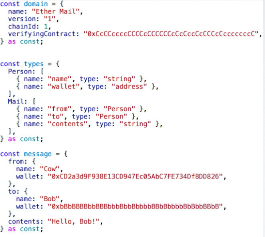
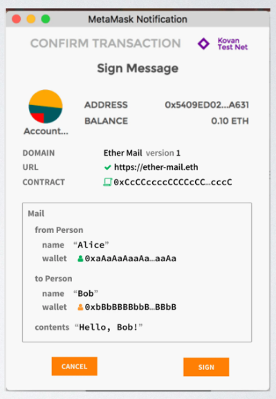
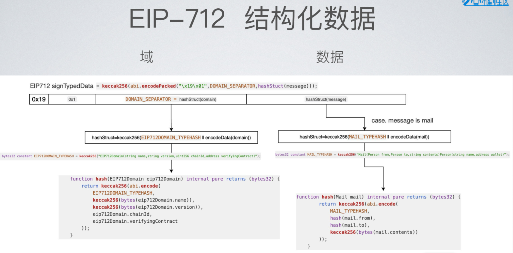
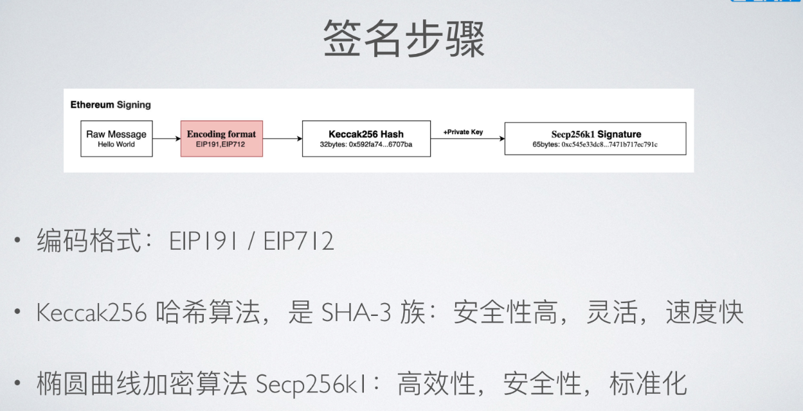

# 前置概念  
## RLP（Recursive Length Prefix，递归长度前缀）编码是以太坊中用于**序列化数据结构的核心编码方案**，专为区块链设计。

它的核心目标是以紧凑、无歧义的方式**将任意嵌套的数据结构转换为字节序列**，同时避免复杂的类型标记（如JSON/XML中的标签）。

**是原始数据结构的编码方案**，可以用于任何需要序列化的数据结构

## abi.encode 
abi.encode 是 Solidity 中用于 将函数参数或数据**按 ABI（应用二进制接口）标准**
**编码为字节序列** 的核心函数。

event Log(bytes data);
function emitLog(uint value) public {
    emit Log(abi.encode(value));
}

**上面的的代码**，表示：将 uint 类型的值 value 按照 ABI 编码为字节序列。

bytes memory data = abi.encodeWithSignature("transfer(address,uint256)", to, amount);
(bool success, ) = token.call(data);

**上面的代码**，表示：将函数名为 transfer 的参数（to 和 amount）按照 ABI 编码为字节序列。
call函数用于执行智能合约的交易，将字节序列作为参数。
data将是1个字节形式，包含：函数签名（4个字节）+ 32字节的 to 地址 + 32字节的 amount 值。

# 签名定义
1. 身份验证（Who）
- 去中心化登录（如 "Sign-In with Ethereum"）
- NFT 持有者验证
- 签名消息 "我同意条款" → 如果条款被篡改，签名验证失败。

2. 操作授权
- 交易执行
用户对交易数据签名，授权链上操作（如转账、合约调用）。

- 智能合约权限控制
合约可通过签名验证调用者权限（如多签钱包、DAO 投票）。

3. 数据完整性
结构化数据签名
使用标准（如 EIP-191/EIP-712）确保签名上下文明确，防止重放攻击。

# 签名性质
签名是无GAS费用的，是区块链上交易的基础。
签名是线下行为

# 详细解释
## 登录连接签名
属于：普通消息签名；
前端连接本地钱包，返回用户地址
这种行为，代码实现：const accounts = await window.ethereum.request({ method: 'eth_requestAccounts' })

## 利用EIP191
EIP191协议中得encoding Spec✅ **"增加0x19前缀**，表示这**是结构化签名数据**（可能是消息或安全交易编码），
而不仅是原始交易数据；

核心区别
| 场景 | 数据格式示例 | 用途 | 
|------|-----------|-------| 
| 普通消息签名 | 0x19 + 0x45（以太坊标准消息前缀） | 登录/验证身份 | 
| 安全交易编码 | 0x19 + 0x01（合约自定义交易前缀） | 多签交易等 |

## EIP191解释

EIP191: 区分交易签名和其他信息签名

• 0x19 初始字节: 这个初始字节确保 signed_data **不是 RLP 编码**,从而防止签名数据被误解为以太坊交易。

• <1 byte version>:可以自行定义签名数据版本,占用一字节,可以是0;

• <version sepific data>: 不定长的消息头数据;

• <data to sign>:原始签名数据;

## 原始交易数据（Raw Transaction Data）
在区块链中，原始交易数据（Raw Transaction Data） 指的是未经结构化处理、直接用于链上执行的交易二进制数据。
**格式：通常为RLP**（Recursive Length Prefix）编码的字节序列。

示例结构：
{
  nonce: 0x1,
  gasPrice: 0x09184e72a000,
  gasLimit: 0x21000,
  to: "0x接收地址",
  value: 0x1,
  data: "0x...", // 调用合约时的输入数据
  chainId: 1     // 主网ID
}

### 安全风险：

原始交易数据若被直接签名，可能被恶意重放（如重复转账）。
EIP-191的0x19前缀强制结构化数据，防止此类攻击（如添加chainId和合约地址约束）。

## 典型场景
原始交易：普通ETH转账、简单的合约调用。
结构化数据：多签交易（Gnosis Safe）、登录签名（SIWE）、EIP-712复杂数据签名。

## 总结
原始交易数据：裸交易二进制，直接签名存在风险。
结构化数据（含0x19）：通过版本标识和域分隔符保障安全，明确签名用途。

# 区块链上发生交易，用户、前端与钱包的工作流程与签名机制

# 去中心化得用户身份认证（后端）
SIWE（Sign-In with Ethereum，EIP-4361） 是一种基于以太坊的去中心化身份认证机制，用于实现无信任的登录、权限验证和身份认证。
 ## 用户控制私钥
钱包管理私钥：用户的私钥完全存储在用户的设备（钱包）上，比如 MetaMask、WalletConnect 或其他钱包应用。
无需信任第三方：用户不需要将私钥交给任何中心化服务。用户的地址相关操作（如签名）只在钱包中完成，验证逻辑由后端执行。

## 总结
就是用户登录信息进行私钥签名，然后后端验证签名，然后返回 JWT Token 给前端，前端根据 Token 进行身份验证。
后端验证是通过区块链查询链上数据，但无需直接交互。

# EIP-712（以太坊类型化数据签名标准）
是以太坊上用于结构化数据签名的协议，旨在提升用户签名时的透明度和安全性。以下是简明介绍：

| 特性 | 说明 | 
|---------------------|------------| 
| 结构化数据 | 支持嵌套数据类型（如Person{name, wallet}），类似JSON但可验证 | | 域名分隔符 | 绑定特定DApp和链，防止跨平台签名攻击 | | 前端友好 | 开发者可自定义显示字段（如将value: 100显示为"支付100 USDT"） |

## 代码示例：

// 1. 定义数据结构

// 2. 请求签名（MetaMask会显示清晰字段）
const signature = await wallet.signTypedData(typedData);

// 3.签名展示

## 对191得数据解构进行拓展
示例：

# 签名得步骤

