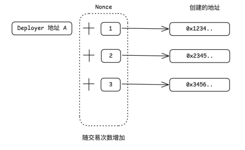
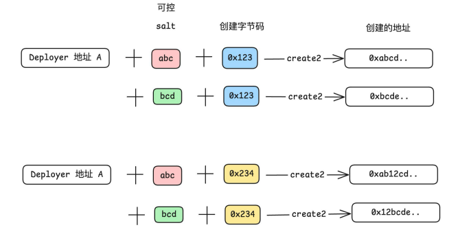
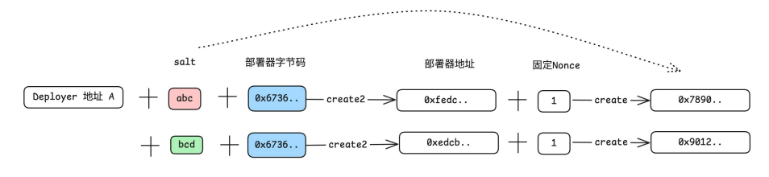

# create1
keccak256(rlp.encode([normalize_address(sender), nonce]))[12:]

# create2
keccak256(0xff ++ sender ++ salt ++ keccak256(init_code))[12:]

# create3
function create3Contract(uint _salt, bytes memory creationCode) external returns (address deployed) {
deployed = CREATE3.deploy(
keccak256(abi.encode(_salt)),
creationCode,
0);
}

