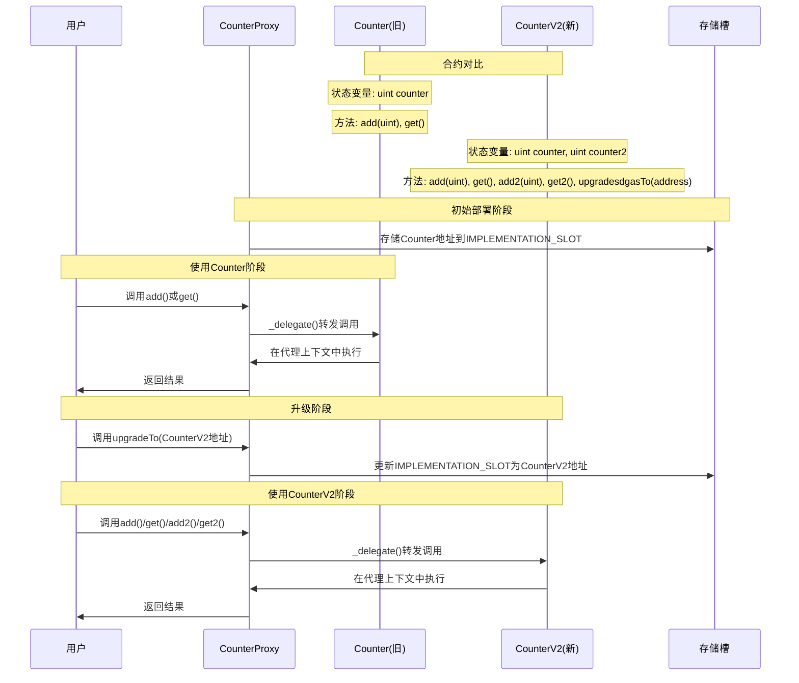
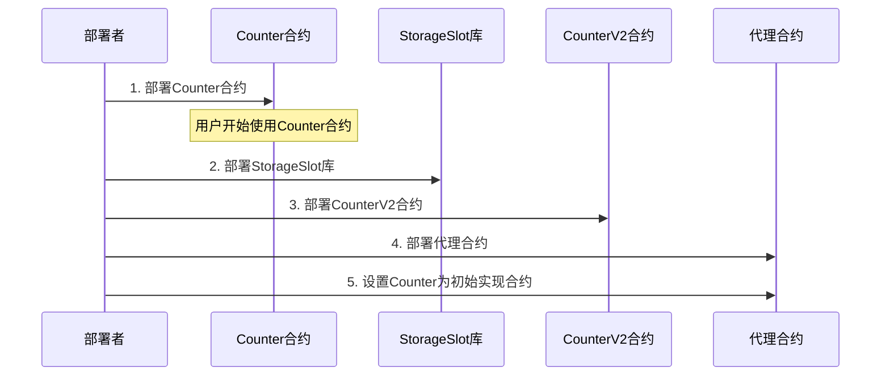
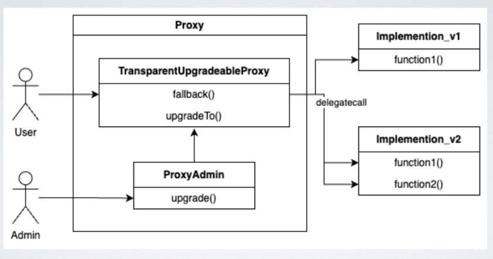
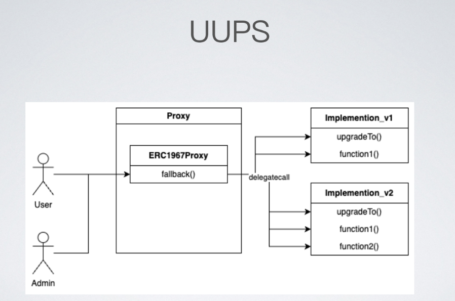
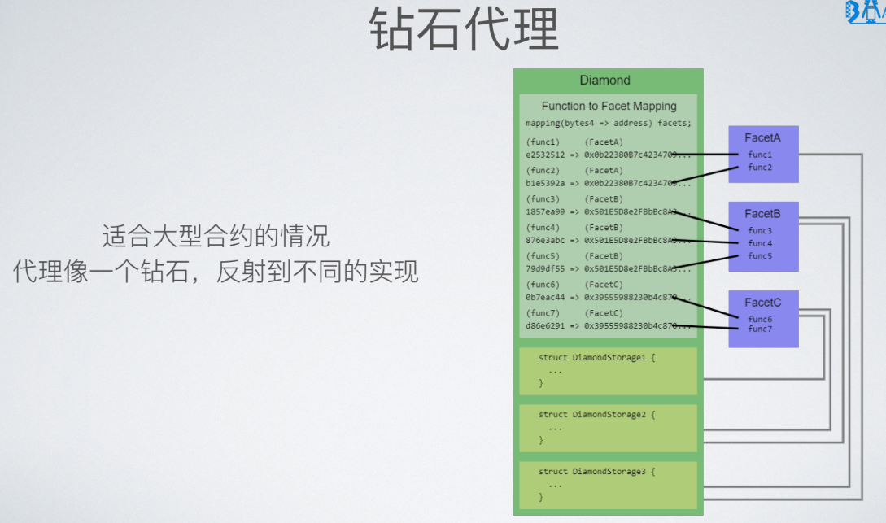
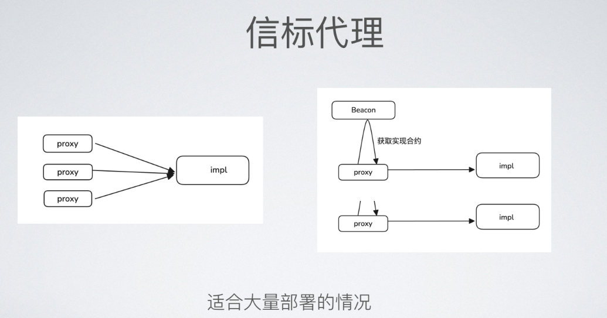

# 标准代理模式得逻辑图，不到一定准确，当作参考，还没时间验证

代码见：D:\blockchain\study_way\src\24day_CounterFallback.sol

实际场景的部署顺序：
部署Counter合约
用户开始使用Counter合约
合约已经运行一段时间
可能已经存储了一些数据
部署StorageSlot库
为代理模式做准备
提供存储槽管理功能
部署CounterV2合约
包含新功能
保持与Counter的存储布局兼容
部署代理合约
设置Counter为初始实现合约
准备升级到CounterV2

## 代理合约需要calldata数据
add(uint256 i)得abi
0x1003e2d20000000000000000000000000000000000000000000000000000000000000014

add2(uint256 i)得abi
0x04c58438000000000000000000000000000000000000000000000000000000000000001e

get()得abi
0x6d4ce63c

get2()得abi
0xd2178b08

# 函数冲撞问题,若某个函数与upgradeTo() 函数选择器一样会出现什么问题?
补充1个该你那：“所有未定义的函数调用”就是指：
当合约收到的calldata中的函数选择器，在该合约自身（这里指你的 TransparentProxy 合约）所有 public 或 external 函数的函数表中都找不到匹配项时，这个调用就被认为是“未定义的函数调用”。

## • 透明代理(Transparent Proxy)- ERC1967Proxy

代码见：D:\blockchain\study_way\src\24day_TransparentProxy.sol

简单明了地说明透明代理（ERC-1967）与你之前代码的主要差异：
调用分发逻辑： 
- 透明代理**会检查调用者是否是管理员**。
- 如果**不是管理员**（普通用户），**所有调用**都会通过 delegatecall **转发到实现合约**。
- 如果**是管理员**，会从管理员发送的 calldata 中解析出升级所需的新的实现合约地址和可选的初始化数据。尝试匹配并执行代理合约自身的函数 _setImplementation。
**解决函数选择器冲突：** 正是因为这种基于调用者的分发逻辑，透明代理有效地解决了实现合约业务函数与代理合约管理函数之间的函数选择器冲突问题，保证普通用户调用的总是转发到实现合约。

## • UUPS(universal upgradeable proxy standard)- ERC-1822

代码见：D:\blockchain\study_way\src\24day_UUPSProxy.sol

与第一个代理升级代码相比，当前代码（UUPS 代理模式）的主要区别在于：
升级函数位置： **upgradeTo** 函数从代理合约**移到了实现合约**（Counter）。**代理合约本身不再有升级逻辑的入口**。
函数代理方式： **不再为每个方法（如 add, get）在代理合约中写显式函**数，而是使用一个通用的 fallback 函数和 _delegate 函数（包含 Assembly 代码）来动态转发所有针对实现合约的调用。
存储布局： 代理合约自身**只存储实现合约地址**（使用标准化的 IMPLEMENTATION_SLOT），**不存储业务状态变量**（如 counter），避免了存储冲突问题。
核心就是：升级控制逻辑在实现合约中，函数调用转发更通用，代理合约自身更精简且存储更安全。

## • 钻石代理(Diamonds, Multi-Facet Proxy) - ERC-2535

## • 信标代理(Beacon Proxy)

## 5月21日作业
编写一个可升级的 ERC721 合约.
实现⼀个可升级的 NFT 市场合约：
• 实现合约的第⼀版本和这个挑战 的逻辑一致。
• 逻辑合约的第⼆版本，加⼊离线签名上架 NFT 功能⽅法（签名内容：tokenId， 价格），实现⽤户⼀次性使用 setApproveAll 给 NFT 市场合约，每个 NFT 上架时仅需使⽤签名上架。
部署到测试⽹，并开源到区块链浏览器，在你的Github的 Readme.md 中备注代理合约及两个实现的合约地址。

要求：
包含升级的测试用例（升级前后的状态保持一致）
包含运行测试用例的日志。

给AI得提示：
1. 编写1个可升级的 ERC721 合约，文件名：ERC721Upgradeable.sol，目录：D:\blockchain\foundry\s6\src\tokens
2. 编写1个可升级得NFT市场合约，文件名: NFTMarketUpgradeable.sol，目录：D:\blockchain\foundry\s6\src\market
这个NFT市场合约的代码逻辑参考这个文件：D:\blockchain\study_way\src\9day_NFTmarket.sol
这个合约作为需要升级合约场景下的初始合约；
目录：D:\blockchain\foundry\s6下，已经安装了如下依赖
forge install OpenZeppelin/openzeppelin-foundry-upgrades
forge install OpenZeppelin/openzeppelin-contracts-upgradeable

创建1个代理合约，存放目录：D:\blockchain\foundry\s6\src\upgrade，文件名：upgradeProxy.sol
用于升级以下功能：
NFT市场合约的实现合约，加⼊离线签名上架 NFT 功能⽅法（签名内容：tokenId， 价格），
实现⽤户⼀次性使用 setApproveAll 给 NFT 市场合约，每个 NFT 上架时仅需使⽤签名上架。

forge script script/Deploy_upgradeNFTmarket.s.sol:DeployScript --rpc-url $SEPOLIA --broadcast --keystore .keys/hf

forge script script/Deploy_upgradeNFTmarket.s.sol:DeployScript --rpc-url sepolia --broadcast --verify --private-key 钱包1643尾号账户的私钥

forge script script/Deploy_upgradeNFTmarket.s.sol:DeployScript --rpc-url sepolia --broadcast --verify --private-key 05523a4e98619b978e35e8cb88dbeb1d27fc3967e4af28c415c2b343c62604df
[⠊] Compiling...
[⠃] Compiling 1 files with Solc 0.8.26
[⠊] Solc 0.8.26 finished in 753.98ms
Compiler run successful!
Script ran successfully.

== Logs ==
  === 开始部署合约 ===
  网络: Sepolia
  部署者地址: 0x44f08Ed7D8F63b345F0fc512aEcfaA4F16831643

1. 部署 NFT 合约
     - 合约地址: 0xB28bE1704A53686381790ddEbEC29B91a1D8CE09
     - 名称: TestNFT
     - 符号: TNFT

2. 部署原始市场合约
     - 合约地址: 0xFdDB1598d34005e31a95F856c12f079aCB129E96

3. 部署升级后的市场合约
     - 合约地址: 0x55453983148aCe3Ac03884c8f78223e826F64ED7

4. 部署代理合约
     - 合约地址: 0xeF4D1E5C3a637eCC5Ed319f430d0e5a8786675B5

=== 合约验证命令 ===
  1. NFT 合约验证命令:
  forge verify-contract 0xB28bE1704A53686381790ddEbEC29B91a1D8CE09 src/tokens/ER
C721Upgradeable.sol:ERC721UpgradeableNFT --constructor-args $(cast abi-encode "c
onstructor(string,string)" "TestNFT" "TNFT") --chain-id 11155111 --etherscan-api
-key AJWMGPID8JKAGE9ZVW4BTZ6F8TQ3SQUKNZ --watch

2. 原始市场合约验证命令:
  forge verify-contract 0xFdDB1598d34005e31a95F856c12f079aCB129E96 src/market/NF
TMarketUpgradeable.sol:NFTMarketUpgradeable --chain-id 11155111 --etherscan-api-
key AJWMGPID8JKAGE9ZVW4BTZ6F8TQ3SQUKNZ --watch

3. 升级后市场合约验证命令:
  forge verify-contract 0x55453983148aCe3Ac03884c8f78223e826F64ED7 src/upgrade/N
FTMarketUpgradeableV2.sol:NFTMarketUpgradeableV2 --chain-id 11155111 --etherscan
-api-key AJWMGPID8JKAGE9ZVW4BTZ6F8TQ3SQUKNZ --watch

4. 代理合约验证命令:
  forge verify-contract 0xeF4D1E5C3a637eCC5Ed319f430d0e5a8786675B5 src/upgrade/u
pgradeProxy.sol:NFTMarketUpgradeableV2 --chain-id 11155111 --etherscan-api-key A
JWMGPID8JKAGE9ZVW4BTZ6F8TQ3SQUKNZ --watch

=== 部署完成 ===
  请确保已设置 ETHERSCAN_API_KEY 环境变量
  使用上述验证命令开源合约

## Setting up 1 EVM.

==========================

Chain 11155111

Estimated gas price: 0.001052018 gwei

Estimated total gas used for script: 14493564

Estimated amount required: 0.000015247490212152 ETH

==========================

##### sepolia
✅  [Success] Hash: 0x376aac2084e8192517d3fb58c239f6220f425fec3a374b9dbb63e1fae27   ⡀ [Pending] 0xfaddb15d76eda2f2754f7fa153aa79ffac06a1b141b1f197fb936012370365
fb7d8
Block: 8376037
Paid: 0.000000096975319847 ETH (94409 gas * 0.001027183 gwei)

##### sepolia
✅  [Success] Hash: 0xfaddb15d76eda2f2754f7fa153aa79ffac06a1b141b1f197fb936012370   ⡀ [Pending] 0xfaddb15d76eda2f2754f7fa153aa79ffac06a1b141b1f197fb936012370365
36559
Contract Address: 0xFdDB1598d34005e31a95F856c12f079aCB129E96
Block: 8376037
Paid: 0.000002118759075087 ETH (2062689 gas * 0.001027183 gwei)

##### sepolia
✅  [Success] Hash: 0xff5a463aa54915936bad79e53195396af26bc85c1453ed729f3f7ea27ca   ⡀ [Pending] 0x84204293a7a247ac4a55a80556763eb7fb5a92c2d9d3e55aad3ecbd617c0ad
13c1f
Contract Address: 0xB28bE1704A53686381790ddEbEC29B91a1D8CE09
Block: 8376037
Paid: 0.000002728429164175 ETH (2656225 gas * 0.001027183 gwei)

##### sepolia
✅  [Success] Hash: 0x84204293a7a247ac4a55a80556763eb7fb5a92c2d9d3e55aad3ecbd617c   ⡀ [Pending] 0x29b2114bd5d87666c06ed59eeb3d884e8d3b6926bc4491400d3f661633a3e6
0ad53
Block: 8376037
Paid: 0.00000004729150532 ETH (46040 gas * 0.001027183 gwei)

##### sepolia
✅  [Success] Hash: 0xf2dbf955c3bf33d3752c44a8648f68a2ea980577b7832c7406b605314be   ⡀ [Pending] 0xf2dbf955c3bf33d3752c44a8648f68a2ea980577b7832c7406b605314bedc2
dc23c
Contract Address: 0xeF4D1E5C3a637eCC5Ed319f430d0e5a8786675B5
Block: 8376037
Paid: 0.000003222712705324 ETH (3137428 gas * 0.001027183 gwei)

##### sepolia
✅  [Success] Hash: 0x29b2114bd5d87666c06ed59eeb3d884e8d3b6926bc4491400d3f661633a   ⠂ [00:00:06] [#############################################] 6/6 txes (0.0s)
3e634
Contract Address: 0x55453983148aCe3Ac03884c8f78223e826F64ED7
Block: 8376037
Paid: 0.000003222712705324 ETH (3137428 gas * 0.001027183 gwei)

✅ Sequence #1 on sepolia | Total Paid: 0.000011436880475077 ETH (11134219 gas *✅ Sequence #1 on sepolia | Total Paid: 0.000011436880475077 ETH (11134219 gas * vg 0.001027183 gwei)
avg 0.001027183 gwei)

==========================

ONCHAIN EXECUTION COMPLETE & SUCCESSFUL.
##
Start verification for (4) contracts
Start verifying contract `0xB28bE1704A53686381790ddEbEC29B91a1D8CE09` deployed o
n sepolia
EVM version: cancun
Compiler version: 0.8.26

Submitting verification for [src/tokens/ERC721Upgradeable.sol:ERC721UpgradeableN
FT] 0xB28bE1704A53686381790ddEbEC29B91a1D8CE09.
Warning: Could not detect the deployment.; waiting 5 seconds before trying again
 (4 tries remaining)

Submitting verification for [src/tokens/ERC721Upgradeable.sol:ERC721UpgradeableN
FT] 0xB28bE1704A53686381790ddEbEC29B91a1D8CE09.
Warning: Could not detect the deployment.; waiting 5 seconds before trying again
 (3 tries remaining)

Submitting verification for [src/tokens/ERC721Upgradeable.sol:ERC721UpgradeableN
FT] 0xB28bE1704A53686381790ddEbEC29B91a1D8CE09.
Warning: Could not detect the deployment.; waiting 5 seconds before trying again
 (2 tries remaining)

Submitting verification for [src/tokens/ERC721Upgradeable.sol:ERC721UpgradeableN
FT] 0xB28bE1704A53686381790ddEbEC29B91a1D8CE09.
Warning: Could not detect the deployment.; waiting 5 seconds before trying again
 (1 tries remaining)

Submitting verification for [src/tokens/ERC721Upgradeable.sol:ERC721UpgradeableN
FT] 0xB28bE1704A53686381790ddEbEC29B91a1D8CE09.
Submitted contract for verification:
        Response: `OK`
        GUID: `jjzyqmpgpzaevgl6xbhqz4qy488wnbhddzbx9zvn8wcxx4cytw`
        URL: https://sepolia.etherscan.io/address/0xb28be1704a53686381790ddebec2
9b91a1d8ce09
Contract verification status:
Response: `OK`
Details: `Pass - Verified`
Contract successfully verified
Start verifying contract `0xFdDB1598d34005e31a95F856c12f079aCB129E96` deployed o
n sepolia
EVM version: cancun
Compiler version: 0.8.26

Submitting verification for [src/market/NFTMarketUpgradeable.sol:NFTMarketUpgrad
eable] 0xFdDB1598d34005e31a95F856c12f079aCB129E96.
Submitted contract for verification:
        Response: `OK`
        GUID: `zb3ydfusvgfsjmswcxvpwpfvh4sib1wa4r3vb6mw4ieehgcqf2`
        URL: https://sepolia.etherscan.io/address/0xfddb1598d34005e31a95f856c12f
079acb129e96
Contract verification status:
Response: `NOTOK`
Details: `Pending in queue`
Warning: Verification is still pending...; waiting 15 seconds before trying agai
n (7 tries remaining)
Contract verification status:
Response: `OK`
Details: `Pass - Verified`
Contract successfully verified
Start verifying contract `0x55453983148aCe3Ac03884c8f78223e826F64ED7` deployed o
n sepolia
EVM version: cancun
Compiler version: 0.8.26

Submitting verification for [src/upgrade/NFTMarketUpgradeableV2.sol:NFTMarketUpg
radeableV2] 0x55453983148aCe3Ac03884c8f78223e826F64ED7.
Submitted contract for verification:
        Response: `OK`
        GUID: `tg35zav8rancqvk5ptkmkxaalek2dsscdayfyyss1ufl8tsjid`
        URL: https://sepolia.etherscan.io/address/0x55453983148ace3ac03884c8f782
23e826f64ed7
Contract verification status:
Response: `OK`
Details: `Pass - Verified`
Contract successfully verified
Start verifying contract `0xeF4D1E5C3a637eCC5Ed319f430d0e5a8786675B5` deployed o
n sepolia
EVM version: cancun
Compiler version: 0.8.26

Submitting verification for [src/upgrade/NFTMarketUpgradeableV2.sol:NFTMarketUpg
radeableV2] 0xeF4D1E5C3a637eCC5Ed319f430d0e5a8786675B5.
Submitted contract for verification:
        Response: `OK`
        GUID: `sj5igwvujlrwuq9bygn6xqttmsgqsim1ibzhykucj5fgsxzqdw`
        URL: https://sepolia.etherscan.io/address/0xef4d1e5c3a637ecc5ed319f430d0
e5a8786675b5
Contract verification status:
Response: `NOTOK`
Details: `Pending in queue`
Warning: Verification is still pending...; waiting 15 seconds before trying agai
n (7 tries remaining)
Contract verification status:
Response: `NOTOK`
Details: `Already Verified`
Contract source code already verified
All (4) contracts were verified!

Transactions saved to: D:/blockchain/foundry/s6/broadcast\Deploy_upgradeNFTmarke
t.s.sol\11155111\run-latest.json

Sensitive values saved to: D:/blockchain/foundry/s6/cache\Deploy_upgradeNFTmarke
t.s.sol\11155111\run-latest.json
